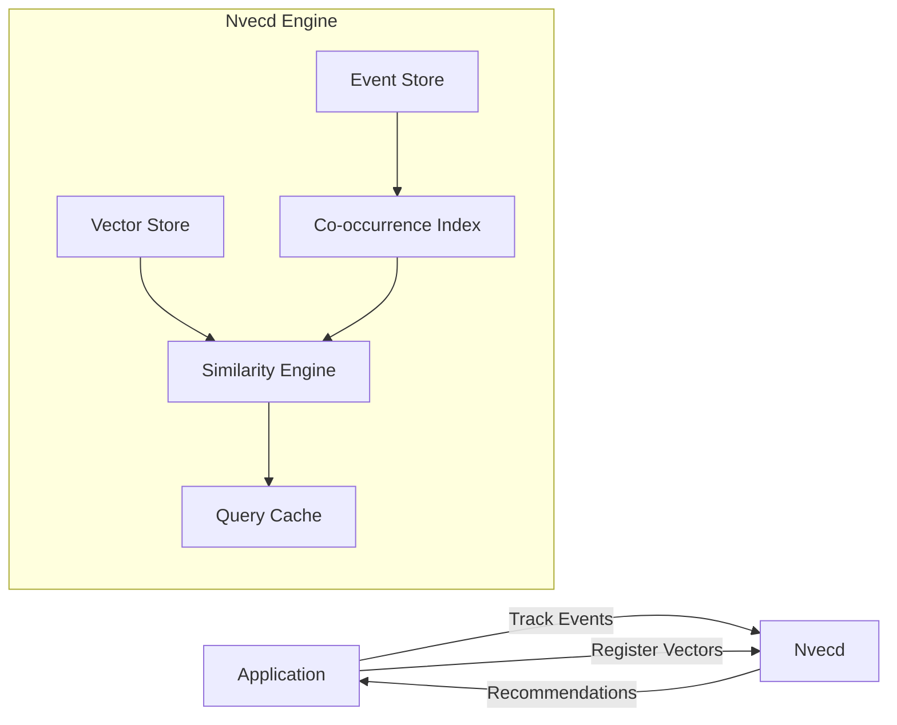

# Nvecd

[](https://github.com/libraz/nvecd/actions/workflows/ci.yml)
[](https://codecov.io/gh/libraz/nvecd)
[](https://opensource.org/licenses/MIT)
[](https://en.cppreference.com/w/cpp/17)
[](https://github.com/libraz/nvecd)

**In-memory vector search engine with event-based co-occurrence tracking and fusion search.**

## Why Nvecd?

Recommendation engines are complex — they require ML pipelines, model training, and infrastructure. Most teams just need "users who did X also did Y."

**Nvecd** solves this with an in-memory engine that combines user behavior tracking with vector similarity, delivering instant recommendations with zero ML setup.

## Quick Start

### Build & Run

```bash
# Build
cmake -B build -DCMAKE_BUILD_TYPE=Release
cmake --build build --parallel

# Run server
./build/bin/nvecd -c examples/config.yaml
# → Listening on 127.0.0.1:11017
```

### Basic Usage

```bash
# Track user purchases
nvecd-cli -p 11017 EVENT user_alice ADD product123 100
nvecd-cli -p 11017 EVENT user_alice ADD product456 80
nvecd-cli -p 11017 EVENT user_bob ADD product123 100
nvecd-cli -p 11017 EVENT user_bob ADD product789 95

# Get recommendations: "People who bought product123 also bought..."
nvecd-cli -p 11017 SIM product123 10 using=events
# (2 results, showing 2)
# 1) product789 (score: 0.92)
# 2) product456 (score: 0.75)

# Register item vectors (optional, for content-based similarity)
nvecd-cli -p 11017 VECSET product123 0.1 0.2 0.3 0.4
nvecd-cli -p 11017 VECSET product456 0.15 0.18 0.32 0.41

# Hybrid search: behavior + content similarity
nvecd-cli -p 11017 SIM product123 10 using=fusion

# Search by query vector
nvecd-cli -p 11017 SIMV 10 0.5 0.3 0.2 0.1
```

### Interactive Mode

```bash
nvecd-cli -p 11017
# nvecd> EVENT user1 ADD item1 100
# OK
# nvecd> SIM item1 10 using=fusion
# (3 results, showing 3)
# 1) item3 (score: 0.85)
# 2) item2 (score: 0.72)
# 3) item4 (score: 0.61)
# nvecd> help
```

### Monitor Cache Performance

```bash
nvecd-cli -p 11017 CACHE STATS
# hit_rate: 0.8500
# current_memory_mb: 12.45
# time_saved_ms: 15420.50
```

### Test

```bash
make test
```

## Performance

100K vectors (dim=128, cosine, Apple M4 Max NEON):

| Query | Latency | Throughput |
|---|---|---|
| SIM (cold) | **1.12ms** | 900 QPS/thread |
| SIMV (cold) | **0.98ms** | 1,000 QPS/thread |
| Cache hit | **0.00025ms** | 4M ops/sec |

At 1M vectors with default sampling: **~0.12ms** per query, **64K QPS** on 8 threads. See [Benchmarks](docs/en/benchmarks.md) for details.

## Features

- **Behavior-Based Recommendations** - Track user actions, get instant recommendations
- **Vector Similarity Search** - Find similar items using embeddings (cosine, dot, L2)
- **Hybrid Fusion Search** - Combine user behavior + content similarity with configurable weights
- **Real-time Updates** - Recommendations adapt as users interact
- **Smart Caching** - LRU cache with LZ4 compression and selective invalidation
- **SIMD Optimization** - AVX2/NEON acceleration for vector operations
- **Fork-Based Snapshots** - Copy-on-write persistence with near-zero downtime
- **Dual Protocol** - TCP (Redis-style) and HTTP/REST JSON API
- **Unix Domain Sockets** - Low-latency local connections
- **Rate Limiting** - Per-client token bucket rate limiting
- **Authentication** - Optional password-based AUTH for write commands
- **CLI Tool** - `nvecd-cli` with tab completion and interactive mode
- **Client Library** - C++ and C client libraries for language bindings

## What Makes Nvecd Different

Most vector search engines treat behavioral signals and vector similarity as separate concerns, leaving the integration to the application layer. Nvecd uniquely combines them at the engine level:

### Adaptive Fusion — Automatic Cold-Start Handling

Static weight blending breaks down when item maturity varies. Nvecd automatically adjusts the balance between vector similarity and behavioral co-occurrence based on each item's data density:

```bash
# New item (few events) → vector similarity weighted more heavily
nvecd-cli -p 11017 SIM new_product 10 using=fusion adaptive=on

# Mature item (many events) → co-occurrence weighted more heavily
nvecd-cli -p 11017 SIM popular_product 10 using=fusion adaptive=on
```

No hand-tuning required. Configurable via `similarity.adaptive_min_alpha`, `adaptive_max_alpha`, and `adaptive_maturity_threshold`.

### Temporal Co-occurrence — Trend-Aware Scoring

Standard co-occurrence counts treat all events equally regardless of recency. Nvecd applies time-decay so recent interactions naturally outweigh older ones:

```yaml
# config.yaml
events:
  temporal_cooccurrence: true
  temporal_half_life_sec: 86400  # 1 day — score halves per day of age
```

Trending items rise automatically; stale associations fade without manual intervention.

### Negative Signals — Preference-Aware Filtering

Co-occurrence alone cannot distinguish "viewed together and chose both" from "viewed together but rejected one." Nvecd's negative signal support suppresses items that users explicitly dismissed:

```bash
# User viewed item_a and item_b, then removed item_a
nvecd-cli -p 11017 EVENT user1 DEL item_a
# Future SIM queries for item_b will down-rank item_a
```

Configurable via `events.negative_signals` and `events.negative_weight`.

### Feature Matrix — Similar Projects

| | Nvecd | Qdrant | Milvus | Faiss |
|--|--|--|--|--|
| Vector search | Yes | Yes | Yes | Yes |
| Behavioral co-occurrence | Engine-level | App-level | App-level | No |
| Adaptive fusion | Built-in | No | No | No |
| Temporal co-occurrence | Built-in | No | No | No |
| Negative signal suppression | Built-in | No | No | No |
| Cold-start handling | Automatic | Manual | Manual | N/A |
| Distributed search | No | Yes | Yes | No |
| Managed cloud service | No | Yes | Yes | No |
| ANN indexing (HNSW, IVF, PQ) | IVF only | Yes | Yes | Yes |
| Metadata filtering | No | Yes | Yes | No |

## Architecture



Nvecd combines user behavior tracking (events) with vector similarity search. The similarity engine fuses both signals to produce hybrid recommendations.

## When to Use Nvecd

**Good fit:**
- Recommendation systems ("customers who bought X also bought Y")
- Content-based similarity search with embeddings
- Hybrid recommendations combining behavior + content
- Real-time personalization without ML pipeline
- Simple deployment requirements

**Not recommended:**
- Dataset doesn't fit in RAM
- Need distributed search across nodes
- Complex ML model serving

## Documentation

- [**Architecture**](docs/en/architecture.md) - System design and component overview
- [**Protocol Reference**](docs/en/protocol.md) - All available commands
- [**HTTP API Reference**](docs/en/http-api.md) - REST API documentation
- [**Configuration Guide**](docs/en/configuration.md) - Configuration options
- [**Use Cases**](docs/en/use-cases.md) - Real-world examples
- [**Snapshot Management**](docs/en/snapshot.md) - Persistence and backups
- [**Benchmarks**](docs/en/benchmarks.md) - Measured performance data and optimization results
- [**Performance Tuning**](docs/en/performance.md) - Cache tuning and SIMD optimization
- [**Installation Guide**](docs/en/installation.md) - Build and install instructions
- [**Development Guide**](docs/en/development.md) - Getting started guide
- [**Client Library**](docs/en/libnvecdclient.md) - C/C++ client library

### Japanese Documentation

- [README (日本語)](README_ja.md)
- [ドキュメント一覧](docs/ja/)

## Requirements

- C++17 or later (GCC 9+, Clang 10+)
- CMake 3.15+
- yaml-cpp (bundled in third_party/)

## Building from Source

```bash
# Using Makefile (recommended)
make

# Or using CMake directly
cmake -B build -DCMAKE_BUILD_TYPE=Release
cmake --build build --parallel

# Run tests
make test
```

## License

[MIT License](LICENSE)

## Contributing

Contributions are welcome! Please feel free to submit issues or pull requests.

## Links

- **Documentation**: [docs/en/](docs/en/)
- **Examples**: [examples/](examples/)
- **Tests**: [tests/](tests/)
