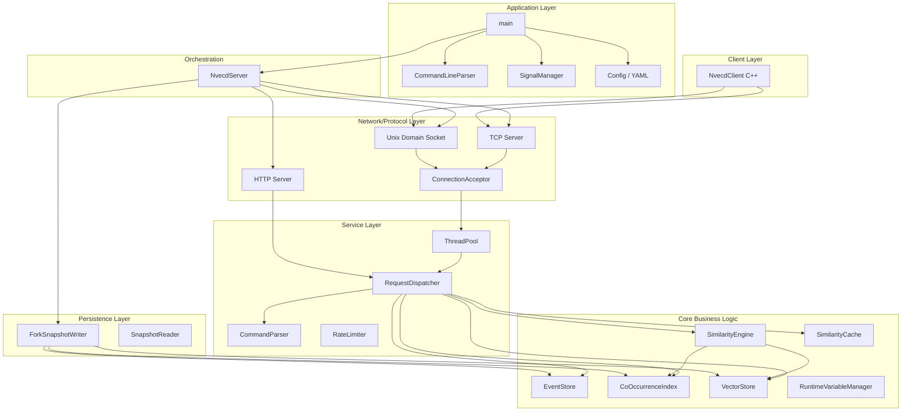
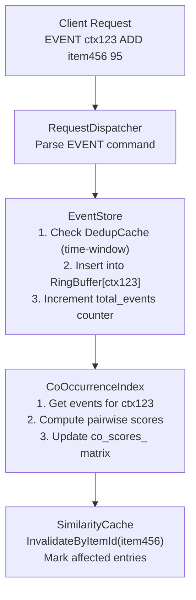
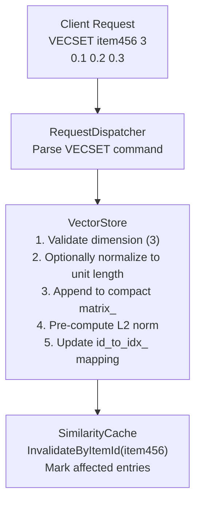
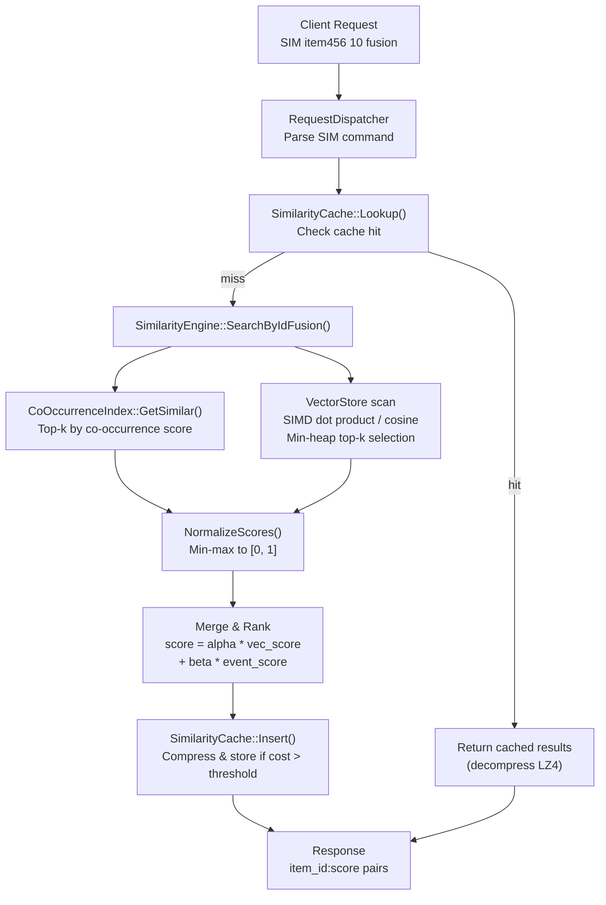
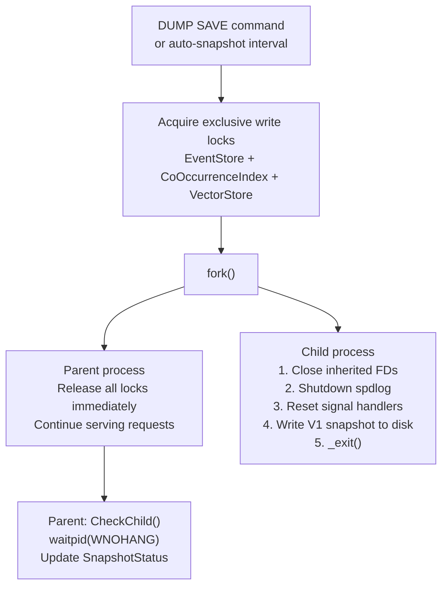
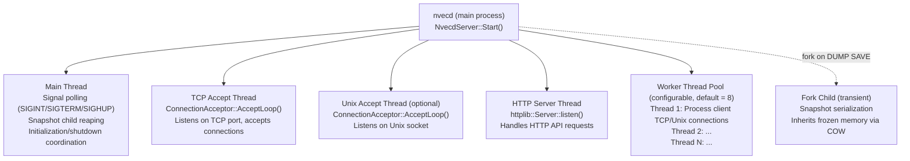
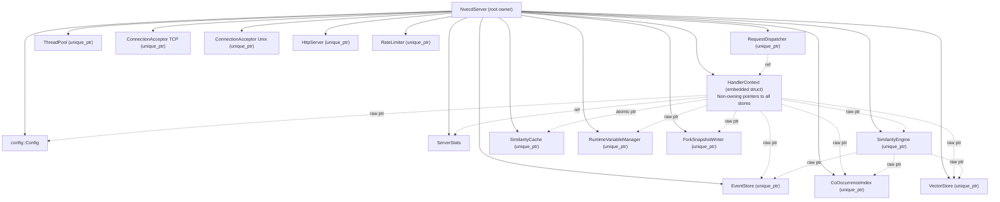

# Nvecd Architecture

**Version**: 1.0
**Last Updated**: 2025-03-25
**Project**: nvecd - In-memory vector search engine with event-based co-occurrence tracking

---

## Table of Contents

1. [Overview](#overview)
2. [System Architecture](#system-architecture)
3. [Component Responsibilities](#component-responsibilities)
4. [Data Flow](#data-flow)
5. [Thread Model](#thread-model)
6. [Component Ownership](#component-ownership)
7. [Key Design Patterns](#key-design-patterns)
8. [Performance Characteristics](#performance-characteristics)

---

## Overview

nvecd is a **C++17 in-memory vector search engine** that combines event-based co-occurrence tracking with high-dimensional vector similarity search. It provides a **fusion search** capability that merges behavioral signals (co-occurrence) with content signals (vector similarity) into a single ranked result set.

- **In-memory storage** with no disk I/O during queries
- **Event-based co-occurrence tracking** with per-context ring buffers
- **High-dimensional vector search** with SIMD-optimized distance computation
- **Fusion search** combining event and vector signals with configurable weights
- **Fork-based COW snapshots** (Redis BGSAVE style) for persistence without blocking

### Key Features

- **Event ingestion** with stream (ADD), state (SET), and deletion (DEL) semantics
- **Co-occurrence index** with exponential decay for temporal relevance
- **Vector storage** with compact contiguous layout and tombstone-based GC
- **Multiple search modes**: events-only, vectors-only, fusion, and ad-hoc vector query (SIMV)
- **SIMD acceleration**: AVX2, ARM NEON, and scalar fallback with runtime detection
- **LRU similarity cache** with selective invalidation via reverse index
- **Type-safe error handling** with `Expected<T, Error>`
- **TCP, HTTP, and Unix domain socket** APIs
- **Fork-based snapshots** with configurable COW or lock mode
- **Rate limiting** and AUTH-based access control
- **C++ client library** with PIMPL pattern

---

## System Architecture

### Layered Architecture



---

## Component Responsibilities

### Core Business Logic Layer

#### Event Module (`src/events/`)

**EventStore** (`event_store.h`)
- **Responsibility**: Per-context event storage using fixed-size ring buffers
- **Features**:
  - Ring buffer per context (user, session, etc.) with configurable capacity
  - Three event types: ADD (stream), SET (state), DEL (deletion)
  - Time-window deduplication for ADD events via `DedupCache`
  - Last-value deduplication for SET/DEL events via `StateCache`
  - Atomic counters for total and deduplicated event counts
  - `shared_mutex` for concurrent reads and exclusive writes
- **Thread Safety**: Multi-reader, single-writer via `shared_mutex`
- **Key Methods**:
  - `AddEvent(ctx, item_id, score, type)`: Insert event into context ring buffer
  - `GetEvents(ctx)`: Retrieve events in insertion order (oldest to newest)
  - `GetContextCount()`: Number of active contexts
  - `GetStatistics()`: Snapshot of event store metrics
  - `AcquireReadLock()` / `AcquireWriteLock()`: External lock access for snapshots

**CoOccurrenceIndex** (`co_occurrence_index.h`)
- **Responsibility**: Symmetric co-occurrence scoring matrix between items
- **Algorithm**:
  - For each context, computes pairwise scores: `score += event1.score * event2.score`
  - Symmetric storage: both `(A,B)` and `(B,A)` are maintained
  - Exponential decay (`ApplyDecay(alpha)`) to favor recent co-occurrences
- **Thread Safety**: Multi-reader, single-writer via `shared_mutex`
- **Key Methods**:
  - `UpdateFromEvents(ctx, events)`: Update pairwise scores from context events
  - `GetSimilar(item_id, top_k)`: Top-k items by co-occurrence score
  - `GetScore(item1, item2)`: Direct score lookup
  - `SetScore(item1, item2, score)`: Direct write (used by snapshot deserialization)
  - `ApplyDecay(alpha)`: Multiply all scores by decay factor

#### Vector Module (`src/vectors/`)

**VectorStore** (`vector_store.h`)
- **Responsibility**: Thread-safe storage for high-dimensional vectors with compact contiguous layout
- **Storage Design**:
  - Single source of truth: contiguous `float[]` matrix (`matrix_`) + pre-computed L2 norms (`norms_`)
  - ID mapping: `id_to_idx_` (string to row index) and `idx_to_id_` (row index to string)
  - Tombstone-based deletion with automatic defragmentation at 25% fragmentation
  - Dimension is locked after the first vector is stored
- **Thread Safety**: Multi-reader, single-writer via `shared_mutex`
- **Key Methods**:
  - `SetVector(id, vec, normalize)`: Store vector (validates dimension consistency)
  - `GetVector(id)`: Retrieve vector by ID
  - `DeleteVector(id)`: Mark slot as tombstone
  - `GetCompactSnapshot()`: Pointer-based snapshot for lock-free batch reads
  - `GetMatrixRow(idx)` / `GetNorm(idx)`: Direct access for SIMD kernels
  - `Defragment()`: Rebuild compact storage removing tombstones

**Distance Functions** (`distance.h`, `distance_simd.h`)
- **Responsibility**: SIMD-optimized vector distance computation
- **Metrics**: Dot Product, Cosine Similarity, L2 Distance
- **Implementations**: AVX2 (x86), ARM NEON, scalar fallback
- **Selection**: Runtime CPU feature detection via `GetOptimalImpl()`
- **Optimizations**: Unrolled kernels, pre-computed norms for cosine, prefetch hints

#### Similarity Module (`src/similarity/`)

**SimilarityEngine** (`similarity_engine.h`)
- **Responsibility**: Unified similarity search across multiple modalities
- **Search Modes**:
  - **Events**: Co-occurrence-based via `CoOccurrenceIndex::GetSimilar()`
  - **Vectors**: Distance-based via compact storage scan with SIMD
  - **Fusion**: Weighted combination: `score = alpha * vector_score + beta * event_score`
  - **Vector Query (SIMV)**: Search by arbitrary vector (not required to be stored)
- **Features**:
  - Min-max score normalization for fusion
  - Configurable fusion weights (`alpha`, `beta`)
  - Approximate search via random sampling (`sample_size` config)
  - Pre-filtered vector search using event candidate set
- **Thread Safety**: All methods are thread-safe (delegates to thread-safe components)
- **Key Methods**:
  - `SearchByIdEvents(item_id, top_k)`: Events-only search
  - `SearchByIdVectors(item_id, top_k)`: Vectors-only search
  - `SearchByIdFusion(item_id, top_k)`: Fusion search
  - `SearchByVector(query_vector, top_k)`: Ad-hoc vector query

#### Cache Module (`src/cache/`)

**SimilarityCache** (`similarity_cache.h`)
- **Responsibility**: LRU cache for similarity search results with selective invalidation
- **Features**:
  - Memory-bounded LRU eviction
  - TTL-based expiration (configurable, 0 = disabled)
  - Minimum query cost threshold (only cache expensive queries)
  - LZ4 compression for cached results via `ResultCompressor`
  - Reverse index: `item_id` to `CacheKey` set for O(k) selective invalidation
  - Lock-free invalidation flag per entry (`atomic<bool>`)
  - Enable/disable at runtime
- **Thread Safety**: `shared_mutex` for concurrent lookups and exclusive modifications
- **Key Methods**:
  - `Lookup(key)`: Cache lookup (returns decompressed results or nullopt)
  - `Insert(key, results, query_cost_ms)`: Insert with cost-based admission
  - `InvalidateByItemId(item_id)`: Selective invalidation via reverse index
  - `PurgeExpired()`: Remove TTL-expired entries (background callable)
  - `GetStatistics()`: Thread-safe statistics snapshot

---

### Network/Protocol Layer (`src/server/`)

#### NvecdServer (`nvecd_server.h`)

- **Responsibility**: Main server orchestrator; owns all components
- **Design Pattern**: Facade + Lifecycle Manager
- **Lifecycle**:
  1. Load configuration
  2. Initialize core stores (EventStore, CoOccurrenceIndex, VectorStore)
  3. Initialize SimilarityEngine, SimilarityCache, RuntimeVariableManager
  4. Create RequestDispatcher with HandlerContext
  5. Start ThreadPool
  6. Start TCP ConnectionAcceptor (and optional Unix socket acceptor)
  7. Start HTTP server (if enabled)
  8. Start ForkSnapshotWriter (if enabled)
- **Shutdown**: Reverse order; stops acceptors, drains thread pool, destroys stores

#### ConnectionAcceptor (`connection_acceptor.h`)

- **Responsibility**: Socket accept loop and connection dispatch
- **Features**:
  - TCP and Unix domain socket modes
  - `SO_REUSEADDR`, `SO_KEEPALIVE` socket options
  - Per-IP connection limits
  - Dispatches accepted connections to ThreadPool
  - Thread-safe connection tracking with `mutex` + `set<int>`

#### HTTP Server (`http_server.h`)

- **API**: RESTful JSON via cpp-httplib
- **Endpoints**:
  - `POST /event`: Register co-occurrence event
  - `POST /vecset`: Register vector
  - `POST /sim`: ID-based similarity search
  - `POST /simv`: Vector-based similarity search
  - `GET /info`: Server information
  - `GET /health`, `/health/live`, `/health/ready`, `/health/detail`: Health checks
  - `GET /config`: Configuration summary
  - `GET /metrics`: Prometheus-format metrics
  - `POST /dump/save`, `/dump/load`, `/dump/verify`, `/dump/info`: Snapshot management
  - `POST /debug/on`, `/debug/off`: Debug mode toggle
  - `GET /cache/stats`, `POST /cache/clear`: Cache management
- **Features**: CORS support, CIDR-based access control, Kubernetes-ready probes

#### RequestDispatcher (`request_dispatcher.h`)

- **Responsibility**: Command parsing and routing (pure application logic, no I/O)
- **Supported Commands**:
  - nvecd-specific: EVENT, VECSET, SIM, SIMV
  - MygramDB-compatible: INFO, CONFIG (HELP/SHOW/VERIFY), DUMP (SAVE/LOAD/VERIFY/INFO/STATUS), DEBUG (ON/OFF)
  - Administrative: AUTH, SET, GET, SHOW VARIABLES
- **Design**: No network dependencies; easy to unit test

#### ThreadPool (`thread_pool.h`)

- **Workers**: Fixed count (default = CPU count)
- **Queue**: Bounded task queue with backpressure
- **Shutdown**: Graceful; waits for all tasks to complete
- **Thread Safety**: Thread-safe task submission via `condition_variable`

#### RateLimiter (`rate_limiter.h`)

- **Algorithm**: Token bucket per client IP
- **Configuration**: Burst capacity, refill rate, maximum tracked clients
- **Features**: Automatic cleanup of stale client entries

---

### Persistence Layer (`src/storage/`)

#### ForkSnapshotWriter (`snapshot_fork.h`)

- **Responsibility**: Non-blocking snapshot persistence using `fork()` + OS copy-on-write
- **Design**: Redis BGSAVE style
- **Pre-fork Barrier**:
  1. Acquires exclusive write locks on all stores (EventStore, CoOccurrenceIndex, VectorStore)
  2. Calls `fork()` while locks are held
  3. Parent releases locks immediately after fork
- **Child Process**:
  1. Closes inherited file descriptors
  2. Shuts down spdlog
  3. Resets signal handlers
  4. Serializes all stores to V1 snapshot format
  5. Calls `_exit()` (never `exit()`)
- **Status Tracking**: `SnapshotStatus` enum (kIdle, kInProgress, kCompleted, kFailed) with `mutex`-protected result
- **Reaping**: `CheckChild()` uses `waitpid(WNOHANG)` for non-blocking child status check

#### Snapshot Format

- **Version**: V1 binary format
- **Content**: Configuration, EventStore state, CoOccurrenceIndex scores, VectorStore matrix
- **Operations**: Save, Load, Verify (integrity check), Info (metadata inspection)
- **Modes**: `"fork"` (COW, non-blocking) or `"lock"` (global write lock, blocking)

---

### Configuration & Utilities

#### Config Module (`src/config/config.h`)

- **Format**: YAML-based via yaml-cpp
- **Sections**:
  - `events`: Ring buffer size, decay interval/alpha, dedup window/cache size
  - `vectors`: Default dimension, distance metric (cosine/dot/l2)
  - `similarity`: Default/max top_k, fusion alpha/beta, sample size
  - `snapshot`: Directory, filename, interval, retention count, mode (fork/lock)
  - `api.tcp`: Bind address, port (default 11017)
  - `api.http`: Enable flag, bind, port (default 8080), CORS
  - `api.unix_socket`: Path (empty = disabled)
  - `api.rate_limiting`: Enable, capacity, refill rate, max clients
  - `perf`: Thread pool size, max connections, connection timeout
  - `network`: Allowed CIDR ranges
  - `logging`: Level, JSON mode, file path
  - `cache`: Enabled, max memory, min query cost, TTL, compression
  - `security`: Required password (requirepass)
- **Validation**: `ValidateConfig()` returns `Expected<void, Error>` with specific error codes

#### RuntimeVariableManager (`src/config/runtime_variable_manager.h`)

- **Responsibility**: Runtime variable management (SET/GET/SHOW VARIABLES commands)
- **Features**: Live reconfiguration of cache TTL, min query cost, etc.

#### Error Handling (`src/utils/`)

**expected.h**
- **Type**: C++17-compatible `Expected<T, E>` (future C++23 `std::expected`)
- **Benefits**: Type-safe error propagation without exceptions

**error.h**
- **Error Code Ranges**:

| Range | Module |
|-------|--------|
| 0-999 | General errors |
| 1000-1999 | Configuration errors |
| 2000-2999 | Event processing errors |
| 3000-3999 | Command parsing errors |
| 4000-4999 | Vector/Similarity errors |
| 5000-5999 | Storage/Snapshot errors |
| 6000-6999 | Network/Server errors |
| 7000-7999 | Client errors |
| 8000-8999 | Cache errors |

#### Observability

**ServerStats** (`server_types.h`)
- **Metrics**: Atomic counters aligned to cache-line boundaries
  - Total/active connections
  - Total/failed commands
  - Per-command counters (EVENT, SIM, VECSET, INFO, CONFIG, DUMP, CACHE)
  - Uptime and QPS computation

**StructuredLog** (`structured_log.h`)
- **Format**: Event-based structured logging via spdlog
- **Benefits**: Machine-parseable log entries for monitoring

---

### Client Layer (`src/client/`)

#### NvecdClient (`nvecdclient.h`)

- **Responsibility**: High-level C++ client for nvecd protocol
- **Design**: PIMPL pattern for ABI stability
- **Connection**: TCP or Unix domain socket
- **Commands**:
  - `Event(ctx, type, id, score)`: Register event
  - `Vecset(id, vector)`: Register vector
  - `Sim(id, top_k, mode)`: ID-based similarity search
  - `Simv(vector, top_k, mode)`: Vector-based similarity search
  - `Info()`: Server information
  - `GetConfig()`: Configuration retrieval
  - `Save()` / `Load()` / `Verify()` / `DumpInfo()`: Snapshot management
  - `EnableDebug()` / `DisableDebug()`: Debug mode
  - `SendCommand(raw)`: Low-level raw command interface

---

## Data Flow

### Event Ingestion



### Vector Registration



### Similarity Search (Fusion Mode)



### Snapshot (Fork-based COW)



---

## Thread Model

### Process Structure



### Thread Safety Patterns

| Component | Concurrency | Mechanism |
|-----------|-------------|-----------|
| **EventStore** | Multi-reader, single-writer | `shared_mutex` |
| **CoOccurrenceIndex** | Multi-reader, single-writer | `shared_mutex` |
| **VectorStore** | Multi-reader, single-writer | `shared_mutex` |
| **SimilarityCache** | Multi-reader, concurrent invalidation | `shared_mutex` + `atomic<bool>` per entry |
| **ServerStats** | Wait-free | `atomic<uint64_t>` with cache-line alignment |
| **ConnectionAcceptor** | Accept thread + main thread | `mutex` + `set<int>` |
| **ForkSnapshotWriter** | Status queries from any thread | `mutex` on `SnapshotResult` |
| **ThreadPool** | Multi-producer, multi-consumer | `mutex` + `condition_variable` |

### Concurrency Guarantees

**Shared Mutable State Protected By:**

1. **EventStore**: `shared_mutex`
   - Readers: Multiple concurrent `GetEvents()`, `GetStatistics()` queries
   - Writers: Single writer via `AddEvent()` (serialized by unique_lock)

2. **CoOccurrenceIndex**: `shared_mutex`
   - Readers: `GetSimilar()`, `GetScore()` for similarity searches
   - Writers: `UpdateFromEvents()`, `ApplyDecay()`, `SetScore()`

3. **VectorStore**: `shared_mutex`
   - Readers: `GetVector()`, `GetCompactSnapshot()`, SIMD scan via `GetMatrixRow()`
   - Writers: `SetVector()`, `DeleteVector()`, `Defragment()`

4. **SimilarityCache**: `shared_mutex` + per-entry `atomic<bool>`
   - Readers: `Lookup()` with shared lock
   - Writers: `Insert()`, `Erase()`, `InvalidateByItemId()` with unique lock
   - Lock-free: Invalidation flag check on cached entries

5. **ServerStats**: `atomic<uint64_t>` (lock-free)
   - All counters use `fetch_add` with relaxed memory order
   - Cache-line aligned to prevent false sharing

---

## Component Ownership

### Ownership Hierarchy



### Resource Lifecycle

**NvecdServer Initialization Order** (in `InitializeComponents()`):

1. **EventStore** (depends on `EventsConfig`)
2. **CoOccurrenceIndex** (no dependencies)
3. **VectorStore** (depends on `VectorsConfig`)
4. **SimilarityEngine** (depends on EventStore, CoOccurrenceIndex, VectorStore)
5. **SimilarityCache** (depends on `CacheConfig`)
6. **RuntimeVariableManager** (depends on SimilarityCache)
7. **HandlerContext** (wired with pointers to all above)
8. **RequestDispatcher** (depends on HandlerContext)
9. **ThreadPool** (depends on `PerformanceConfig`)
10. **RateLimiter** (optional, depends on `ApiConfig`)
11. **ConnectionAcceptor** for TCP (depends on ThreadPool)
12. **ConnectionAcceptor** for Unix socket (optional, depends on ThreadPool)
13. **ForkSnapshotWriter** (no store dependencies at construction)
14. **HttpServer** (optional, depends on HandlerContext)

**Shutdown Order** (reverse of initialization):

1. **HTTP server** shutdown (if running)
2. **Unix acceptor** stop (if running)
3. **TCP acceptor** stop
4. **ThreadPool** shutdown (drain pending tasks)
5. **ForkSnapshotWriter** wait for child (if snapshot in progress)
6. **All unique_ptrs** destroyed in reverse declaration order

### RAII Patterns

1. **`unique_ptr` for ownership**: All components owned by NvecdServer
2. **`shared_mutex` for read/write coordination**: EventStore, CoOccurrenceIndex, VectorStore, SimilarityCache
3. **`atomic<T>` for lock-free stats**: ServerStats counters, cache invalidation flags
4. **`AcquireReadLock()` / `AcquireWriteLock()`**: Explicit lock access for cross-component consistency (snapshots)
5. **PIMPL for ABI stability**: NvecdClient uses `unique_ptr<Impl>`
6. **Fork child cleanup**: `_exit()` in child, `waitpid()` in parent, SIGTERM on timeout

---

## Key Design Patterns

### Error Handling: Expected<T, Error>

```cpp
Expected<std::vector<SimilarityResult>, Error> result =
    engine.SearchByIdFusion("item123", 10);
if (result) {
    for (const auto& r : *result) {
        std::cout << r.item_id << ": " << r.score << std::endl;
    }
} else {
    spdlog::error("Search failed: {}", result.error().message());
}
```

**Advantages:**
- Type-safe: Compile-time error checking
- No exceptions: Predictable performance in hot paths
- Composable: Chain operations with early return on error

### Resource Management: RAII

```cpp
class NvecdServer {
    std::unique_ptr<events::EventStore> event_store_;
    std::unique_ptr<events::CoOccurrenceIndex> co_index_;
    std::unique_ptr<vectors::VectorStore> vector_store_;
    std::unique_ptr<similarity::SimilarityEngine> similarity_engine_;
    std::unique_ptr<cache::SimilarityCache> cache_;
    // ...

    ~NvecdServer() {
        Stop();
        // Destructor automatically cleans up all unique_ptrs
        // in reverse order of declaration
    }
};
```

### Thread Safety: shared_mutex + Atomic

```cpp
class VectorStore {
    mutable std::shared_mutex mutex_;
    std::vector<float> matrix_;

    std::optional<Vector> GetVector(const std::string& id) const {
        std::shared_lock lock(mutex_);  // Multiple readers
        // ...
    }

    Expected<void, Error> SetVector(const std::string& id,
                                     const std::vector<float>& vec) {
        std::unique_lock lock(mutex_);  // Exclusive writer
        // ...
    }
};

struct ServerStats {
    alignas(64) std::atomic<uint64_t> total_commands{0};

    void IncrementCommands() {
        total_commands.fetch_add(1, std::memory_order_relaxed);
    }
};
```

### Fork-based COW Snapshots

```cpp
// Parent process: minimal blocking
auto lock_es = event_store.AcquireWriteLock();
auto lock_co = co_index.AcquireWriteLock();
auto lock_vs = vector_store.AcquireWriteLock();
pid_t pid = fork();  // OS copies page tables, not data
if (pid == 0) {
    // Child: serialize frozen memory to disk
    WriteSnapshotV1(filepath, config, event_store, co_index, vector_store);
    _exit(0);
}
// Parent: release locks immediately, continue serving
```

**Benefits:**
- Near-zero downtime: Parent blocks only during `fork()` syscall
- Memory efficient: OS COW pages; only modified pages are duplicated
- Consistent: Child sees a frozen point-in-time snapshot

### Dependency Injection: HandlerContext

```cpp
struct HandlerContext {
    events::EventStore* event_store;
    events::CoOccurrenceIndex* co_index;
    vectors::VectorStore* vector_store;
    similarity::SimilarityEngine* similarity_engine;
    std::atomic<cache::SimilarityCache*> cache;
    config::RuntimeVariableManager* variable_manager;
    ServerStats& stats;
    const config::Config* config;
    // ...
};
```

**Benefits:**
- Decouples RequestDispatcher from component creation
- Testable: Inject mock dependencies
- Centralized wiring: All pointers set once in NvecdServer::InitializeComponents()

### Compact Contiguous Storage

```cpp
class VectorStore {
    std::vector<float> matrix_;  // [n x dim] contiguous array
    std::vector<float> norms_;   // [n] pre-computed L2 norms
    std::vector<bool> deleted_;  // Tombstone flags

    const float* GetMatrixRow(size_t idx) const {
        return matrix_.data() + idx * dimension_;
    }
};
```

**Benefits:**
- Cache-friendly: Sequential memory access for SIMD scan
- Pre-computed norms: Avoids redundant computation in cosine similarity
- Tombstone GC: Defers compaction to reduce write amplification

---

## Performance Characteristics

### Vector Search Performance

- **SIMD acceleration**: AVX2 (8-wide float), NEON (4-wide float), with unrolled loops
- **Compact storage**: Contiguous `float[]` matrix enables sequential SIMD scan
- **Pre-computed norms**: Cosine similarity avoids per-query norm computation
- **Min-heap top-k**: O(n log k) selection without full sort
- **Prefetch hints**: Memory prefetch for next vector during distance computation
- **Approximate search**: Random sampling reduces scan scope (configurable `sample_size`)

### Event Processing Performance

- **Ring buffers**: O(1) insertion with fixed memory per context
- **Time-window deduplication**: LRU cache prevents duplicate event processing
- **Pairwise co-occurrence**: O(k^2) per context where k is ring buffer size (bounded)
- **Exponential decay**: O(n) scan with configurable interval

### Cache Performance

- **LRU eviction**: Memory-bounded with configurable maximum
- **LZ4 compression**: Reduces memory footprint of cached results
- **Selective invalidation**: Reverse index enables O(k) invalidation instead of O(n) clear
- **Cost-based admission**: Only caches queries above minimum cost threshold
- **TTL expiration**: Background-purgeable stale entries

### Concurrency Performance

- **Multi-reader/single-writer**: `shared_mutex` maximizes read throughput
- **Lock-free stats**: `atomic` counters with cache-line alignment prevent false sharing
- **Fork-based snapshots**: Near-zero write pause (only `fork()` syscall is blocking)
- **Thread pool**: Fixed workers with bounded queue and backpressure

### Memory Efficiency

- **Compact vector storage**: Single contiguous matrix instead of per-vector allocations
- **Tombstone GC**: Automatic defragmentation at 25% fragmentation threshold
- **Ring buffers**: Fixed-size per context prevents unbounded memory growth
- **Cache compression**: LZ4 on cached results reduces memory by approximately 50-70%

---

## Protocol Reference

### TCP Protocol

Text-based protocol with `\r\n` delimiters.

**nvecd-specific commands:**

| Command | Syntax | Description |
|---------|--------|-------------|
| EVENT | `EVENT <ctx> <type> <id> <score>` | Register co-occurrence event |
| VECSET | `VECSET <id> <dim>\r\n<v1> <v2> ...` | Register vector (multi-line) |
| SIM | `SIM <id> <top_k> [mode]` | Similarity search by ID |
| SIMV | `SIMV <dim> <top_k> [mode]\r\n<v1> <v2> ...` | Similarity search by vector |

**MygramDB-compatible commands:**

| Command | Syntax | Description |
|---------|--------|-------------|
| INFO | `INFO` | Server information |
| CONFIG | `CONFIG SHOW\|HELP\|VERIFY` | Configuration management |
| DUMP | `DUMP SAVE\|LOAD\|VERIFY\|INFO\|STATUS [path]` | Snapshot management |
| DEBUG | `DEBUG ON\|OFF` | Debug mode toggle |
| AUTH | `AUTH <password>` | Authenticate connection |

---

## References

- [MygramDB Architecture](../../../mygram-db/docs/en/architecture.md) - Reference architecture
- `src/utils/expected.h` - Expected<T, E> implementation
- `src/utils/error.h` - Error codes and Error class
- `src/utils/structured_log.h` - Structured logging
