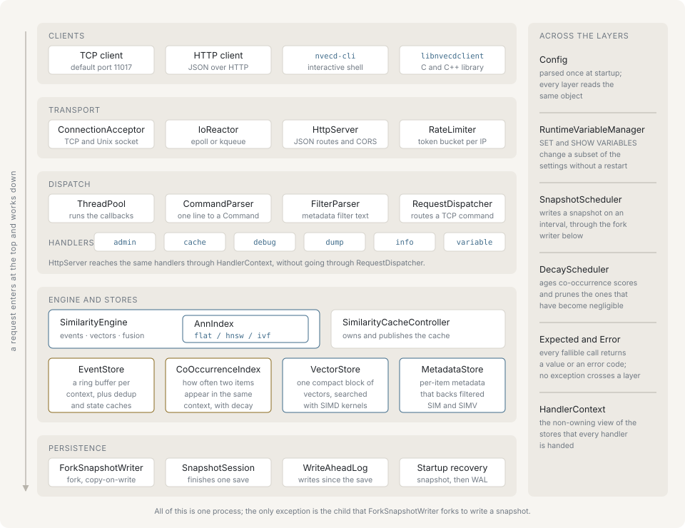
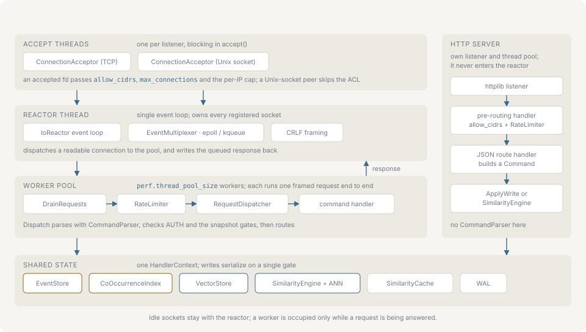
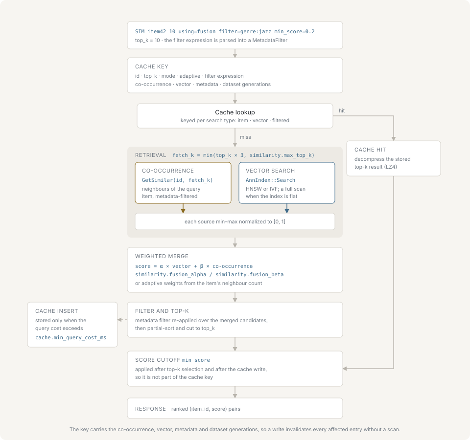
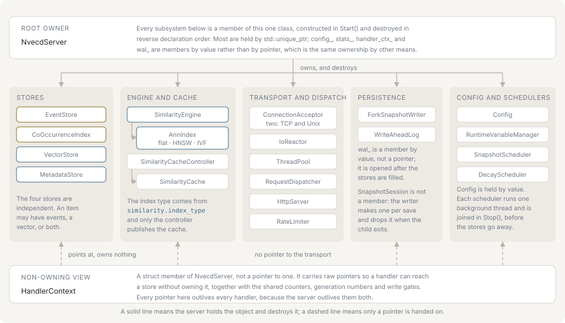

# Architecture

nvecd is a single process holding all of its data in memory, serving two protocol surfaces over one set of stores. This page describes the layers, the path a request takes through them, the locks that hold the whole thing together, and who owns what.

## Layer map

**Network.** `ConnectionAcceptor` runs an accept loop per listener — one for TCP, optionally one for a Unix domain socket. `IoReactor` is a single level-triggered event loop that owns every accepted descriptor; `reactor/event_multiplexer` is the portable readiness backend behind it, and `ReactorConnection` holds the per-client buffers and write queue. `ConnectionIOHandler` does the framing. `ThreadPool` runs command execution off the event loop. `HttpServer` is a separate listener with its own worker threads, exposing the same commands as JSON routes. `RateLimiter` is an optional per-client token bucket in front of both.

**Dispatch.** `command_parser` turns a request line into a `Command`. `RequestDispatcher` authenticates, checks the lifecycle gates, and routes. Handlers under `src/server/handlers/` own the non-query commands: `info_handler`, `admin_handler`, `debug_handler`, `dump_handler`, `cache_handler`, `variable_handler`. `filter_parser` turns a `filter=` expression into a `MetadataFilter`.

**Domain.** `EventStore` holds a bounded ring of recent events per context. `CoOccurrenceIndex` holds the item-to-item associations derived from them. `VectorStore` holds the vectors. `MetadataStore` holds the per-item attributes a filter matches against. `SimilarityEngine` reads all four and answers co-occurrence, vector and fusion searches; it also owns the ANN index.

**ANN index.** `AnnIndex` is the interface, with `HnswIndex` and `IvfIndex` behind it, selected by `similarity.index_type` (`flat`, `hnsw`, `ivf`) through `ann_index_factory`. The index is **owned by `SimilarityEngine`, not by `VectorStore`** — the store holds vectors, the engine holds the structure that searches them.

**Cache.** `SimilarityCacheController` owns the cache instance for the process lifetime and is the single place that enables, disables, publishes and tunes it. `SimilarityCache` is the LRU itself, with `cache_key_generator` deriving keys, `result_compressor` compressing stored entries, and a reverse index from item ID to the cache keys that mention it.

**Storage.** `WriteAheadLog` records each mutation. `snapshot_fork` and `snapshot_lock` are the two ways of writing a snapshot; `snapshot_session` owns the durability handshake both share; `snapshot_format_v1` is the on-disk format. `wal_codec` encodes a `Command` into a WAL payload and back. Reading a snapshot is done by free functions — `ReadSnapshotV1`, `VerifySnapshotIntegrity`, `GetSnapshotInfo` — with no reader class.

**Schedulers.** `SnapshotScheduler` takes periodic fork snapshots and enforces retention. `DecayScheduler` applies exponential decay to the co-occurrence index and prunes negligible entries.

The storage layer is covered in full by [Persistence](./persistence.md).

## Request path

The reactor and the thread pool are both always in the path; it is not a choice between them.

1. **Accept.** The acceptor's own thread accepts a socket, checks the connection limits and the allowed CIDRs, and hands the descriptor to the reactor. Registration is what transfers ownership of the descriptor: if it fails, the acceptor is still the sole closer; if it succeeds, the reactor is.
2. **Wait.** The socket now lives in the event loop, not on a thread. An idle connection costs a map entry, and the loop reaps connections that exceed the idle timeout.
3. **Read.** When the loop sees a readable descriptor, the connection reads and accumulates bytes against a per-connection framing limit and a process-wide budget for buffered, unprocessed bytes.
4. **Execute.** Once a complete request is framed, the connection submits it to `ThreadPool`. **This is the thread boundary:** everything up to here ran on the event loop thread, everything after runs on a pool worker.
5. **Dispatch.** On the worker, the request goes through the rate limiter, is parsed, is checked against the authentication requirement and the lifecycle gates, and reaches its handler.
6. **Respond.** The response is queued back on the connection. If the socket cannot take it all, the reactor arms for writability and drains the remainder on the loop thread.

The HTTP surface runs its own listener and its own worker threads and does not go through the reactor. It converges at the same point: it builds the same `Command` and calls the same write path and the same engine, sharing the stores, the cache and the generation counters with the TCP surface.

## Read path

A fusion `SIM` takes this path.

1. **Parse the filter.** A `filter=` argument becomes a `MetadataFilter`. Its presence changes the cache's search-type classification, since filtered and unfiltered results are not interchangeable.
2. **Check the cache.** The key is derived from the query ID, `top_k`, the mode, the adaptive flag, the filter expression, and four generation counters: the co-occurrence generation, the vector generation, the metadata generation and the dataset generation. Because a generation is part of the key, a mutation that bumps one makes every affected key unreachable rather than requiring the old entries to be found and deleted. On a hit the result is returned directly, with `min_score` applied on the way out.
3. **Run both signals.** The engine oversamples — three times the requested `top_k`, clamped to `similarity.max_top_k` — and runs the co-occurrence search and the vector search independently over the full store. They are additive, not an intersection: an item that is content-similar but has never co-occurred still surfaces.
4. **Weight.** With adaptive fusion the blend weight comes from the query item's true neighbor count in the co-occurrence index, not from the truncated result list, so a small `top_k` cannot make a mature item look new. Otherwise the configured `fusion_alpha` and `fusion_beta` apply.
5. **Normalize and blend.** Each source's scores are normalized before the weighted sum, so the two scales do not have to be comparable. If one source has no candidates, its weight does not shrink the other's contribution. If one source fails, the query still answers on the surviving signal and the failure is logged.
6. **Filter and store.** The metadata filter is applied, the result is measured, and it is inserted into the cache — but only if the cache is still the published instance and all four generation counters still hold the values captured at step 2. A result computed against state that has since changed is discarded rather than cached.

The scoring itself is covered by [Fusion](./fusion.md).

## Concurrency model

**Locks that exist.**

| Lock | Protects |
|---|---|
| One `shared_mutex` per store | The contents of `EventStore`, `CoOccurrenceIndex`, `VectorStore`, `MetadataStore` — one each |
| `snapshot_write_gate` (`shared_mutex`) | The point-in-time boundary of a snapshot |
| `write_serialization_gate` (`mutex`) | A mutation together with its WAL append, and the generation counters |
| `SimilarityCache::mutex_` (`shared_mutex`) | The LRU list, the entry map and the reverse index |
| `SimilarityEngine::ann_publication_mutex_` (`shared_mutex`) | The ANN label mapping published alongside a vector-store generation |
| `IoReactor::connections_mutex_` | The reactor's descriptor tables |

**Lock order.** A request that mutates state takes `snapshot_write_gate` shared, then `write_serialization_gate`, then a store's own lock. A snapshot or a `DUMP LOAD` takes `snapshot_write_gate` exclusively and then `write_serialization_gate`. The order is the same in both directions, which is what makes them safe against each other. Within the stores the order is fixed as event store, co-occurrence index, vector store, metadata store, and both snapshot modes acquire all four at once in that order.

**What `shared_mutex` buys.** A store's own lock is what makes concurrent reads possible: any number of `SIM` queries read the vector store at the same time, and a `VECSET` excludes them for the duration of the insert. The two server-wide gates are not about the stores' internal consistency — they exist so that a snapshot's point-in-time boundary is real, and so that WAL order matches dependency order across both protocol surfaces.

**Where atomics replace a lock.** Counters that only need to be monotonic use atomics with relaxed ordering: the per-command statistics, the connection counts, the cache's hit and miss counters. The four generation counters and the lifecycle flags (`loading`, `read_only`) are atomics with acquire/release ordering, because a reader must see the state the writer published before bumping them. The published cache pointer is an atomic so that enabling or disabling the cache never requires a lock on the query path. A cache entry's invalidation flag is an atomic so it can be set without taking the cache's write lock.

**What a reader is promised during a concurrent write.** Each store gives a reader a consistent view of *that store*. A query that touches the co-occurrence index and the vector store takes their locks separately, so it can observe a write that landed in one but not yet in the other. Fusion is defined so that this is harmless: the two signals are independent, normalized separately, and a source with no candidate contributes nothing rather than a wrong value.

Consistency across all four stores at once exists only under the snapshot gate. That is what a snapshot needs and what a query does not.

## Ownership and lifetime

`NvecdServer` is the single root owner. Every component is a `unique_ptr` member of it, except the WAL, which is a direct member. Nothing else owns anything: `SimilarityEngine` holds raw pointers to the stores, `SnapshotScheduler` and `DecayScheduler` hold raw pointers to what they operate on, and `HandlerContext` is a struct of non-owning pointers plus references to the server's statistics and lifecycle flags. A handler receives the context and can reach everything without owning any of it.

The one exception is the ANN index, which `SimilarityEngine` owns outright.

**Construction order** is forced by those pointers. The stores come first, because the engine takes their addresses. Then the engine, then the cache controller (which publishes its cache pointer into the handler context), then the runtime variable manager (which needs the controller). Only then is the handler context filled in and the dispatcher built on it. Recovery — snapshot load and WAL replay — runs after the stores exist and before the schedulers start, and the WAL pointer is published into the handler context only after replay finishes. The network stack comes last: thread pool, reactor, acceptors, then the HTTP server.

**Shutdown order** is the reverse, and each step exists to keep a pointer valid until its last user is gone.

1. The schedulers stop, so nothing starts a new snapshot or decay pass.
2. Any in-flight fork child is waited for, within the configured shutdown budget.
3. The HTTP server stops, then the acceptors, so no new connection is admitted.
4. The reactor stops, unregistering every client while the server state its close callbacks touch is still valid.
5. Active connections are given the shutdown timeout to finish.
6. The thread pool is shut down, and this wait is deliberately unbounded: queued tasks hold raw pointers to the stores, and returning while a worker is still running would let it read freed memory. The acceptors and reactor are already stopped, so no new task can arrive and the queue is finite.
7. The WAL is closed last, which flushes pending writes and joins its background fsync thread. By then every surface that could append is stopped.

The WAL is declared last among the members so that destruction reaches it first, after the schedulers that reference it have been stopped.

## Error model

Every fallible operation returns `Expected<T, Error>`. There are no exceptions on the request path; a failure is a value that propagates up to whichever layer knows how to turn it into a response. `Error` carries a code, a message and an optional context string — for a storage failure, the file path.

`ErrorCode` is partitioned by module, and a code's numeric range identifies where it came from:

| Range | Module |
|---|---|
| 0–999 | General |
| 1000–1999 | Configuration |
| 2000–2999 | Event processing |
| 3000–3999 | Command parsing |
| 4000–4999 | Vector and similarity |
| 5000–5999 | Storage and snapshot |
| 6000–6999 | Network and server |
| 7000–7999 | Client |
| 8000–8999 | Cache |

On the TCP surface an error becomes `ERROR <message>`. On the HTTP surface it becomes a JSON body with an HTTP status derived from the code. Some conditions are answered before a handler is reached and carry a distinct prefix: `NOAUTH` for an unauthenticated privileged command, `LOADING` while a `DUMP LOAD` is publishing, `READONLY` while a lock-mode snapshot holds the write gate.
