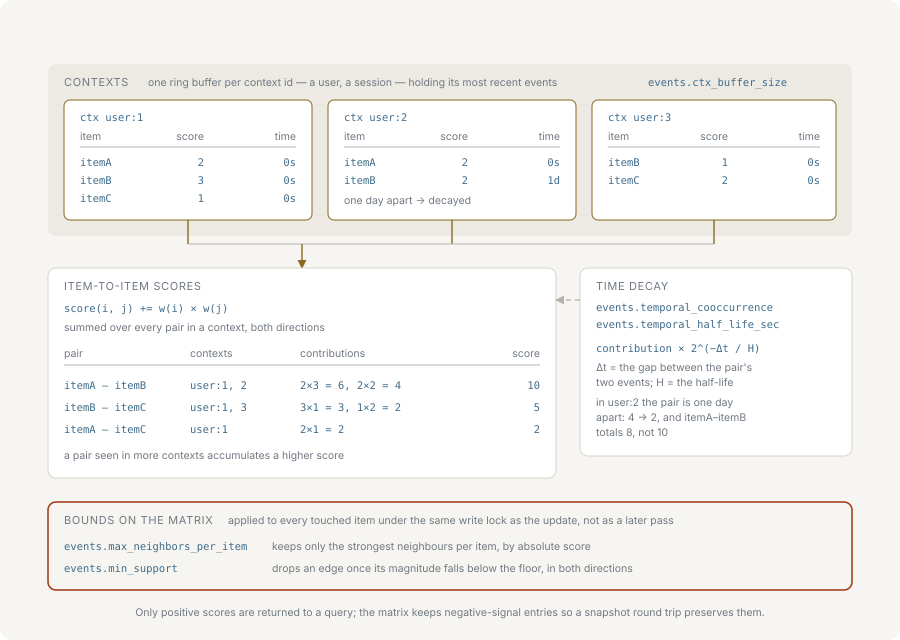
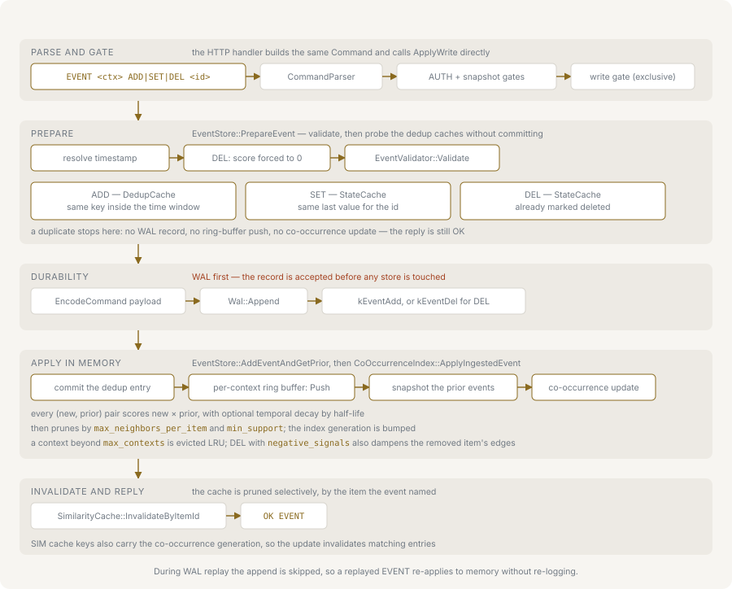

# Events and co-occurrence

nvecd derives item-to-item association from behaviour: items that appear in the
same context are treated as related, and the strength of that relation is a
score that accumulates over time. This page covers what a context is, what the
three event verbs mean, how the pairwise score is computed, and what the
retention bounds discard.



Command syntax is listed in full in [protocol.md](./protocol.md); every key named
here is described alongside its range in [configuration.md](./configuration.md).

## Contexts

A context is the grouping key of an `EVENT` command — its first argument. Every
event carries one, and two events count as co-occurring only when they are in
the same context and both are present in that context's buffer at the moment the
later one arrives.

A context is an opaque identifier. What it should be depends on what "related"
means for the workload: a user ID groups items one person interacted with, a
session ID groups items seen in one visit, an order ID groups items bought
together. Narrower contexts produce sharper associations from fewer events;
wider ones accumulate faster but blur unrelated interests together. Contexts do
not nest and are not enumerated at query time — the co-occurrence index they feed
is global, so `SIM` never takes a context argument.

An identifier may not be empty and may not contain a space, a control character
or `0x7F`; bytes at or above `0x80` are accepted, so UTF-8 identifiers work. The
same rule applies to item IDs.

## The three verbs

```bash
EVENT user1 ADD item42 80
EVENT user1 SET item42 100
EVENT user1 DEL item42
```

Each returns `OK EVENT`. All three accept a trailing `timestamp=<unix_seconds>`;
without it the server stamps the event with its own clock.

`ADD` is the stream verb — a click, a view, a play. It is deduplicated by a time
window: a repeat of the same `(context, item, score)` triple within
`dedup_window_sec` is counted and dropped. Outside that window the same triple is
a new event and contributes again, so `ADD` is idempotent only within the window.

`SET` is the state verb — a rating, a like, a bookmark. It is deduplicated by
last value: a repeat with a score the context already holds for that item is
dropped, regardless of elapsed time. Re-sending the same `SET` is therefore
always a no-op, and changing the score is always a new event.

`DEL` is the removal verb — an unlike, a removed bookmark, a dismissed
recommendation. It carries no score: the server stores it with a score of exactly
0, and the protocol has no score slot for it. It is deduplicated by a deletion
flag, so a second `DEL` for an item already deleted in that context is dropped.
Because its stored score is 0, a `DEL` never adds a positive pairwise
contribution. With `negative_signals` enabled it does the opposite — see
[Negative signals](#negative-signals).

Scores on `ADD` and `SET` are integers in the inclusive range 0–100, checked both
at parse time and in the event store. A score of 0 is accepted, but its pairwise
contribution is 0 and no pair is created from it.

## The path an event takes



An accepted event is appended to its context's ring buffer, and only then scored:
the new event is paired with each event that was already in the buffer, once per
pair, and the resulting contribution is written into both directions of the
symmetric matrix. The buffer contents are captured under the same lock that
performs the append, so two events arriving concurrently in one context each see
a distinct prior view and neither pair is lost or double-counted.

Pairing is incremental, never a re-scan: an event that is already in the buffer
is not re-paired with its neighbours when the next one arrives.

### The ring buffer

Each context owns a fixed-size ring buffer holding `ctx_buffer_size` events
(default 50). When it is full, the oldest event is overwritten.

An overwritten event stops participating: it is no longer paired against
anything that arrives later. Contributions it already made stay in the matrix.
The buffer size is therefore the co-occurrence window — with the default of 50,
an item pairs only with the 50 most recent items in the same context. Raising it
widens the association but makes each event cost more, because every new event
is scored against the whole buffer.

### Deduplication

`ADD` uses a bounded LRU cache of `dedup_cache_size` entries (default 10000) keyed
by `(context, item, score)`, holding the timestamp last seen for that triple.
`SET` and `DEL` use a separate state cache of the same size keyed by
`(context, item)`, holding the last score or a deleted flag.

Setting `dedup_cache_size` to 0 disables both caches. That removes the `ADD` time
window and also removes `SET`/`DEL` idempotency, so a repeated `SET` starts
contributing a second time. Setting `dedup_window_sec` to 0 disables only the
`ADD` window and leaves the state cache in place.

A deduplicated event is still an accepted command: it is counted in the
`event_count` that `INFO` reports, and it is not written to the write-ahead log.
What it does not do is enter the buffer or change any score.

## How the pairwise score is computed

For a newly stored event `e` and each prior event `p` in the same context buffer
where `p.item != e.item`:

```text
contribution = e.score * p.score
```

That value is added to `score[e.item][p.item]` and to `score[p.item][e.item]` —
the matrix is symmetric, and both directions always carry the same number. With
the 0–100 score bound, one pair contributes at most 10000. A contribution of
exactly 0 is skipped rather than stored, so a zero-score event never creates an
entry.

With `temporal_cooccurrence` enabled, the contribution is additionally weighted
by the age of each event relative to the newer of the two:

```text
t_max        = max(e.timestamp, p.timestamp)
decay(t)     = max(2^(-(t_max - t) / temporal_half_life_sec), 1e-6)
contribution = e.score * p.score * decay(e.timestamp) * decay(p.timestamp)
```

The newer event's factor is 1, so the product reduces to
`2^(-|e.timestamp - p.timestamp| / temporal_half_life_sec)`.

The quantity being decayed is the interval *within the pair*, not how old either
event is. Two events a half-life apart contribute half as much as two
simultaneous ones — but two events that are both a year old and were recorded
seconds apart decay by nothing at all. `temporal_half_life_sec` therefore answers
"how far apart may two actions be and still count as one behaviour", not "how
long should an association last". The latter is the decay scheduler's job, below.

The weighting is computed per pair from the two timestamps alone, so it does not
depend on when the events arrived relative to each other, and the floor of `1e-6`
keeps a widely separated pair from vanishing into exactly zero. The default
half-life is 86400 seconds.

`SIM ... using=events` returns the neighbours of the queried item sorted by this
accumulated score, descending, with non-positive scores excluded.

## Decay

Two mechanisms reduce old associations. They are independent, they measure
different things, and conflating them is the natural mistake.

`temporal_cooccurrence` weights each pair at write time by the gap between the
two events, as above. It never touches a score already in the matrix, and it does
not know or care how old the pair is in absolute terms. Absolute ageing is the
other mechanism's job.

The decay scheduler works on the matrix itself, and it is the one that ages
associations out. Every `decay_interval_sec` seconds (default 3600) it multiplies
every score by `decay_alpha` (default 0.99)
and erases any entry whose absolute value falls below `min_support` — or below
`1e-6` when `min_support` is 0. An item left with no neighbours is removed from
the index. Every tenth cycle it also runs a full prune, applying
`max_neighbors_per_item` across the whole index rather than only to items touched
by a write.

Setting `decay_interval_sec` to 0 disables the scheduler. Scores then accumulate
without bound, nothing ages out, and `min_support` is applied only to items
touched by a write.

A `decay_alpha` of exactly 0 clears the entire index on the next cycle. Values
outside 0–1 are ignored and the cycle does nothing.

## Negative signals

With `negative_signals` enabled, a `DEL` does more than stop contributing: for
each event `p` still in the context buffer, `p.score * negative_weight`
(default 0.5) is subtracted from both directions of the pair between the deleted
item and `p`.

A score driven to zero or below is kept in the matrix but excluded from search
results, which return only positive scores. It stays subtractable, so repeated
removals push it further down, and it survives a snapshot round trip — the
baseline a negative signal established is not silently reset by a restart. Decay
moves a negative score back toward zero along with everything else, and prunes it
once its absolute value drops below the threshold.

## Retention bounds

Three bounds cap what the index and the event store retain. All three default to
unlimited, and all three discard data permanently when they bite.

`max_neighbors_per_item` and `min_support` both judge an edge by its *absolute*
score, so an edge pushed negative by a removal is trimmed on magnitude rather
than sign. Both run inside the same write lock as the update that triggered them,
once for each ID that update touched. Trimming is part of the write, not a later
sweep — the only thing deferred to the decay scheduler is applying the bounds to
items no write has touched.

`max_neighbors_per_item` caps the neighbour list of a single item. When an item
exceeds it, its neighbours are sorted by absolute score and everything past the
cap is erased — from that item and from the reverse direction on each dropped
neighbour. The dropped pairs are gone: they cannot be returned by a later query
and will only reappear if the two items co-occur again. Because a write grows
both endpoints of every new edge, both are checked, so a popular hub is trimmed
even when the item that just arrived is small. This is the main lever on
co-occurrence memory, which grows with the number of distinct pairs, not with the
number of events.

`min_support` erases any edge whose absolute score is below the threshold, in
both directions. It removes weak associations — a pair seen once, at a low score
— which is what makes it a noise filter rather than only a memory bound. Set it
too high and legitimate long-tail associations never accumulate enough to
survive, because each decay cycle applies the threshold again.

`max_contexts` caps how many contexts keep a ring buffer. When a new context
arrives and the cap is reached, the least recently written context's buffer is
dropped. Only the buffer is lost: every co-occurrence score that context already
contributed stays in the index. The cost is that the evicted context starts from
an empty buffer, so its next event pairs with nothing and the association between
its older and newer items is never formed.

`INFO` reports `id_count`, the number of items holding at least one neighbour,
and `ctx_count`, the number of contexts holding a buffer. Watching those two
against the configured bounds is how a bound is observed to be biting. The
`used_memory_bytes` that `INFO` reports covers the vector matrix only, so it does
not account for the co-occurrence matrix.
