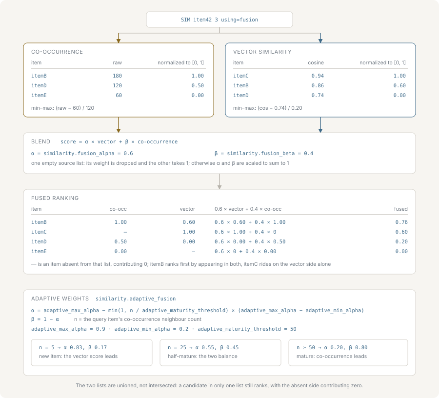

# Fusion search

Fusion search combines the two signals nvecd maintains — co-occurrence from
events and similarity from embeddings — into one ranked list. This page covers
the three query modes, how the two score lists are made comparable, the blend
formula and its weights, adaptive weighting, and what a caller gets when one
side has nothing to contribute.



## The three modes

`SIM` selects a mode with `using=`:

```bash
SIM item42 10 using=events
SIM item42 10 using=vectors
SIM item42 10 using=fusion
```

`using=events` ranks by accumulated co-occurrence score alone. It works for any
item that has appeared in an event, whether or not it has a vector. See
[events-and-co-occurrence.md](./events-and-co-occurrence.md).

`using=vectors` ranks by the configured distance metric alone. It requires the
queried item to have a vector, and fails with a not-found error if it does not.
See [vector-search.md](./vector-search.md).

`using=fusion` runs both and merges them. It is the default: a `SIM` with no
`using=` is a fusion query.

Fusion applies to `SIM` only. `SIMV` has no `using=` option at all — the parser
rejects it — because `SIMV` ranks against a raw query vector and there is no item
ID from which to look up co-occurrence neighbours.

## Normalizing before merging

The two signals are not on the same scale. A co-occurrence score is a sum of
products of event scores, each pair contributing up to 10000, and it grows
without bound as events accumulate. A cosine similarity sits between −1 and 1.
Adding those directly would make the co-occurrence term dominate by several
orders of magnitude, and the vector weight would have no observable effect.

Each list is therefore min-max normalized to 0–1 within itself before the merge:

```text
normalized = (score - min) / (max - min)
```

The consequence worth knowing is that this is *relative*: the weakest candidate
in each list normalizes to exactly 0 and contributes nothing from that side, and
the strongest normalizes to 1 regardless of how strong it actually was. What the
merge consumes is each candidate's rank position within its own source, spread
across 0–1.

Two cases skip the spread and clamp the raw score into 0–1 instead: a list with
one or zero candidates, and a list whose scores are all within `1e-4` of each
other. Clamping preserves absolute confidence there — a lone candidate at 0.99
stays at 0.99 rather than being flattened to a fixed midpoint, and a cluster of
weak matches stays weak.

## The blend

Fusion is additive, not an intersection. Both searches run over their full
domain and their candidates are unioned, so an item that is content-similar but
has never co-occurred can still surface, and vice versa. Both sides are queried
for three times `top_k` candidates, capped at `similarity.max_top_k`, so the
merge has enough material to reorder.

For each candidate ID appearing in either list:

```text
fused = vector_weight * normalized_vector_score
      + event_weight  * normalized_event_score
```

Each candidate accumulates whatever each side gave it, and a side that did not
return that candidate contributes 0.

That last point is the one to keep straight, because the weights are decided per
*list*, not per item. Whether a source counts as contributing is a single boolean
per source, computed once from whether its list came back empty. An item present
in only one of two non-empty lists is not a one-sided query: both weights remain
in force, and the item simply scores 0 from the side that did not return it.
`itemE` in the example below is exactly that case — it takes 0.6 of its vector
score and nothing more, not a full-weight vector score.

The weights come from `similarity.fusion_alpha` (the vector side, default 0.6) and
`similarity.fusion_beta` (the co-occurrence side, default 0.4), rescaled to sum
to 1:

```text
vector_weight = fusion_alpha / (fusion_alpha + fusion_beta)
event_weight  = fusion_beta  / (fusion_alpha + fusion_beta)
```

With the defaults the two already sum to 1, so the rescaling changes nothing. It
matters when the pair is configured to something else — `0.8` and `0.4` behave
identically to `0.67` and `0.33`, because only the ratio between them is
meaningful.

The merged list is sorted descending and truncated to `top_k`.

### A worked example

`SIM item42 3 using=fusion` with the default weights. Co-occurrence returns:

| Item | Raw score | Normalized |
|---|---|---|
| itemB | 120 | 1.00 |
| itemC | 80 | 0.50 |
| itemD | 40 | 0.00 |

Vector search returns:

| Item | Raw score | Normalized |
|---|---|---|
| itemC | 0.92 | 1.00 |
| itemE | 0.80 | 0.25 |
| itemB | 0.76 | 0.00 |

Merging with `vector_weight = 0.6` and `event_weight = 0.4`:

| Item | Vector term | Event term | Fused |
|---|---|---|---|
| itemC | 0.6 × 1.00 = 0.60 | 0.4 × 0.50 = 0.20 | 0.80 |
| itemB | 0.6 × 0.00 = 0.00 | 0.4 × 1.00 = 0.40 | 0.40 |
| itemE | 0.6 × 0.25 = 0.15 | absent | 0.15 |
| itemD | absent | 0.4 × 0.00 = 0.00 | 0.00 |

The response is `itemC`, `itemB`, `itemE`. `itemC` wins because it is the only
candidate strong on both sides — it is third by raw co-occurrence and first by
vector similarity, and neither list alone would have ranked it first. `itemE`,
which co-occurrence never saw, still places third on vector similarity alone.
`itemD` falls out because it was the weakest co-occurrence candidate and
normalized to 0.

## Adaptive fusion

A fixed blend weight suits a corpus of uniformly mature items. It does not suit
one where a new item has an embedding but almost no event history: the
co-occurrence side is not merely weaker there, it is close to noise, and giving
it a fixed 0.4 of the score actively degrades the result.

Adaptive fusion moves the weight with how much co-occurrence data the queried
item actually has. Maturity is the item's neighbour count in the co-occurrence
index — the true count, not the number of candidates the query fetched, so a
small `top_k` cannot make a mature item look new:

```text
ratio         = min(1, neighbor_count / adaptive_maturity_threshold)
vector_weight = adaptive_max_alpha - ratio * (adaptive_max_alpha - adaptive_min_alpha)
event_weight  = 1 - vector_weight
```

The defaults are `adaptive_min_alpha` 0.2, `adaptive_max_alpha` 0.9 and
`adaptive_maturity_threshold` 50. An item with no neighbours gets a vector weight
of 0.9 — it is judged almost entirely on its embedding. An item at or above 50
neighbours gets 0.2, and its established behavioural signal carries the ranking.
An item with 10 neighbours sits at `0.9 − 0.2 × 0.7 = 0.76`.

The weight moves linearly with the ratio and stops at the bounds, so
`adaptive_min_alpha` and `adaptive_max_alpha` are the range the weight is allowed
to travel, and `adaptive_maturity_threshold` sets how quickly it travels. A lower
threshold reaches full maturity sooner.

Adaptive fusion replaces `fusion_alpha` and `fusion_beta` for the queries it
applies to; the two are not combined.

It is turned on globally with `similarity.adaptive_fusion`, and per query with
`adaptive=`:

```bash
SIM item42 10 using=fusion adaptive=on
SIM item42 10 using=fusion adaptive=off
```

The per-query value wins in both directions — `adaptive=off` disables it under a
configuration that enables it, and `adaptive=on` enables it under one that does
not. Omitting the option leaves the configured value in force. `adaptive=` is
accepted on `SIM` regardless of mode but only affects fusion.

## When one side has nothing

A cold-start item with a vector but no events, and an item with a long event
history but no embedding, are both ordinary cases. Here one *whole list* comes
back empty — not one item missing from one list. Fusion handles that by dropping
the empty side out of the blend entirely and giving the surviving side a weight
of 1, rather than letting it contribute its configured fraction of the score.

That keeps the score scale identical to the corresponding single-source query, so
a `min_score` cutoff means the same thing whether a query fell back to one source
or used both. Without it, a fusion result standing on the vector side alone would
top out at 0.6 with the default weights, and a cutoff tuned against
`using=vectors` would silently reject everything.

Failures are distinguished from emptiness. If both sides fail, the query returns
an error. If the queried ID exists in neither the co-occurrence index nor the
vector store, the vector store's not-found error is returned, rather than an
empty result that would hide a typo in the ID. If exactly one side fails, the
query proceeds on the other and the failure is logged — with the deliberate
exception of a missing vector, which is the expected cold-start case and would
otherwise produce a warning on every such query.

An item that genuinely has no candidates on either side returns an empty result:

```text
OK RESULTS 0
```
