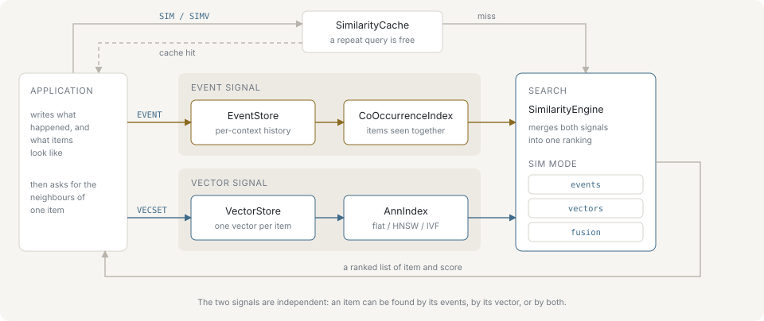

# Introduction

nvecd is an in-memory search engine that keeps two independent signals about the same items and answers a query from either one, or from both blended into a single ranking. This page describes the model the engine is built on and the shape of problem it fits.

## Two signals

The first signal is behavioural. A client reports an interaction with `EVENT <context> ADD <item> <score>`. The context is a grouping key — a session, a user, a basket, a page view — and the score is an integer weight in the range 0 to 100. Items that appear in the same context are treated as associated, and the strength of the association grows with the weights of the events that produced it. Nothing outside the engine computes this: the co-occurrence index is derived from the event stream as it arrives, with no training step and no model.

The second signal is a vector, and it comes from outside. `VECSET <item> <f1> <f2> …` stores an embedding a client has already produced. nvecd does not encode anything; it stores vectors, indexes them and measures distance between them under the configured metric. The dimension is fixed by the first vector stored, and every later vector must match it.

The two signals describe the same item IDs but are maintained separately. An item can have events and no vector, a vector and no events, or both.

## Holding both in one process

"Items acted on together" and "items whose embeddings are close" are different questions. Answering both usually means running a vector database alongside an association store built in the application, then reconciling two ranked lists at request time. nvecd keeps both indexes in one process, so the merge happens where both score lists already are: `SIM <item> <k> using=fusion` returns one ranking, computed from one query, over one dataset.

That also means one place to persist, one place to restore and one write path. Events, vectors and metadata go into the same snapshot and the same write-ahead log, so a restart brings back both signals at the same point in time. See [Persistence](./persistence.md).

## What each signal answers alone

Co-occurrence answers questions about behaviour. It reflects what actually happened in the traffic and needs no representation of the item's content, so it works for items that have no usable text or image — and it captures associations content similarity cannot see, such as two unrelated products bought in one basket. Its scores are unbounded sums, not similarities in [0, 1]. See [Events and co-occurrence](./events-and-co-occurrence.md).

Vector search answers questions about content. It is available as soon as an item has an embedding, works for an item nobody has interacted with, and can be queried by a raw vector that belongs to no stored item at all (`SIMV`). It knows nothing about how items are used together. See [Vector search](./vector-search.md).

## The cold-start asymmetry

The two signals do not become useful at the same time. Co-occurrence for an item nobody has touched is empty — `SIM` in `using=events` mode returns zero results for it, because the item has no entry in the co-occurrence index at all. Vector similarity for that same item is fully available the moment its embedding is stored.

Fusion is what makes the transition between the two continuous rather than a switch the application has to throw. When one source has no candidates, its weight is dropped and the surviving source is renormalized to one, so a brand-new item is ranked purely on its vector without its score being scaled down for the missing signal. With `adaptive=on` (or `similarity.adaptive_fusion` in the configuration), the weight follows each item's own data density: the vector weight starts near `adaptive_max_alpha` for an item with few co-occurrence neighbours and falls towards `adaptive_min_alpha` as the neighbour count approaches `adaptive_maturity_threshold`. An item moves from content-ranked to behaviour-ranked as evidence accumulates, without a cutover. See [Fusion](./fusion.md).

## How it compares

Against a general-purpose vector database and against an embedded ANN library:

| | nvecd | general-purpose vector database | embedded ANN library |
|---|---|---|---|
| Vector search | flat, HNSW or IVF, cosine / dot / L2 | yes | yes |
| Co-occurrence from an event stream | built into the engine | application's problem | out of scope |
| Blending both signals in one query | `using=fusion`, optionally adaptive | application merges two result sets | out of scope |
| Ageing of associations | scheduled decay, plus per-pair temporal half-life | not applicable | not applicable |
| Down-weighting on a removal | `EVENT … DEL` with negative signals | not applicable | not applicable |
| Metadata filtering | comparison and set operators on stored metadata | yes | varies |
| Deployment | one process, one configuration file | service or cluster | linked into the application |
| Scale-out | none | sharding and replication | not applicable |
| Working set | resident in memory | commonly disk-backed | in-process |

Where nvecd is different is the left-hand side of the middle rows: co-occurrence is a first-class engine feature rather than something assembled from a key-value store, the blend between it and vector similarity is computed per query, and associations decay so old behaviour stops dominating.

Where nvecd is behind is the bottom of the table. It is a single node with no distributed query, no replication and no managed offering. Moving a dataset to another machine is an operator's script — `DUMP SAVE`, copy the file, `DUMP LOAD` on the target — and nvecd does not do it for you.

## What nvecd does not do

- **Produce embeddings.** Items are encoded elsewhere and the result is sent with `VECSET`.
- **Serve a dataset larger than memory.** Snapshots and the write-ahead log make a restart recoverable; nothing is read from disk to answer a query.
- **Rank with a model.** Fusion is a weighted sum of two normalized score lists, not an inference step.
- **Run as a cluster.** One process holds the whole dataset, and there is no cross-node query.

[Getting started](./getting-started.md) runs one session end to end: events, vectors, all three search modes and a snapshot.
