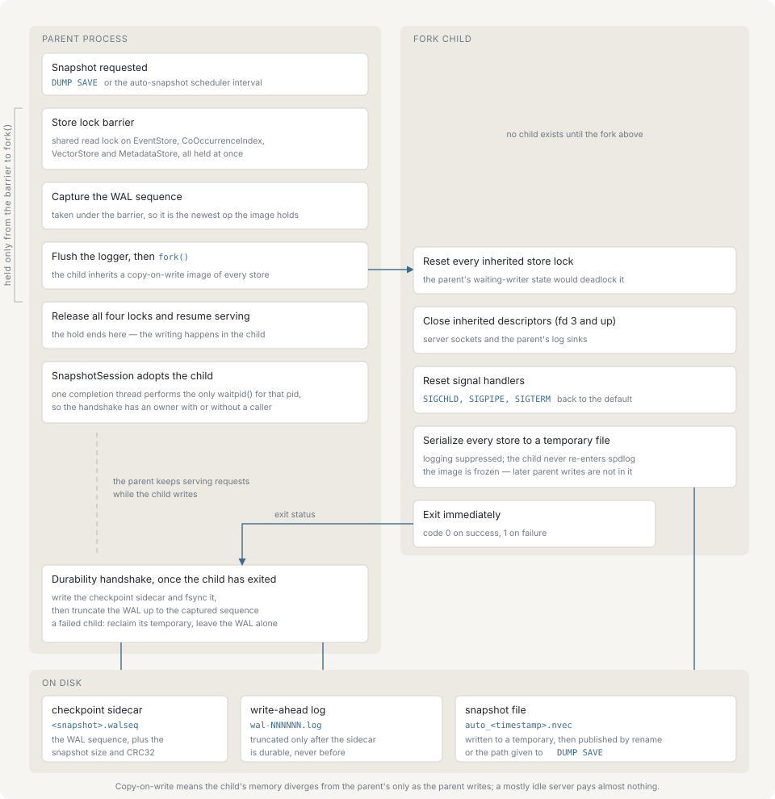
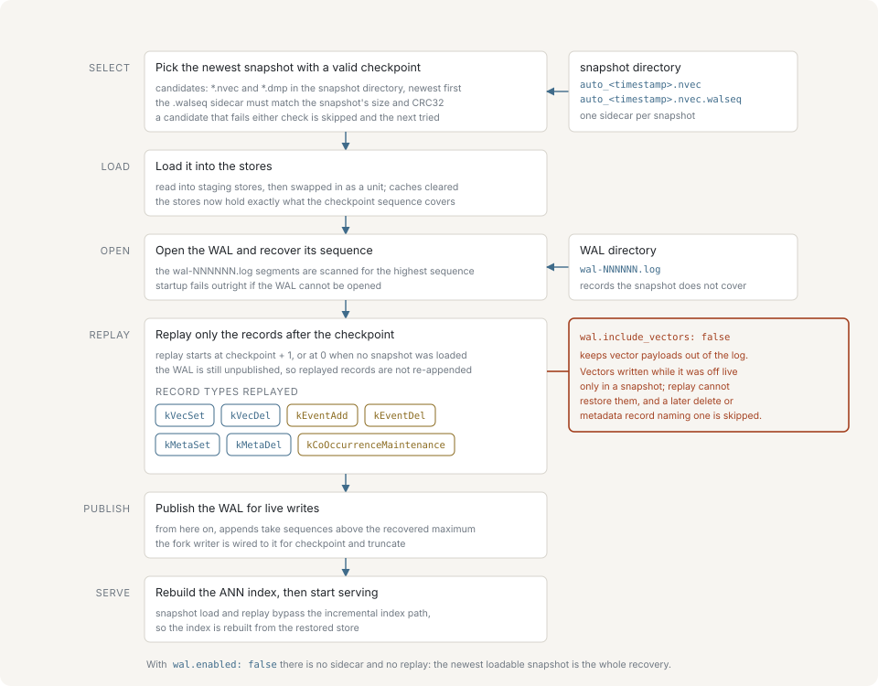

# Persistence

nvecd keeps its data in memory. Two mechanisms put that data on disk: a snapshot, which is a complete image of the stores at one point in time, and a write-ahead log, which records every mutation between snapshots. This page covers how each is written, what recovery does with them at startup, and how an operator drives both.

## Snapshot modes

`snapshot.mode` selects how a snapshot is taken.

| Mode | How it works | Cost |
|---|---|---|
| `fork` (default) | The process forks; the child serializes the copy-on-write image while the parent keeps serving | Write traffic during the child's run dirties pages, and each dirtied page is copied |
| `lock` | The server publishes a read-only flag, drains in-flight writes, and serializes in the calling thread | Every write is refused for the whole serialization |

Fork is the default because the parent excludes writers only across the sequence capture and the `fork()` call, not across the serialization. Lock mode has no copy-on-write memory cost, but a client that sends `EVENT`, `VECSET`, `VECDEL` or `METASET` during a lock-mode save receives `ERROR READONLY Snapshot in progress`.

`snapshot.mode` governs `DUMP SAVE`. Automated snapshots always use the fork writer regardless of the setting.

## The fork sequence



A fork-mode save runs in this order.

1. The writer publishes `in_progress` before touching any lock, so a second save is refused rather than racing.
2. A shared read lock is acquired on all four stores at once — event store, co-occurrence index, vector store, metadata store. Writers are serialized behind these locks, so holding all four drains the in-flight ones and excludes new ones.
3. **The WAL sequence is read while that barrier is held.** Because no write can be in progress, the captured value is exactly the highest operation the about-to-be-frozen image contains. Everything downstream depends on this: the sidecar records it and the truncation uses it, so the log can never drop a record the snapshot does not carry.
4. The logger is quiesced **in the parent**, by a `pthread_atfork` prepare handler and a flush immediately before the call, and the process forks. The child never touches the logger at all — a sibling thread may have held its registry mutex at fork time, and that mutex would be permanently locked in the child.
5. The child re-initializes the four inherited locks, closes every descriptor above standard error, resets `SIGCHLD`, `SIGPIPE` and `SIGTERM` to their defaults, and serializes the stores with logging suppressed. It exits `0` on a complete write and `1` otherwise, reporting failure through an async-signal-safe `write(2)`, which is its only diagnostic.
6. The parent releases the four locks and resumes serving. It hands the child to a session object and returns.

The session owns the child from that point. The parent's request threads never reap it: a completion thread inside the session performs the single `waitpid()` for that pid and then runs the durability handshake — the sidecar write and the WAL truncate — on that same thread, without waiting for a client request, a scheduler tick or shutdown.

## The durability handshake

Writing the file is only half of a snapshot. The other half is identical in both modes and runs through the same session object.

When the writer failed, the session removes the temporary files the writer left behind and leaves the WAL untouched, so the recovery base is exactly what it was before the attempt. A failed snapshot costs nothing in durability terms.

When the writer succeeded and a WAL is configured, the session does two things in a fixed order:

1. **Write the checkpoint sidecar.** A 32-byte file named `<snapshot path>.walseq` holds the magic `NWCP`, a format version, the captured WAL sequence, and the bound snapshot's size and whole-file CRC32, followed by a CRC32 over the preceding 28 bytes. It is written to a temporary file, fsynced, renamed into place, and the parent directory is fsynced.
2. **Truncate the WAL** up to the captured sequence, which unlinks every segment whose records are all at or below it.

The sidecar comes first so that a crash between the two steps leaves a WAL that is longer than necessary rather than one cut back to a snapshot no reader will accept as a recovery base. Reading the sidecar re-reads the snapshot's size and CRC32 and rejects the sidecar if either disagrees, so a sidecar left beside a replaced or truncated snapshot is not usable.

A failure in either step is a failed snapshot, reported as such, not a warning attached to a success.

## Snapshot file format

A snapshot is a little-endian binary file. Multi-byte integers are little-endian, strings are length-prefixed with a `uint32` byte count, and CRC32 uses the zlib polynomial.

```text
Fixed header      magic "NVEC" (4 bytes) + format version uint32
V1 header         header_size uint32
                  flags uint32
                  snapshot_timestamp uint64
                  total_file_size uint64
                  file_crc32 uint32
                  reserved_length uint32 + reserved bytes
Config section    length uint32 + crc32 uint32 + serialized configuration
Statistics        length uint32 + crc32 uint32 + snapshot statistics
                  (present only when the kWithStatistics flag is set)
Store data        store_count uint32
                  per store:
                    store name (length-prefixed string)
                    store statistics (length uint32 + crc32 uint32 + data,
                                      or a zero length when absent)
                    store data (length uint32 + crc32 uint32 + data)
```

The whole-file CRC32 lives in the header, not at the end of the file. The writer emits the header with that field zeroed, writes every section, seeks back to record the real total size, then recomputes the CRC32 over the complete file with the field still zeroed and patches it in at its fixed offset.

There are **four** store sections, written in this order: `events`, `co_occurrence`, `vectors`, `metadata`. The reader accepts three (a snapshot written with no metadata store) or four, rejects any other name, and rejects a repeated name.

The flags word carries `kWithCRC` (`0x10`), which is always set, and `kWithStatistics` (`0x08`), set only when the caller supplies statistics. Neither the server's save paths nor the fork child supplies them, so snapshots written by a running server report `flags: 16` and `has_statistics: false`.

The format rejects a file larger than 3 GiB.

### Integrity

`DUMP VERIFY` runs the fast check: the file exists and is readable, the magic and version are right, the length on disk equals `total_file_size`, and the whole-file CRC32 matches. It does not verify individual section checksums and does not deserialize anything, which makes it cheap enough for a periodic health check.

A load is the full check. It repeats everything above and additionally verifies the CRC32 of the config section, the statistics section, each store's statistics, and each store's data, and it fails on trailing bytes inside any section. A failure reports which section failed — the error names the config, statistics, event store, co-occurrence, vector store or metadata store checksum specifically.

Both size validation and CRC32 verification catch a truncated file, which is the shape a snapshot takes when the disk fills mid-write. The atomic rename means a partially written snapshot never appears under its final name in the first place.

## The write-ahead log

The WAL exists to recover the mutations that happened after the last snapshot. It is disabled by default (`wal.enabled: false`); without it, a restart recovers exactly the last snapshot and everything after it is lost.

Segments are files named `wal-NNNNNN.log` in `wal.dir`. Each starts with an 8-byte header (magic `NWAL` plus a version) and then carries records of the form:

```text
[body_length uint32] [crc32 uint32] [sequence uint64] [timestamp_us uint64] [op uint8] [payload]
```

Sequence numbers are contiguous across segments; replay treats a gap as corruption. The record kinds written are an event add, an event delete, a vector set, a vector delete, a metadata set, and a co-occurrence maintenance epoch that records a decay factor and whether the pass also pruned.

### Ordering

**The record is appended before the in-memory mutation, not after.** A write handler validates the command, appends the record, and only then applies it to the stores. A refused append propagates as an error, so a client never receives `OK` for a write the log would not accept; the server also latches itself read-only, because a WAL that cannot accept a record can no longer describe what the server did.

An event that the deduplication window rejects is applied as a no-op and writes no record.

The mutation and its append run together under a serialization mutex shared by the TCP and HTTP surfaces. WAL order therefore matches dependency order across both: a `METASET` that observed a vector cannot be replayed before the `VECSET` that created it.

### fsync policy

With `wal.sync_on_write: true`, every append is fsynced before the handler returns, so an acknowledged write is on the platter. Otherwise a background thread fsyncs at most every `wal.sync_interval_ms` milliseconds — cheaper, but up to one interval's worth of acknowledged writes is lost to a power failure. Setting `sync_interval_ms: 0` with `sync_on_write: false` would leave nobody to perform the fsync at all, so the server promotes that combination to per-append fsync when it opens the log.

A short or failed write closes the current segment and refuses further appends to it. Replay stops at a corrupt tail, so continuing to append past one would silently lose every later record in the same file.

### Rotation and truncation

A new segment is started when the current one would exceed `wal.max_file_size` (64 MiB by default). Segment numbers are six digits wide; the reader matches that fixed width only.

Truncation is the only thing that reclaims WAL space, and it runs solely as part of the snapshot durability handshake. A deployment that enables the WAL and never takes a snapshot accumulates segments without bound.

### Omitting vector bodies

`wal.include_vectors: false` writes no record at all for a `VECSET`. Operators choose it when snapshots are their intended durability boundary for vector data and the log only needs to carry events and metadata.

The consequence is direct: **a vector written while that setting was off cannot be recovered from the WAL.** Only a snapshot taken after the write holds it. Replay tolerates the resulting gap narrowly — a `VECDEL` or `METASET` whose subject vector is missing is a deliberate absence rather than corruption, so it is skipped and counted. `INFO` reports the running total as `wal_replay_records_skipped`, so the size of the gap survives log rotation. Every other operation and every other failure, including a CRC mismatch, a truncation or a decode failure, stops recovery.

## Restart recovery



With the WAL enabled, startup runs this sequence, and the order is load-bearing.

1. **Select a snapshot.** The server lists regular files in `snapshot.dir` whose extension is `.nvec` or `.dmp` and which have a `.walseq` sidecar beside them, newest modification time first. For each candidate it validates the sidecar, then deserializes the snapshot into a staged set of stores and publishes them only on success. The first candidate that survives both wins.
2. **Open the WAL.** Opening scans the segment directory, discards header-only segments left by a previous run that appended nothing, recovers the current sequence, and starts a fresh segment.
3. **Replay.** Records strictly after the checkpointed sequence are re-applied — the floor is the sidecar's sequence plus one, or zero when no snapshot was loaded. Each record goes through the same write path live traffic uses, so recovery reconstructs exactly the state the original command produced.
4. **Publish the WAL.** Only now do the write handlers and the fork writer receive the WAL pointer. Until this moment it is null, which is what keeps replay from appending every replayed record a second time.

The ANN index is rebuilt from the restored vector store afterwards. Both the snapshot load and the replay repopulate the store directly rather than through the incremental add path, so the index would otherwise be empty or hold only the replayed tail.

A snapshot **without** a sidecar is not a candidate at all while the WAL is enabled, because nothing says where replay should begin. A **stale** sidecar — one whose recorded size or CRC32 does not match the snapshot beside it — is rejected with a warning and the server moves to the next-newest candidate. When candidates exist and every one of them fails, startup fails rather than silently starting on empty stores; when the directory holds no candidate at all, the server starts empty.

With the WAL disabled, the same candidate scan runs without the sidecar requirement, the newest valid snapshot is loaded, and nothing is replayed.

What a reader should conclude about the durability window: with the WAL enabled and `sync_on_write` set, everything acknowledged before the crash survives. With batched fsync, everything except the last `sync_interval_ms` survives. With the WAL disabled, the boundary is the last completed snapshot.

## The DUMP commands

[Protocol](./protocol.md) carries the exhaustive argument syntax. What each subcommand is for:

**`DUMP SAVE [path]`** writes a snapshot. With no argument it uses `snapshot.default_filename`, which goes through the same path validation as a client-supplied name. In fork mode the response comes back as soon as the child exists:

```bash
nvecd-cli DUMP SAVE backup.nvec
```

```text
OK DUMP_SAVE_STARTED /var/lib/nvecd/snapshots/backup.nvec
```

In lock mode the response comes back after the whole handshake has completed, as `OK DUMP_SAVED /var/lib/nvecd/snapshots/backup.nvec`.

**`DUMP LOAD <path>`** replaces the live state with a snapshot. The file is deserialized into staged stores first, so a corrupt or semantically invalid snapshot can only damage those; the live stores are swapped in under exclusive gates, the ANN index is rebuilt and the query cache is cleared. With a WAL configured, a load is treated as a deliberate rollback: the loaded snapshot becomes the newest recovery base and the pre-load WAL tail is discarded, so a later restart does not replay the mutations the operator just rolled back. If any durability step of a load fails after publication, the server latches itself read-only and needs a restart — it will not resume serving on a state whose recovery base is uncertain.

**`DUMP VERIFY <path>`** runs the integrity check described above without loading anything.

**`DUMP INFO <path>`** reports the header without reading store data:

```bash
nvecd-cli DUMP INFO backup.nvec
```

```text
OK DUMP_INFO /var/lib/nvecd/snapshots/backup.nvec
version: 1
stores: 4
flags: 16
file_size: 20481
timestamp: 1767225600
has_statistics: false
END
```

**`DUMP STATUS`** reports the state of the fork writer. It has four states, and all but `idle` carry extra fields:

| Status | Fields |
|---|---|
| `idle` | none |
| `in_progress` | `filepath`, `pid`, `start_time` |
| `completed` | `filepath`, `start_time`, `end_time` |
| `failed` | `filepath`, `start_time`, `end_time`, `error` |

```text
OK DUMP_STATUS
status: completed
filepath: /var/lib/nvecd/snapshots/backup.nvec
start_time: 1767225600
end_time: 1767225601
END
```

`completed` and `failed` describe the last snapshot, not a current one, and persist until the next save starts. Issuing `DUMP STATUS` also publishes a finished background snapshot's outcome, which is how a server with no snapshot scheduler running leaves `in_progress`.

## Automated snapshots

```yaml
snapshot:
  dir: "/var/lib/nvecd/snapshots"
  default_filename: "nvecd.snapshot"
  interval_sec: 3600
  retain: 3
  mode: "fork"
```

`interval_sec` is `0` by default, which disables the scheduler entirely. When it is positive, a background thread starts a fork snapshot every interval, named `auto_YYYYMMDD_HHMMSS.nvec`.

`retain` bounds the number of automatic snapshots kept. Retention matches `auto_*.nvec` only and sorts by modification time, so a snapshot written by `DUMP SAVE` under any other name is never deleted. Cleanup runs after a fork child has been reaped, not while one is in flight, so a newly started snapshot cannot appear after the file count was taken and leave `retain + 1` files behind.

Each scheduler tick also publishes the outcome of a finished background snapshot, which is what moves the writer out of `in_progress` so the next snapshot can start. The durability handshake itself does not wait for that tick — the session's own thread has already run it. On a server with the scheduler disabled, the next `DUMP SAVE` or `DUMP STATUS` publishes the outcome instead.

Temporary files left by a writer whose process no longer exists are reclaimed at startup and on every retention pass. A temporary is named `.<snapshot name>.tmp.<pid>.<n>` and can only be published by the process that created it, so one whose owner is gone can never complete.

## File permissions and path restrictions

Snapshot temporary files, WAL segments and checkpoint sidecars are created mode `0600`. The WAL directory is created mode `0700`.

Before writing, the parent directory must be owned by the server's effective user and must not be writable by group or others, and no ancestor directory may be group- or world-writable without the sticky bit. Once validated, the directory is held open as a descriptor and every later operation — creating the temporary, renaming it into place, fsyncing — is performed relative to that descriptor, so replacing a directory in the path after validation cannot redirect the write.

A path supplied to any `DUMP` subcommand is rejected outright if it contains `..` anywhere, and after canonicalization it must resolve inside `snapshot.dir`. The same validation applies to `snapshot.default_filename`, because that value comes from a configuration file rather than from the code: a configured name that escapes the snapshot directory is refused rather than resolved against it.

## Backups and copying state between machines

nvecd has no replication, no snapshot synchronization between nodes and no clustering. Moving state between machines is something an operator scripts from outside:

```bash
nvecd-cli -h source-host DUMP SAVE transfer.nvec
scp source-host:/var/lib/nvecd/snapshots/transfer.nvec \
    target-host:/var/lib/nvecd/snapshots/
nvecd-cli -h target-host DUMP VERIFY transfer.nvec
nvecd-cli -h target-host DUMP LOAD transfer.nvec
```

Copy only the snapshot file. The `.walseq` sidecar is bound to the WAL of the machine that wrote it and means nothing on another; `DUMP LOAD` writes the destination's own sidecar as part of its handshake.

In fork mode `DUMP SAVE` returns before the file is complete, so a script that copies immediately copies a partial file. Poll `DUMP STATUS` until it reports `completed` for that path, or use `DUMP VERIFY` on the destination before loading — which is worth doing regardless, since it is the only check that the transfer itself was clean.

For a backup, copying a completed snapshot file is sufficient: it is a self-contained image whose integrity is verifiable offline. The WAL is not a backup artifact — it is truncated against each snapshot and describes only the interval since the last one.
