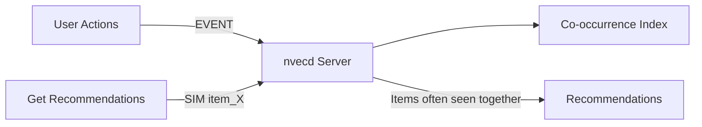
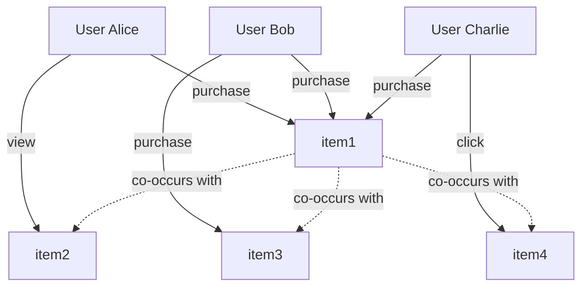
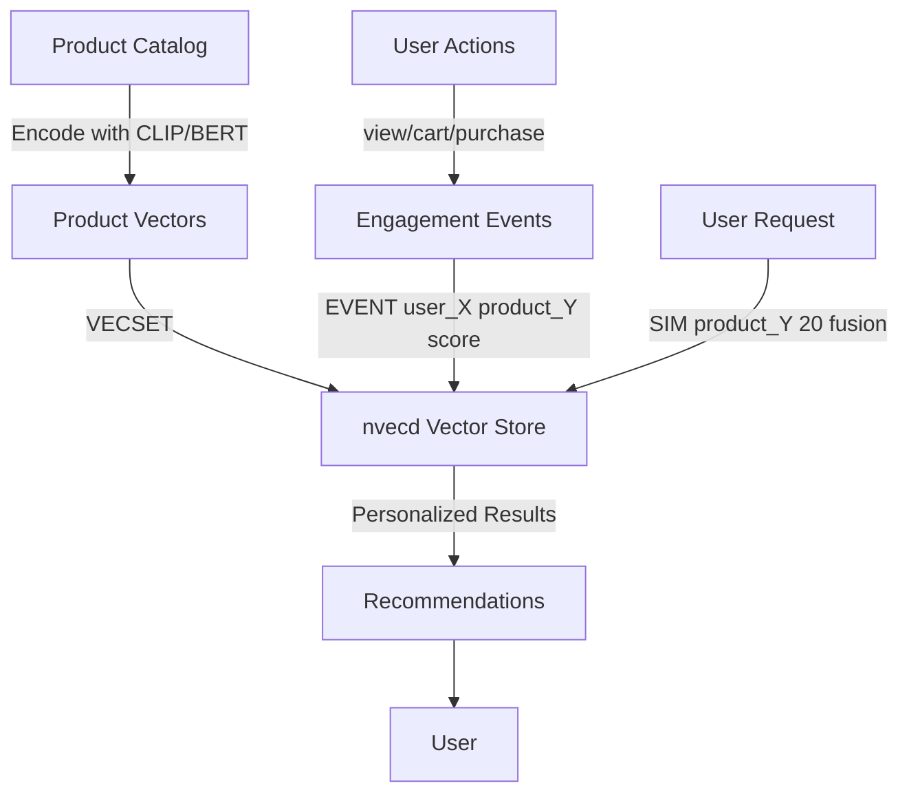
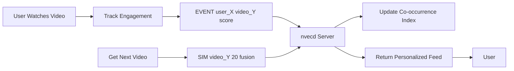
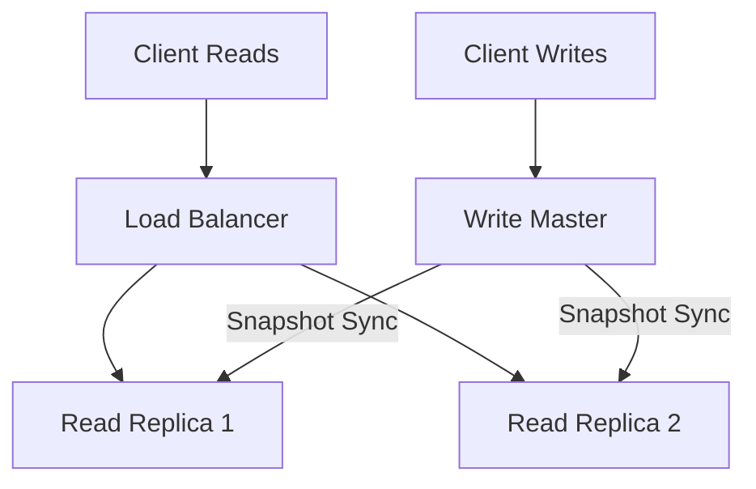

# Use Cases and Implementations

This guide demonstrates real-world use cases for Nvecd with detailed implementation examples.

---

## Use Case 0: Getting Started - Simple Recommendation Engine

Build a recommendation engine based on user behavior patterns.

### Overview

This is the **simplest** way to use Nvecd:
- Track user interactions with items (views, clicks, purchases)
- Get recommendations based on what users do together
- Start with just a few lines of code
- Perfect for getting started quickly

### How It Works

When users interact with similar items, Nvecd automatically builds a co-occurrence index. Items that are frequently viewed/purchased together will be recommended together.



### Data Model

**Events**: User interactions (views, clicks, purchases)
**Contexts**: `user_{user_id}` (per-user interaction history)

### Node.js Implementation

```javascript
const net = require('net');

class SimpleRecommender {
  constructor(host = 'localhost', port = 11017) {
    this.host = host;
    this.port = port;
  }

  // Helper to send commands to nvecd
  async sendCommand(command) {
    return new Promise((resolve, reject) => {
      const client = net.createConnection({ host: this.host, port: this.port }, () => {
        client.write(command + '\n');
      });

      let data = '';
      client.on('data', (chunk) => {
        data += chunk.toString();
      });

      client.on('end', () => {
        resolve(data.trim());
      });

      client.on('error', (err) => {
        reject(err);
      });
    });
  }

  // Track user interaction with an item
  async trackInteraction(userId, itemId, interactionType) {
    // Score based on interaction type
    const scores = {
      'view': 60,
      'click': 70,
      'add_to_cart': 85,
      'purchase': 100,
      'like': 90
    };

    const score = scores[interactionType] || 50;
    const command = `EVENT user_${userId} ${itemId} ${score}`;

    const response = await this.sendCommand(command);
    return response === 'OK';
  }

  // Get recommendations for an item
  async getRecommendations(itemId, limit = 10) {
    const command = `SIM ${itemId} ${limit} fusion`;
    const response = await this.sendCommand(command);

    // Parse response
    // OK RESULTS 5
    // item2 0.85
    // item3 0.72
    // ...

    const lines = response.split('\n');
    if (!lines[0].startsWith('OK RESULTS')) {
      throw new Error('Unexpected response: ' + response);
    }

    const recommendations = [];
    for (let i = 1; i < lines.length; i++) {
      const line = lines[i].trim();
      if (!line) continue;

      const [itemId, score] = line.split(/\s+/);
      recommendations.push({
        itemId: itemId,
        score: parseFloat(score)
      });
    }

    return recommendations;
  }
}

// Usage Example
async function main() {
  const recommender = new SimpleRecommender();

  // Track user interactions
  console.log('Tracking user interactions...');

  // User alice views and purchases item1
  await recommender.trackInteraction('alice', 'item1', 'view');
  await recommender.trackInteraction('alice', 'item1', 'purchase');

  // User alice also views item2
  await recommender.trackInteraction('alice', 'item2', 'view');

  // User bob purchases item1 (similar to alice)
  await recommender.trackInteraction('bob', 'item1', 'purchase');
  await recommender.trackInteraction('bob', 'item3', 'purchase');

  // User charlie purchases item1 and item4
  await recommender.trackInteraction('charlie', 'item1', 'purchase');
  await recommender.trackInteraction('charlie', 'item4', 'click');

  console.log('\nGetting recommendations for item1...');

  // Get recommendations for item1
  // Should return items that users who interacted with item1 also liked
  const recommendations = await recommender.getRecommendations('item1', 5);

  console.log('\nRecommended items for users who liked item1:');
  recommendations.forEach((rec, index) => {
    console.log(`${index + 1}. ${rec.itemId} (score: ${rec.score.toFixed(3)})`);
  });
}

main().catch(console.error);
```

### Example Output

```bash
$ node simple-recommender.js

Tracking user interactions...

Getting recommendations for item1...

Recommended items for users who liked item1:
1. item3 (score: 0.850)
2. item2 (score: 0.720)
3. item4 (score: 0.650)
```

### How Co-occurrence Works

When multiple users interact with the same items, nvecd builds a co-occurrence graph:



**Result**: When you query `SIM item1`, Nvecd returns items that co-occur with item1 in user contexts.

### Configuration

```yaml
events:
  ctx_buffer_size: 50         # Track last 50 interactions per user
  decay_interval_sec: 86400   # Daily decay
  decay_alpha: 0.98           # Slow decay (stable preferences)
```

### When to Use This Approach

✅ **Good for:**
- Quick prototypes and MVPs
- Small to medium catalogs (<100K items)
- Collaborative filtering based on user behavior
- "Customers who bought this also bought..."
- Getting started quickly without complex setup

❌ **Not ideal for:**
- New items with no user interactions yet (cold start problem)
- Finding similar items based on their properties/content

### Advanced: Adding Content-Based Similarity

Later, you can enhance recommendations by adding item features (see Use Case 1 for details).

### Production Tips

- Start with tracking user interactions only
- Monitor co-occurrence index growth
- Use appropriate event scores (purchase=100, view=60)
- Set decay based on how quickly user preferences change
- Consider upgrading to hybrid recommendations later (see Use Case 1)

---

## Use Case 1: E-Commerce Product Recommendations

Build a product recommendation system that combines content similarity and user behavior.

### Overview

Recommend products based on:
- Product similarity (visual features, descriptions)
- User purchase/view history
- Collaborative filtering (users with similar taste)

### Data Flow



### Data Model

**Vectors**: Product embeddings (image + text features, 768-dim)
**Events**: User interactions (views, cart additions, purchases)
**Contexts**: `user_{user_id}` (per-user history)

### Implementation

```bash
# 1. Register product vectors (from embeddings)
# Example: Product images + descriptions encoded with CLIP/BERT
VECSET product_12345 768 0.123 0.456 0.789 ... (768 dimensions)
VECSET product_67890 768 0.234 0.567 0.891 ...
VECSET product_11111 768 0.345 0.678 0.912 ...

# 2. Track user interactions
# User alice views product
EVENT user_alice product_12345 60

# User alice adds to cart (higher engagement)
EVENT user_alice product_12345 85

# User alice purchases (highest engagement)
EVENT user_alice product_12345 100

# User bob purchases same product
EVENT user_bob product_12345 100
EVENT user_bob product_67890 95

# 3. Get recommendations for user alice
# Based on product she purchased
SIM product_12345 20 fusion
# Returns: Products similar in features AND purchased by similar users
```

### Configuration

```yaml
events:
  ctx_buffer_size: 100        # Track last 100 interactions per user
  decay_interval_sec: 86400   # Daily decay
  decay_alpha: 0.98           # Slow decay (2% per day)

similarity:
  fusion_alpha: 0.7           # 70% content similarity
  fusion_beta: 0.3            # 30% collaborative signal

vectors:
  default_dimension: 768
```

### Event Scoring Strategy

- **100**: Purchase
- **85**: Add to cart
- **70**: Add to wishlist
- **60**: View product page
- **40**: Impression only

### Production Tips

- Update product vectors when catalog changes
- Periodic snapshots to preserve user histories
- Monitor co-occurrence index growth (set buffer limits)

---

## Use Case 2: TikTok-Style Real-Time Video Feed

Build a personalized short-video feed with real-time engagement tracking.

### Overview

Generate personalized video feeds that adapt in real-time based on:
- Video content similarity (visual/audio features)
- User engagement signals (watch time, likes, shares)
- Trending videos (high recent engagement)

### System Architecture



### Data Model

**Vectors**: Video embeddings (visual + audio features, 512-dim)
**Events**: User engagement (views, watch time, interactions)
**Contexts**:
- `user_{user_id}` - Per-user preferences
- `trending_{hour}` - Hourly trending patterns

### Implementation

```bash
# 1. Register video vectors
# Example: Video frames + audio encoded with VideoMAE/CLAP
VECSET video_abc123 512 0.11 0.22 0.33 ... (512 dimensions)
VECSET video_def456 512 0.44 0.55 0.66 ...
VECSET video_ghi789 512 0.77 0.88 0.99 ...

# 2. Track real-time user engagement
# User watches 10% of video (low engagement)
EVENT user_alice video_abc123 10

# User watches 50% of video (medium engagement)
EVENT user_alice video_abc123 50

# User watches 100% + likes (high engagement)
EVENT user_alice video_abc123 100

# User shares video (very high engagement)
EVENT user_alice video_abc123 100
EVENT user_alice video_abc123 95  # Reinforce with second event

# 3. Track trending patterns (hourly context)
EVENT trending_2025011812 video_abc123 100
EVENT trending_2025011812 video_def456 95
EVENT trending_2025011812 video_ghi789 90

# 4. Generate personalized feed for user
# Get next video based on user's last watched video
SIM video_abc123 20 fusion

# 5. Boost with trending videos
# Get trending videos from hourly context
# (Implementation note: Use SIM on recently trending videos)
```

### Real-Time Feed Generation Algorithm

```python
import socket

def generate_feed(user_id, last_video_id, feed_size=20):
    sock = socket.socket(socket.AF_INET, socket.SOCK_STREAM)
    sock.connect(('localhost', 11017))

    # Get personalized recommendations
    sock.sendall(f'SIM {last_video_id} {feed_size} fusion\n'.encode())
    response = sock.recv(4096).decode()

    # Parse results
    # OK RESULTS 20
    # video_def456 0.92
    # video_ghi789 0.88
    # ...

    feed = []
    for line in response.split('\n')[1:]:  # Skip "OK RESULTS" line
        if line.strip():
            video_id, score = line.split()
            feed.append({'video_id': video_id, 'score': float(score)})

    sock.close()
    return feed

# Track engagement in real-time
def track_engagement(user_id, video_id, watch_percentage, liked=False, shared=False):
    sock = socket.socket(socket.AF_INET, socket.SOCK_STREAM)
    sock.connect(('localhost', 11017))

    # Base engagement score from watch percentage
    score = watch_percentage

    # Boost for interactions
    if liked:
        score = 100
        sock.sendall(f'EVENT user_{user_id} {video_id} {score}\n'.encode())
        sock.recv(1024)

    if shared:
        score = 100
        # Double event for sharing (very high signal)
        sock.sendall(f'EVENT user_{user_id} {video_id} {score}\n'.encode())
        sock.recv(1024)
        sock.sendall(f'EVENT user_{user_id} {video_id} 95\n'.encode())
        sock.recv(1024)

    # Track watch percentage
    sock.sendall(f'EVENT user_{user_id} {video_id} {watch_percentage}\n'.encode())
    sock.recv(1024)

    sock.close()
```

### Configuration

```yaml
events:
  ctx_buffer_size: 50         # Recent 50 videos per user
  decay_interval_sec: 3600    # Decay every hour (fast for trending)
  decay_alpha: 0.90           # 10% decay per hour (capture trends)

similarity:
  fusion_alpha: 0.5           # 50% content similarity
  fusion_beta: 0.5            # 50% engagement patterns

vectors:
  default_dimension: 512      # Video embeddings

performance:
  thread_pool_size: 16        # High concurrency for real-time
  max_connections: 10000      # Many concurrent users
```

### Event Scoring Strategy

- **100**: Full watch + like/share
- **80-99**: Full watch without interaction
- **50-79**: 50-99% watch time
- **20-49**: 20-49% watch time
- **1-19**: <20% watch time (quick skip)

### Production Tips

- **Fast decay**: Use hourly decay to capture trending content
- **Short buffer**: Keep buffer small (50) for recent preferences
- **Real-time updates**: Update engagement immediately on user actions
- **Trending contexts**: Maintain separate trending contexts per time window
- **Prefetch**: Prefetch next batch of recommendations while user watches

---

## Use Case 3: News Article Recommendations

Personalized news feed combining topic similarity and reading behavior.

### Overview

Recommend articles based on:
- Content similarity (topic, entities, sentiment)
- Reading history
- Trending topics

### Data Model

**Vectors**: Article embeddings (title + content, 384-dim)
**Events**: Reading behavior (clicks, read time)
**Contexts**:
- `user_{user_id}` - Per-user reading history
- `category_{category}` - Per-category trends

### Implementation

```bash
# 1. Register article vectors
VECSET article_tech_001 384 0.1 0.2 0.3 ... (384 dimensions)
VECSET article_sports_002 384 0.4 0.5 0.6 ...

# 2. Track reading behavior
# User clicks article (low signal)
EVENT user_bob article_tech_001 40

# User reads 50% of article
EVENT user_bob article_tech_001 70

# User reads 100% of article
EVENT user_bob article_tech_001 100

# User shares article (very high signal)
EVENT user_bob article_tech_001 100

# 3. Track category trends
EVENT category_tech article_tech_001 95
EVENT category_sports article_sports_002 88

# 4. Get recommendations
SIM article_tech_001 10 fusion
```

### Configuration

```yaml
events:
  ctx_buffer_size: 30         # Last 30 articles per user
  decay_interval_sec: 7200    # Decay every 2 hours
  decay_alpha: 0.95           # 5% decay (news has short lifespan)

similarity:
  fusion_alpha: 0.6           # 60% content similarity
  fusion_beta: 0.4            # 40% reading patterns

vectors:
  default_dimension: 384      # Lightweight embeddings (MiniLM)
```

### Event Scoring Strategy

- **100**: Full read + share
- **90**: Full read + comment
- **80**: Full read (100% scroll)
- **70**: Partial read (50-99%)
- **40**: Click only (<50% read)

---

## Use Case 4: Music Streaming Recommendations

Spotify-style music recommendations based on listening history and song features.

### Overview

Recommend songs based on:
- Audio features (tempo, mood, genre)
- Listening history
- Skip/repeat behavior

### Data Model

**Vectors**: Song embeddings (audio features, 128-dim)
**Events**: Listening behavior (plays, skips, repeats)
**Contexts**: `user_{user_id}`

### Implementation

```bash
# 1. Register song vectors
VECSET song_pop_001 128 0.5 0.3 0.8 ... (128 dimensions)
VECSET song_rock_002 128 0.6 0.4 0.2 ...

# 2. Track listening behavior
# User plays full song
EVENT user_charlie song_pop_001 100

# User skips song quickly (<30s)
EVENT user_charlie song_rock_002 10

# User repeats song (very high signal)
EVENT user_charlie song_pop_001 100
EVENT user_charlie song_pop_001 100

# User adds to playlist
EVENT user_charlie song_pop_001 95

# 3. Get next song recommendation
SIM song_pop_001 20 fusion
```

### Configuration

```yaml
events:
  ctx_buffer_size: 100        # Last 100 songs
  decay_interval_sec: 604800  # Weekly decay (7 days)
  decay_alpha: 0.99           # Very slow decay (stable taste)

similarity:
  fusion_alpha: 0.4           # 40% audio similarity
  fusion_beta: 0.6            # 60% listening patterns (strong signal)

vectors:
  default_dimension: 128
```

### Event Scoring Strategy

- **100**: Full play / repeat / add to playlist
- **80**: Full play (no skip)
- **50**: Partial play (>50%)
- **10**: Skip (<30s)

---

## Use Case 5: Semantic Search Engine

Pure content-based similarity search for documents, images, or code.

### Overview

Search by meaning, not keywords. Find semantically similar content.

### Data Model

**Vectors**: Content embeddings (text/image/code)
**Events**: Not used (pure vector search)

### Implementation

```bash
# 1. Register document vectors
VECSET doc_python_tutorial 768 0.1 0.2 ... (768 dimensions)
VECSET doc_javascript_guide 768 0.3 0.4 ...

# 2. Search with query vector
# User searches: "how to sort arrays in python"
# Query encoded to vector: [0.15, 0.25, ...]
SIMV 768 0.15 0.25 0.35 ... 10 cosine

# Returns semantically similar documents
```

### Configuration

```yaml
vectors:
  default_dimension: 768
  distance_metric: "cosine"   # Normalized similarity

similarity:
  default_top_k: 100          # Return top 100 results
```

---

## Scaling Strategies

### Horizontal Scaling Pattern

For high-traffic applications:

1. **Read replicas**: Run multiple nvecd instances with periodic snapshot sync
2. **Load balancer**: Route reads across replicas
3. **Write master**: Single master for EVENT/VECSET writes
4. **Snapshot sync**: Master saves snapshots, replicas load periodically



### Vertical Scaling

For single-instance optimization:

```yaml
performance:
  thread_pool_size: 32       # Match CPU cores
  max_connections: 20000     # Increase connection limit

events:
  ctx_buffer_size: 200       # Larger buffers for more history

snapshot:
  interval_sec: 3600         # Frequent snapshots for safety
  retain: 10                 # Keep more snapshots
```

---

## Performance Benchmarks

### Expected Throughput

| Operation | Throughput | Latency (p50) | Latency (p99) |
|-----------|-----------|---------------|---------------|
| EVENT     | ~50K/s    | <0.1ms        | <0.5ms        |
| VECSET    | ~20K/s    | <0.2ms        | <1ms          |
| SIM       | ~10K/s    | <1ms          | <5ms          |
| SIMV      | ~8K/s     | <1.5ms        | <7ms          |

*Benchmarks on 16-core server, 768-dim vectors, 1M vectors, 100K contexts*

### Optimization Tips

1. **Use fusion mode** for hybrid recommendations (best quality)
2. **Use cosine mode** for pure semantic search
3. **Batch VECSET** operations when bulk loading
4. **Configure decay** based on content lifespan
5. **Monitor memory** and adjust buffer sizes
6. **Regular snapshots** to prevent data loss

---

## Next Steps

- See [Configuration Guide](configuration.md) for tuning parameters
- See [Protocol Reference](protocol.md) for command details
- See [Performance Guide](performance.md) for optimization tips
