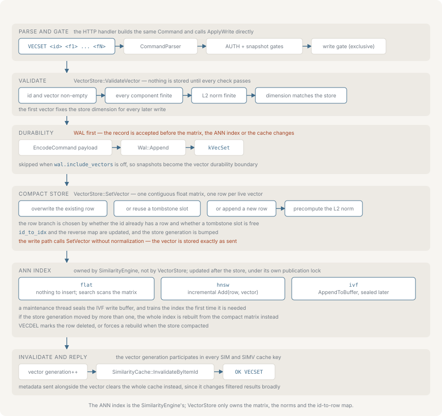

# Vector search

nvecd stores one embedding per item ID in a contiguous in-memory matrix and
ranks candidates against a query by a similarity metric. This page covers
registering vectors, the metrics, the three index types, deletion and
fragmentation, metadata filtering, and where in the pipeline a filter and a score
cutoff are applied.



Command syntax is listed in full in [protocol.md](./protocol.md); every key named
here is described alongside its range in [configuration.md](./configuration.md).

## Registering and deleting vectors

```bash
VECSET item42 0.12 -0.44 0.98
VECDEL item42
```

`VECSET` returns `OK VECSET`, `VECDEL` returns `OK VECDEL`. Re-sending `VECSET`
for an existing ID overwrites the row in place. `VECDEL` on an unknown ID is an
error.

Components must be finite, and both the components and the resulting L2 norm are
checked before anything is stored. A vector may hold at most 4096 components.

### When the dimension is fixed

The store learns its dimension from the first vector written to it, and from
then on rejects any `VECSET` of a different length. `vectors.default_dimension`
does not constrain writes — it pre-sizes the ANN index at startup, and the index
is rebound to the store's real dimension as soon as one vector exists. A store
that has never held a vector accepts any length as its first write.

Recovery re-establishes the dimension even when the persisted corpus is empty, so
a restart does not reopen that window. Clearing the store resets the dimension to
unset.

### Normalization

Vectors are stored exactly as sent. nvecd does not normalize on write. What it
does compute and keep per row is the L2 norm, used by the cosine kernel so a
query does not recompute the candidate's magnitude.

This matters for the metric choice: under `dot`, magnitude is part of the score,
so a longer vector outranks a shorter one pointing the same way. If that is not
wanted, normalize client-side before sending. Under `cosine` the norms divide
out, so it makes no difference.

## Distance metrics

`vectors.distance_metric` selects the metric. It accepts `cosine` (the default),
`dot` and `l2`; an unrecognised value falls back to cosine. There is no
`similarity.metric` key — the metric lives under `vectors`, while
`similarity.index_type` selects the index that applies it.

| Value | Score | Range |
|---|---|---|
| `cosine` | `dot(a,b) / (‖a‖·‖b‖)` | −1 to 1 |
| `dot` | `dot(a,b)` | unbounded |
| `l2` | `1 / (1 + ‖a−b‖)` | 0 to 1 |

All three are similarity-shaped: higher is more similar, and results always sort
descending. `l2` is the Euclidean distance mapped through `1/(1+d)` so it obeys
that convention. A vector whose norm is below `1e-7` scores 0 under cosine rather
than dividing by zero.

The metric is global. It is chosen at startup and applies to `SIM`, `SIMV`, and
to the ANN index, which is given the same metric so its ranking cannot drift from
the brute-force kernel.

## Storage layout

Vectors live in a single contiguous `[n × dimension]` float matrix with a
parallel array of precomputed norms, an ID-to-row map and a row-to-ID vector. A
scan walks the matrix in order with a prefetch four rows ahead and keeps a
bounded min-heap of the best `top_k`, so only the surviving IDs are ever
materialized as strings.

Reads take a snapshot that holds a read lock for its whole lifetime, which is why
a query never sees a matrix reallocated underneath it.

## SIMD dispatch

The dot-product, L2-norm and L2-distance kernels have AVX2, NEON and scalar
implementations. The one used is chosen on first use from runtime CPU detection,
restricted to what the binary was compiled with: AVX2 is considered only if the
build defined `__AVX2__`, NEON only if it defined `__ARM_NEON`, and scalar is the
fallback that is always present.

The active implementation is written to the log at startup:

```text
Vector SIMD: NEON
```

No command reports it. Building with `NVECD_PORTABLE_BUILD` targets the base
instruction set for the architecture, which on x86-64 excludes AVX2 from the
compiled kernels: such a binary reports `Scalar` even on a CPU that supports
AVX2. NEON is part of the AArch64 baseline and stays available in a portable
build. See [installation.md](./installation.md) for the build options.

## Index types

`similarity.index_type` selects one of `flat`, `hnsw` and `ivf`. An unrecognised
name behaves as `flat`. Setting `similarity.ivf_enabled` to true promotes a
`flat` configuration to `ivf`.

### flat

The default. No index object is built; every query scans the whole matrix. Build
cost is zero, query cost is linear in the corpus, and the result is exact — with
one exception. `similarity.sample_size` (default 10000) engages reservoir
sampling once the corpus exceeds twice that value: the scan then visits a random
sample of that many rows instead of all of them, which makes even `flat`
approximate on a large corpus, with a different sample per query. Setting
`sample_size` to 0 disables sampling and keeps the scan exact at any size.

### hnsw

A multi-layer proximity graph. Every `VECSET` inserts into the graph
incrementally, so build cost is paid per write rather than in a batch, and the
index is queryable as soon as it holds anything. Query cost grows with the
logarithm of the corpus rather than linearly.

`hnsw_m` (default 16) sets the connections per node and `hnsw_ef_construction`
(default 200) the search width during insertion; both raise recall and both cost
memory and build time. `hnsw_ef_search` (default 50) sets the search width at
query time and is the knob to turn first, because it trades query latency for
recall without rebuilding anything. `hnsw_max_elements` pre-allocates capacity;
0 grows dynamically.

`VECDEL` marks a graph node retired rather than unlinking it. The graph compacts
itself once retired nodes reach a quarter of its size, provided it holds at least
64 nodes.

### ivf

k-means partitioning into Voronoi cells, with an inverted list per cell. A query
scores the `ivf_nprobe` (default 8) cells nearest the query instead of the whole
corpus, so query cost falls roughly in proportion to `nprobe / nlist`.

IVF has to be trained before it can partition anything. Training starts once the
store holds `ivf_train_threshold` vectors (default 10000) and runs in a
background thread over a sample of at most 50000 vectors, so ingestion is not
blocked by it. `ivf_nlist` (default 256) sets the number of cells; 0 derives
`sqrt(n)`, capped at 1024.

Until training finishes, and for every vector written after it, new vectors land
in a flat write buffer that is brute-force searched alongside the cells — so a
just-written vector is immediately findable, at the cost of a linear scan over
the buffer. The buffer is sealed into the cells when it reaches
`ivf_seal_threshold` (default 100000), and also when a maintenance pass finds
that no write arrived since the previous one, which drains the tail of a stream
that has gone quiet.

Raising `ivf_nprobe` raises recall and query cost; raising `ivf_nlist` makes each
cell smaller, which lowers per-cell cost but requires a proportionally higher
`nprobe` to keep the same recall.

### When the index is rebuilt

An index is rebuilt from the whole store, rather than updated incrementally, when
the store's compact layout changes underneath it: a `VECDEL` that triggers a
defragment re-keys every row, so the index has to be rebuilt to stay in
correspondence. A write that finds the store's generation has advanced by more
than the one write it just made also triggers a rebuild.

While a rebuild or an IVF training run leaves the index inconsistent with the
store, queries fall back to the brute-force path against a fresh snapshot rather
than returning stale rows. The correctness of a result never depends on the index
being current; only its cost does.

Recall against exact brute force is measured by `tests/benchmark/ann_recall_benchmark.cpp`,
which scores each index's top-k against an exhaustive scan of the same corpus.
See [benchmarks.md](./benchmarks.md) for how to run it and what it reports.

## Deletion and fragmentation

`VECDEL` does not move any other row. It marks the row a tombstone, removes the
ID from the lookup map and records the slot as reusable. The next `VECSET` of a
new ID takes a reusable slot before appending, so a delete-then-insert workload
does not grow the matrix.

Once tombstones exceed a quarter of the allocated slots, the store defragments
itself: it rebuilds the matrix from the live rows only, which reclaims the memory
and re-keys every row. There is no command to force a defragment — it is a
consequence of the delete that crosses the threshold.

Until that point, tombstoned rows still occupy memory and are still visited by a
`flat` scan, which skips them. A workload that deletes heavily without inserting
therefore keeps paying for the deleted rows until the ratio crosses.

## Metadata and filtering

Metadata is registered per item and requires the vector to exist:

```bash
METASET item42 category:shoes,price:8900,in_stock:true
```

Values are typed by the parser: `true` and `false` become booleans, a bare
integer becomes an integer, a decimal becomes a floating-point number, and
anything else stays a string. A comparison between incompatible types never
matches; integers and floating-point numbers are compared numerically across the
two.

`filter=` takes comma-separated conditions combined with AND. There is no OR and
no grouping.

| Operator | Example | Matches |
|---|---|---|
| `=` | `filter=category=shoes` | field equals the value |
| `:` | `filter=category:shoes` | alias for `=` |
| `!=` | `filter=category!=shoes` | field differs, or is absent |
| `>` | `filter=price>5000` | field greater than the value |
| `<` | `filter=price<5000` | field less than the value |
| `>=` | `filter=rating>=4` | field greater than or equal |
| `<=` | `filter=rating<=4` | field less than or equal |
| `in(…)` | `filter=category=in(shoes\|boots\|sandals)` | field equals any listed value |

`in(…)` is written after `=` or `:` and separates its values with `|`. Several
conditions combine with commas:

```bash
SIM item42 10 using=vectors filter=category=shoes,price<10000,rating>=4
```

An item whose metadata lacks the field fails every operator except `!=`, which
treats an absent field as different from the value. An item with no metadata at
all therefore survives only an all-`!=` filter.

`METASET` invalidates the whole query cache, because a metadata change can alter
which items any filtered query returns. See [caching.md](./caching.md).

## Filtering, top-k and min_score

The order these are applied in decides how many results a caller gets back.

The metadata filter is not a post-processing stage. It is applied as candidates
are gathered, inside each retrieval arm: a candidate that fails the filter is
never admitted to the top-k heap in the first place. A fusion query applies it a
second time over the merged candidate map, and the dispatcher applies a final
pass for every mode except `events`, so a result that reached the response by any
other route is held to the same filter.

Filtering during collection is what keeps a filtered query from simply returning
fewer results. The engine over-fetches — three times `top_k` for vector search,
capped at `similarity.max_top_k` — and then backfills: on the ANN path it doubles
the fetch and searches again until it has `top_k` survivors or the index is
exhausted, and co-occurrence search does the same doubling against the neighbour
list. A filtered query therefore fills `top_k` whenever enough matching items
exist anywhere in the corpus, not merely among the first `top_k` unfiltered
candidates.

`min_score` runs **after** top-k selection. It is a cutoff on the returned rows,
not a search parameter, so it can only shrink the response:

```bash
SIM item42 10 using=vectors min_score=0.8
```

asks for the 10 best matches and then drops those scoring below 0.8. If only
three clear the cutoff, three come back — the engine does not go looking for
seven more. A caller that wants ten results above a threshold has to request a
larger `top_k` and cut the list itself.

`min_score` is applied after the query cache as well as after top-k, which is why
it is not part of the cache key. What gets stored is the pre-cutoff top-k, so two
queries that differ only in `min_score` share one cache entry and each cuts the
same stored list. Changing `min_score` never causes a miss. See
[caching.md](./caching.md).

## Querying by a raw vector

`SIMV` skips the ID lookup and ranks against a vector supplied inline:

```bash
SIMV 10 filter=category=shoes 0.12 -0.44 0.98
```

Options come before the components; the first token without an `=` starts the
vector. The query must have the same dimension as the store, and its components
and norm must be finite. Under cosine a zero-norm query is rejected.

`SIMV` has no `using=` option — it takes no mode, and fusion is not available to
it, because there is no item ID from which to look up co-occurrence neighbours.
See [fusion.md](./fusion.md).

Both commands answer with a count line followed by one line per result, scores
rendered to four decimal places:

```text
OK RESULTS 3
item17 0.9312
item88 0.9044
item03 0.8771
```
