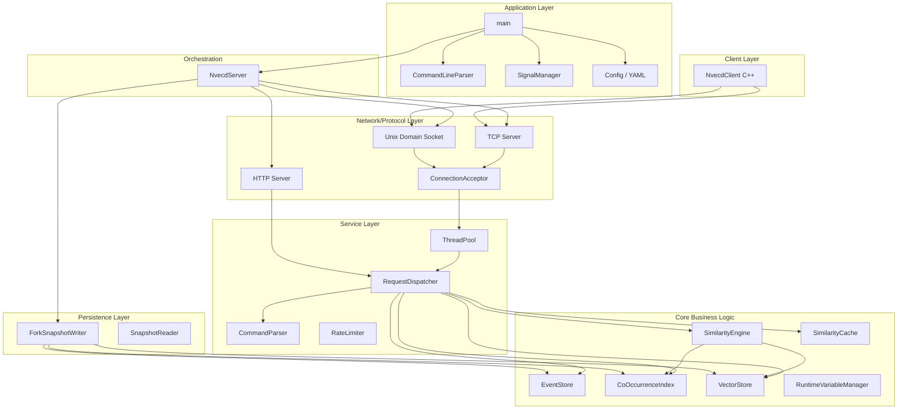
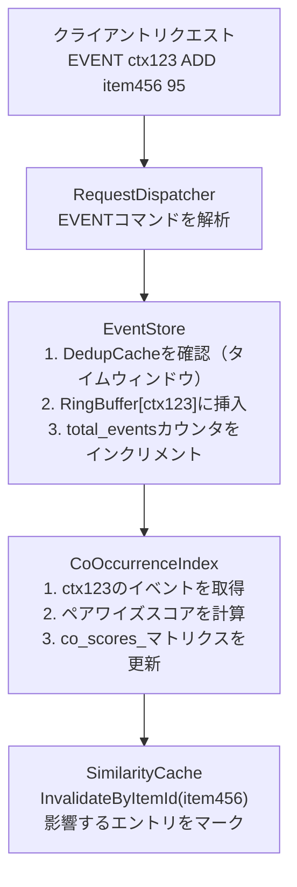
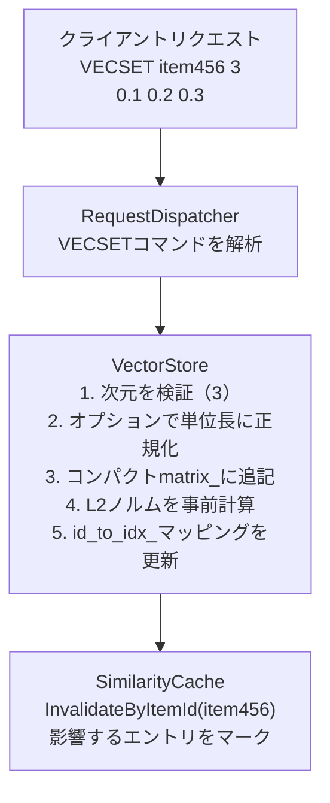
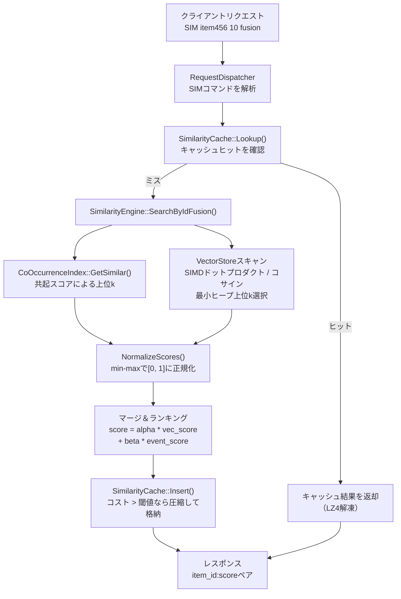
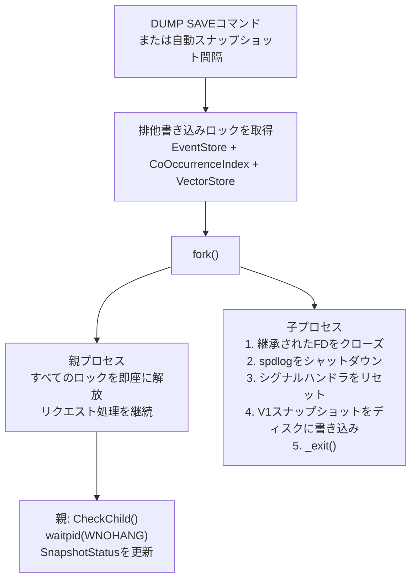
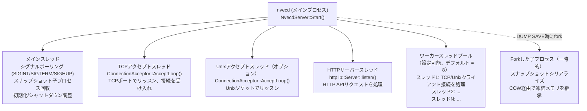
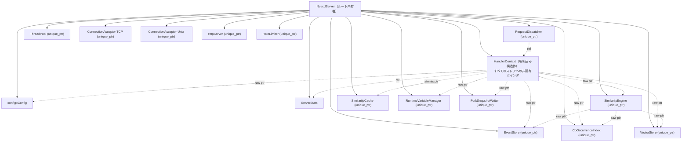

# Nvecd アーキテクチャ

**バージョン**: 1.0
**最終更新日**: 2025-03-25
**プロジェクト**: nvecd - イベントベース共起追跡機能を備えたインメモリベクトル検索エンジン

---

## 目次

1. [概要](#概要)
2. [システムアーキテクチャ](#システムアーキテクチャ)
3. [コンポーネントの責務](#コンポーネントの責務)
4. [データフロー](#データフロー)
5. [スレッドモデル](#スレッドモデル)
6. [コンポーネントの所有権](#コンポーネントの所有権)
7. [主要な設計パターン](#主要な設計パターン)
8. [パフォーマンス特性](#パフォーマンス特性)

---

## 概要

nvecdは、イベントベースの共起追跡と高次元ベクトル類似度検索を組み合わせた**C++17インメモリベクトル検索エンジン**です。行動シグナル（共起）とコンテンツシグナル（ベクトル類似度）を統合し、単一のランク付き結果セットを返す**フュージョン検索**機能を提供します。

- **インメモリストレージ** - クエリ実行時のディスクI/Oなし
- **イベントベースの共起追跡** - コンテキストごとのリングバッファ
- **高次元ベクトル検索** - SIMD最適化された距離計算
- **フュージョン検索** - イベントとベクトルシグナルの重み付き結合
- **Forkベースのコピーオンライトスナップショット** - ブロッキングなしの永続化（Redis BGSAVE方式）

### 主要機能

- **イベント取り込み** - ストリーム（ADD）、状態（SET）、削除（DEL）のセマンティクス
- **共起インデックス** - 時間的関連性のための指数減衰
- **ベクトルストレージ** - コンパクトな連続配置とトゥームストーンベースのGC
- **複数の検索モード**: イベントのみ、ベクトルのみ、フュージョン、アドホックベクトルクエリ（SIMV）
- **SIMD高速化**: AVX2、ARM NEON、スカラーフォールバック（実行時CPU検出）
- **LRU類似度キャッシュ** - リバースインデックスによる選択的無効化
- **型安全なエラーハンドリング** - `Expected<T, Error>`を使用
- **TCP、HTTP、Unixドメインソケット** API対応
- **Forkベースのスナップショット** - COWまたはロックモードの選択
- **レート制限** - AUTHベースのアクセス制御
- **C++クライアントライブラリ** - PIMPLパターン

---

## システムアーキテクチャ

### レイヤードアーキテクチャ



---

## コンポーネントの責務

### コアビジネスロジックレイヤー

#### イベントモジュール (`src/events/`)

**EventStore** (`event_store.h`)
- **責務**: コンテキストごとの固定サイズリングバッファによるイベント管理
- **機能**:
  - コンテキスト（ユーザー、セッション等）ごとのリングバッファ（設定可能な容量）
  - 3種類のイベントタイプ: ADD（ストリーム）、SET（状態）、DEL（削除）
  - ADDイベント用のタイムウィンドウ重複排除（`DedupCache`経由）
  - SET/DELイベント用のラストバリュー重複排除（`StateCache`経由）
  - 処理済みおよび重複排除イベントのアトミックカウンター
  - 並行読み取りと排他書き込みのための`shared_mutex`
- **スレッドセーフティ**: `shared_mutex`によるマルチリーダー・シングルライター
- **主要メソッド**:
  - `AddEvent(ctx, item_id, score, type)`: コンテキストのリングバッファにイベントを挿入
  - `GetEvents(ctx)`: 挿入順（古いものから新しいもの）でイベントを取得
  - `GetContextCount()`: アクティブなコンテキスト数
  - `GetStatistics()`: イベントストアメトリクスのスナップショット
  - `AcquireReadLock()` / `AcquireWriteLock()`: スナップショット用の外部ロックアクセス

**CoOccurrenceIndex** (`co_occurrence_index.h`)
- **責務**: アイテム間の対称的な共起スコアリングマトリクス
- **アルゴリズム**:
  - 各コンテキストについてペアワイズスコアを計算: `score += event1.score * event2.score`
  - 対称ストレージ: `(A,B)` と `(B,A)` の両方を保持
  - 最近の共起を優先するための指数減衰（`ApplyDecay(alpha)`）
- **スレッドセーフティ**: `shared_mutex`によるマルチリーダー・シングルライター
- **主要メソッド**:
  - `UpdateFromEvents(ctx, events)`: コンテキストイベントからペアワイズスコアを更新
  - `GetSimilar(item_id, top_k)`: 共起スコアによる上位kアイテム
  - `GetScore(item1, item2)`: 直接スコア参照
  - `SetScore(item1, item2, score)`: 直接書き込み（スナップショットデシリアライズ用）
  - `ApplyDecay(alpha)`: すべてのスコアに減衰係数を乗算

#### ベクトルモジュール (`src/vectors/`)

**VectorStore** (`vector_store.h`)
- **責務**: コンパクトな連続配置によるスレッドセーフな高次元ベクトルストレージ
- **ストレージ設計**:
  - 単一の信頼できるソース: 連続`float[]`マトリクス（`matrix_`）+ 事前計算L2ノルム（`norms_`）
  - IDマッピング: `id_to_idx_`（文字列から行インデックス）と`idx_to_id_`（行インデックスから文字列）
  - トゥームストーンベースの削除、25%の断片化で自動デフラグ
  - 最初のベクトル格納後に次元がロックされる
- **スレッドセーフティ**: `shared_mutex`によるマルチリーダー・シングルライター
- **主要メソッド**:
  - `SetVector(id, vec, normalize)`: ベクトルを格納（次元の一貫性を検証）
  - `GetVector(id)`: IDでベクトルを取得
  - `DeleteVector(id)`: スロットをトゥームストーンとしてマーク
  - `GetCompactSnapshot()`: ロックフリーバッチ読み取り用のポインタベーススナップショット
  - `GetMatrixRow(idx)` / `GetNorm(idx)`: SIMDカーネル用の直接アクセス
  - `Defragment()`: トゥームストーンを除去してコンパクトストレージを再構築

**距離関数** (`distance.h`, `distance_simd.h`)
- **責務**: SIMD最適化されたベクトル距離計算
- **メトリクス**: ドットプロダクト、コサイン類似度、L2距離
- **実装**: AVX2（x86）、ARM NEON、スカラーフォールバック
- **選択**: `GetOptimalImpl()`による実行時CPU機能検出
- **最適化**: アンロールカーネル、コサイン用の事前計算ノルム、プリフェッチヒント

#### 類似度モジュール (`src/similarity/`)

**SimilarityEngine** (`similarity_engine.h`)
- **責務**: 複数のモダリティにわたる統一的な類似度検索
- **検索モード**:
  - **Events**: `CoOccurrenceIndex::GetSimilar()`による共起ベース
  - **Vectors**: SIMDを使用したコンパクトストレージスキャンによる距離ベース
  - **Fusion**: 重み付き結合: `score = alpha * vector_score + beta * event_score`
  - **Vector Query (SIMV)**: 任意のベクトルによる検索（事前格納不要）
- **機能**:
  - フュージョン用のmin-maxスコア正規化
  - 設定可能なフュージョン重み（`alpha`、`beta`）
  - ランダムサンプリングによる近似検索（`sample_size`設定）
  - イベント候補セットを使用したフィルタ済みベクトル検索
- **スレッドセーフティ**: すべてのメソッドはスレッドセーフ（スレッドセーフなコンポーネントに委譲）
- **主要メソッド**:
  - `SearchByIdEvents(item_id, top_k)`: イベントのみの検索
  - `SearchByIdVectors(item_id, top_k)`: ベクトルのみの検索
  - `SearchByIdFusion(item_id, top_k)`: フュージョン検索
  - `SearchByVector(query_vector, top_k)`: アドホックベクトルクエリ

#### キャッシュモジュール (`src/cache/`)

**SimilarityCache** (`similarity_cache.h`)
- **責務**: 選択的無効化機能を備えた類似度検索結果のLRUキャッシュ
- **機能**:
  - メモリ上限付きLRUエビクション
  - TTLベースの有効期限（設定可能、0 = 無効）
  - 最小クエリコスト閾値（高コストのクエリのみキャッシュ）
  - `ResultCompressor`経由のLZ4圧縮
  - リバースインデックス: `item_id`から`CacheKey`セットへのO(k)選択的無効化
  - エントリごとのロックフリー無効化フラグ（`atomic<bool>`）
  - 実行時の有効化/無効化切り替え
- **スレッドセーフティ**: 並行参照と排他変更のための`shared_mutex`
- **主要メソッド**:
  - `Lookup(key)`: キャッシュ参照（解凍結果またはnulloptを返却）
  - `Insert(key, results, query_cost_ms)`: コストベースのアドミッション制御付き挿入
  - `InvalidateByItemId(item_id)`: リバースインデックスによる選択的無効化
  - `PurgeExpired()`: TTL期限切れエントリの削除（バックグラウンド呼び出し可能）
  - `GetStatistics()`: スレッドセーフな統計スナップショット

---

### ネットワーク/プロトコルレイヤー (`src/server/`)

#### NvecdServer (`nvecd_server.h`)

- **責務**: メインサーバーオーケストレーター。すべてのコンポーネントを所有
- **設計パターン**: Facade + ライフサイクルマネージャー
- **ライフサイクル**:
  1. 設定のロード
  2. コアストア（EventStore、CoOccurrenceIndex、VectorStore）の初期化
  3. SimilarityEngine、SimilarityCache、RuntimeVariableManagerの初期化
  4. HandlerContextを使用してRequestDispatcherを作成
  5. ThreadPoolの起動
  6. TCP ConnectionAcceptorの起動（およびオプションのUnixソケットアクセプター）
  7. HTTPサーバーの起動（有効な場合）
  8. ForkSnapshotWriterの起動（有効な場合）
- **シャットダウン**: 初期化の逆順。アクセプターの停止、スレッドプールのドレイン、ストアの破棄

#### ConnectionAcceptor (`connection_acceptor.h`)

- **責務**: ソケットアクセプトループとコネクションのディスパッチ
- **機能**:
  - TCPとUnixドメインソケットモード
  - `SO_REUSEADDR`、`SO_KEEPALIVE`ソケットオプション
  - IPごとの接続数制限
  - 受け入れたコネクションをThreadPoolにディスパッチ
  - `mutex` + `set<int>`によるスレッドセーフな接続追跡

#### HTTPサーバー (`http_server.h`)

- **API**: cpp-httplib経由のRESTful JSON
- **エンドポイント**:
  - `POST /event`: 共起イベントの登録
  - `POST /vecset`: ベクトルの登録
  - `POST /sim`: IDベースの類似度検索
  - `POST /simv`: ベクトルベースの類似度検索
  - `GET /info`: サーバー情報
  - `GET /health`、`/health/live`、`/health/ready`、`/health/detail`: ヘルスチェック
  - `GET /config`: 設定概要
  - `GET /metrics`: Prometheusフォーマットのメトリクス
  - `POST /dump/save`、`/dump/load`、`/dump/verify`、`/dump/info`: スナップショット管理
  - `POST /debug/on`、`/debug/off`: デバッグモード切替
  - `GET /cache/stats`、`POST /cache/clear`: キャッシュ管理
- **機能**: CORSサポート、CIDRベースのアクセス制御、Kubernetes対応ヘルスプローブ

#### RequestDispatcher (`request_dispatcher.h`)

- **責務**: コマンド解析とルーティング（純粋なアプリケーションロジック、I/Oなし）
- **サポートコマンド**:
  - nvecd固有: EVENT、VECSET、SIM、SIMV
  - MygramDB互換: INFO、CONFIG (HELP/SHOW/VERIFY)、DUMP (SAVE/LOAD/VERIFY/INFO/STATUS)、DEBUG (ON/OFF)
  - 管理: AUTH、SET、GET、SHOW VARIABLES
- **設計**: ネットワーク依存なし。ユニットテストが容易

#### ThreadPool (`thread_pool.h`)

- **ワーカー数**: 固定（デフォルト = CPU数）
- **キュー**: バックプレッシャー付きの上限付きタスクキュー
- **シャットダウン**: グレースフル。すべてのタスクの完了を待機
- **スレッドセーフティ**: `condition_variable`によるスレッドセーフなタスク送信

#### RateLimiter (`rate_limiter.h`)

- **アルゴリズム**: クライアントIPごとのトークンバケット
- **設定**: バースト容量、リフィルレート、最大追跡クライアント数
- **機能**: 古いクライアントエントリの自動クリーンアップ

---

### 永続化レイヤー (`src/storage/`)

#### ForkSnapshotWriter (`snapshot_fork.h`)

- **責務**: `fork()` + OSコピーオンライトを使用したノンブロッキングスナップショット永続化
- **設計**: Redis BGSAVE方式
- **Fork前バリア**:
  1. すべてのストア（EventStore、CoOccurrenceIndex、VectorStore）の排他書き込みロックを取得
  2. ロック保持中に`fork()`を呼び出し
  3. fork後、親プロセスは即座にロックを解放
- **子プロセス**:
  1. 継承されたファイルディスクリプタをクローズ
  2. spdlogをシャットダウン
  3. シグナルハンドラをリセット
  4. V1スナップショットフォーマットですべてのストアをシリアライズ
  5. `_exit()`を呼び出し（`exit()`ではない）
- **ステータス追跡**: `SnapshotStatus`列挙型（kIdle、kInProgress、kCompleted、kFailed）と`mutex`で保護された結果
- **子プロセス回収**: `CheckChild()`は`waitpid(WNOHANG)`でノンブロッキングな子プロセスステータス確認

#### スナップショットフォーマット

- **バージョン**: V1バイナリフォーマット
- **内容**: 設定、EventStoreの状態、CoOccurrenceIndexのスコア、VectorStoreのマトリクス
- **操作**: 保存、読み込み、検証（整合性チェック）、情報（メタデータ確認）
- **モード**: `"fork"`（COW、ノンブロッキング）または `"lock"`（グローバル書き込みロック、ブロッキング）

---

### 設定とユーティリティ

#### Configモジュール (`src/config/config.h`)

- **フォーマット**: yaml-cpp経由のYAMLベース設定
- **セクション**:
  - `events`: リングバッファサイズ、減衰間隔/アルファ、重複排除ウィンドウ/キャッシュサイズ
  - `vectors`: デフォルト次元、距離メトリクス（cosine/dot/l2）
  - `similarity`: デフォルト/最大top_k、フュージョンalpha/beta、サンプルサイズ
  - `snapshot`: ディレクトリ、ファイル名、間隔、保持数、モード（fork/lock）
  - `api.tcp`: バインドアドレス、ポート（デフォルト 11017）
  - `api.http`: 有効フラグ、バインド、ポート（デフォルト 8080）、CORS
  - `api.unix_socket`: パス（空 = 無効）
  - `api.rate_limiting`: 有効化、容量、リフィルレート、最大クライアント数
  - `perf`: スレッドプールサイズ、最大接続数、接続タイムアウト
  - `network`: 許可CIDRレンジ
  - `logging`: レベル、JSONモード、ファイルパス
  - `cache`: 有効化、最大メモリ、最小クエリコスト、TTL、圧縮
  - `security`: 必須パスワード（requirepass）
- **バリデーション**: `ValidateConfig()`は特定のエラーコード付き`Expected<void, Error>`を返却

#### RuntimeVariableManager (`src/config/runtime_variable_manager.h`)

- **責務**: ランタイム変数管理（SET/GET/SHOW VARIABLESコマンド）
- **機能**: キャッシュTTL、最小クエリコスト等のライブ再設定

#### エラーハンドリング (`src/utils/`)

**expected.h**
- **型**: C++17互換の`Expected<T, E>`（将来のC++23 `std::expected`に対応）
- **利点**: 例外を使わない型安全なエラー伝播

**error.h**
- **エラーコード範囲**:

| 範囲 | モジュール |
|------|----------|
| 0-999 | 一般エラー |
| 1000-1999 | 設定エラー |
| 2000-2999 | イベント処理エラー |
| 3000-3999 | コマンド解析エラー |
| 4000-4999 | ベクトル/類似度エラー |
| 5000-5999 | ストレージ/スナップショットエラー |
| 6000-6999 | ネットワーク/サーバーエラー |
| 7000-7999 | クライアントエラー |
| 8000-8999 | キャッシュエラー |

#### オブザーバビリティ

**ServerStats** (`server_types.h`)
- **メトリクス**: キャッシュラインアライメントされたアトミックカウンター
  - 総接続数/アクティブ接続数
  - 総コマンド数/失敗コマンド数
  - コマンドタイプ別カウンター（EVENT、SIM、VECSET、INFO、CONFIG、DUMP、CACHE）
  - アップタイムとQPS計算

**StructuredLog** (`structured_log.h`)
- **フォーマット**: spdlog経由のイベントベース構造化ロギング
- **利点**: モニタリング用の機械解析可能なログエントリ

---

### クライアントレイヤー (`src/client/`)

#### NvecdClient (`nvecdclient.h`)

- **責務**: nvecdプロトコル用の高レベルC++クライアント
- **設計**: ABI安定性のためのPIMPLパターン
- **接続**: TCPまたはUnixドメインソケット
- **コマンド**:
  - `Event(ctx, type, id, score)`: イベント登録
  - `Vecset(id, vector)`: ベクトル登録
  - `Sim(id, top_k, mode)`: IDベースの類似度検索
  - `Simv(vector, top_k, mode)`: ベクトルベースの類似度検索
  - `Info()`: サーバー情報
  - `GetConfig()`: 設定取得
  - `Save()` / `Load()` / `Verify()` / `DumpInfo()`: スナップショット管理
  - `EnableDebug()` / `DisableDebug()`: デバッグモード
  - `SendCommand(raw)`: 低レベルの生コマンドインターフェース

---

## データフロー

### イベント取り込み



### ベクトル登録



### 類似度検索（フュージョンモード）



### スナップショット（ForkベースCOW）



---

## スレッドモデル

### プロセス構成



### スレッドセーフティパターン

| コンポーネント | 並行性 | メカニズム |
|-------------|--------|----------|
| **EventStore** | マルチリーダー・シングルライター | `shared_mutex` |
| **CoOccurrenceIndex** | マルチリーダー・シングルライター | `shared_mutex` |
| **VectorStore** | マルチリーダー・シングルライター | `shared_mutex` |
| **SimilarityCache** | マルチリーダー・並行無効化 | `shared_mutex` + エントリごとの`atomic<bool>` |
| **ServerStats** | ウェイトフリー | キャッシュラインアライメント付き`atomic<uint64_t>` |
| **ConnectionAcceptor** | アクセプトスレッド + メインスレッド | `mutex` + `set<int>` |
| **ForkSnapshotWriter** | 任意のスレッドからのステータスクエリ | `SnapshotResult`上の`mutex` |
| **ThreadPool** | マルチプロデューサー・マルチコンシューマー | `mutex` + `condition_variable` |

### 並行性保証

**共有可変状態の保護:**

1. **EventStore**: `shared_mutex`
   - リーダー: 複数の並行`GetEvents()`、`GetStatistics()`クエリ
   - ライター: `AddEvent()`経由の単一ライター（unique_lockによるシリアライズ）

2. **CoOccurrenceIndex**: `shared_mutex`
   - リーダー: 類似度検索のための`GetSimilar()`、`GetScore()`
   - ライター: `UpdateFromEvents()`、`ApplyDecay()`、`SetScore()`

3. **VectorStore**: `shared_mutex`
   - リーダー: `GetVector()`、`GetCompactSnapshot()`、`GetMatrixRow()`経由のSIMDスキャン
   - ライター: `SetVector()`、`DeleteVector()`、`Defragment()`

4. **SimilarityCache**: `shared_mutex` + エントリごとの`atomic<bool>`
   - リーダー: 共有ロックによる`Lookup()`
   - ライター: 排他ロックによる`Insert()`、`Erase()`、`InvalidateByItemId()`
   - ロックフリー: キャッシュエントリの無効化フラグ確認

5. **ServerStats**: `atomic<uint64_t>`（ロックフリー）
   - すべてのカウンターは緩和メモリオーダーで`fetch_add`を使用
   - フォールスシェアリング防止のためキャッシュラインアライメント

---

## コンポーネントの所有権

### 所有権階層



### リソースライフサイクル

**NvecdServerの初期化順序**（`InitializeComponents()`内）:

1. **EventStore**（`EventsConfig`に依存）
2. **CoOccurrenceIndex**（依存なし）
3. **VectorStore**（`VectorsConfig`に依存）
4. **SimilarityEngine**（EventStore、CoOccurrenceIndex、VectorStoreに依存）
5. **SimilarityCache**（`CacheConfig`に依存）
6. **RuntimeVariableManager**（SimilarityCacheに依存）
7. **HandlerContext**（上記すべてへのポインタを接続）
8. **RequestDispatcher**（HandlerContextに依存）
9. **ThreadPool**（`PerformanceConfig`に依存）
10. **RateLimiter**（オプション、`ApiConfig`に依存）
11. **ConnectionAcceptor** TCP用（ThreadPoolに依存）
12. **ConnectionAcceptor** Unixソケット用（オプション、ThreadPoolに依存）
13. **ForkSnapshotWriter**（構築時にストア依存なし）
14. **HttpServer**（オプション、HandlerContextに依存）

**シャットダウン順序**（初期化の逆順）:

1. **HTTPサーバー**のシャットダウン（実行中の場合）
2. **Unixアクセプター**の停止（実行中の場合）
3. **TCPアクセプター**の停止
4. **ThreadPool**のシャットダウン（保留タスクをドレイン）
5. **ForkSnapshotWriter** 子プロセスの完了待ち（スナップショット進行中の場合）
6. **すべてのunique_ptr**が宣言の逆順で破棄

### RAIIパターン

1. **所有権のための`unique_ptr`**: すべてのコンポーネントはNvecdServerが所有
2. **読み書き調整のための`shared_mutex`**: EventStore、CoOccurrenceIndex、VectorStore、SimilarityCache
3. **ロックフリー統計のための`atomic<T>`**: ServerStatsカウンター、キャッシュ無効化フラグ
4. **`AcquireReadLock()` / `AcquireWriteLock()`**: クロスコンポーネント整合性（スナップショット）のための明示的ロックアクセス
5. **ABI安定性のためのPIMPL**: NvecdClientは`unique_ptr<Impl>`を使用
6. **Fork子プロセスのクリーンアップ**: 子プロセスで`_exit()`、親プロセスで`waitpid()`、タイムアウト時にSIGTERM

---

## 主要な設計パターン

### エラーハンドリング: Expected<T, Error>

```cpp
Expected<std::vector<SimilarityResult>, Error> result =
    engine.SearchByIdFusion("item123", 10);
if (result) {
    for (const auto& r : *result) {
        std::cout << r.item_id << ": " << r.score << std::endl;
    }
} else {
    spdlog::error("Search failed: {}", result.error().message());
}
```

**利点:**
- 型安全: コンパイル時のエラーチェック
- 例外なし: ホットパスでの予測可能なパフォーマンス
- 合成可能: エラー時の早期リターンで操作をチェイン

### リソース管理: RAII

```cpp
class NvecdServer {
    std::unique_ptr<events::EventStore> event_store_;
    std::unique_ptr<events::CoOccurrenceIndex> co_index_;
    std::unique_ptr<vectors::VectorStore> vector_store_;
    std::unique_ptr<similarity::SimilarityEngine> similarity_engine_;
    std::unique_ptr<cache::SimilarityCache> cache_;
    // ...

    ~NvecdServer() {
        Stop();
        // デストラクタがすべてのunique_ptrを宣言の逆順で自動クリーンアップ
    }
};
```

### スレッドセーフティ: shared_mutex + Atomic

```cpp
class VectorStore {
    mutable std::shared_mutex mutex_;
    std::vector<float> matrix_;

    std::optional<Vector> GetVector(const std::string& id) const {
        std::shared_lock lock(mutex_);  // 複数リーダー
        // ...
    }

    Expected<void, Error> SetVector(const std::string& id,
                                     const std::vector<float>& vec) {
        std::unique_lock lock(mutex_);  // 排他ライター
        // ...
    }
};

struct ServerStats {
    alignas(64) std::atomic<uint64_t> total_commands{0};

    void IncrementCommands() {
        total_commands.fetch_add(1, std::memory_order_relaxed);
    }
};
```

### ForkベースのCOWスナップショット

```cpp
// 親プロセス: 最小限のブロッキング
auto lock_es = event_store.AcquireWriteLock();
auto lock_co = co_index.AcquireWriteLock();
auto lock_vs = vector_store.AcquireWriteLock();
pid_t pid = fork();  // OSがデータではなくページテーブルをコピー
if (pid == 0) {
    // 子プロセス: 凍結メモリをディスクにシリアライズ
    WriteSnapshotV1(filepath, config, event_store, co_index, vector_store);
    _exit(0);
}
// 親プロセス: 即座にロック解放、リクエスト処理を継続
```

**利点:**
- ほぼゼロダウンタイム: 親プロセスは`fork()`システムコール中のみブロック
- メモリ効率的: OSのCOWページ。変更されたページのみ複製
- 一貫性: 子プロセスはポイントインタイムの凍結スナップショットを参照

### 依存性注入: HandlerContext

```cpp
struct HandlerContext {
    events::EventStore* event_store;
    events::CoOccurrenceIndex* co_index;
    vectors::VectorStore* vector_store;
    similarity::SimilarityEngine* similarity_engine;
    std::atomic<cache::SimilarityCache*> cache;
    config::RuntimeVariableManager* variable_manager;
    ServerStats& stats;
    const config::Config* config;
    // ...
};
```

**利点:**
- RequestDispatcherをコンポーネント作成から分離
- テスト可能: モック依存性の注入
- 一元的な接続: すべてのポインタはNvecdServer::InitializeComponents()で一度だけ設定

### コンパクトな連続ストレージ

```cpp
class VectorStore {
    std::vector<float> matrix_;  // [n x dim] 連続配列
    std::vector<float> norms_;   // [n] 事前計算L2ノルム
    std::vector<bool> deleted_;  // トゥームストーンフラグ

    const float* GetMatrixRow(size_t idx) const {
        return matrix_.data() + idx * dimension_;
    }
};
```

**利点:**
- キャッシュフレンドリー: SIMDスキャンのためのシーケンシャルメモリアクセス
- 事前計算ノルム: コサイン類似度でのクエリごとのノルム計算を回避
- トゥームストーンGC: コンパクションを遅延させ書き込み増幅を削減

---

## パフォーマンス特性

### ベクトル検索パフォーマンス

- **SIMD高速化**: AVX2（8ワイドfloat）、NEON（4ワイドfloat）、アンロールループ
- **コンパクトストレージ**: 連続`float[]`マトリクスによるシーケンシャルSIMDスキャン
- **事前計算ノルム**: コサイン類似度でクエリごとのノルム計算を回避
- **最小ヒープ上位k**: フルソートなしのO(n log k)選択
- **プリフェッチヒント**: 距離計算中の次ベクトルのメモリプリフェッチ
- **近似検索**: ランダムサンプリングによるスキャン範囲の削減（設定可能な`sample_size`）

### イベント処理パフォーマンス

- **リングバッファ**: コンテキストごとの固定メモリでO(1)挿入
- **タイムウィンドウ重複排除**: LRUキャッシュが重複イベント処理を防止
- **ペアワイズ共起**: コンテキストあたりO(k^2)（kはリングバッファサイズ、上限あり）
- **指数減衰**: 設定可能な間隔でのO(n)スキャン

### キャッシュパフォーマンス

- **LRUエビクション**: 設定可能な上限によるメモリ制限
- **LZ4圧縮**: キャッシュ結果のメモリフットプリントを削減
- **選択的無効化**: リバースインデックスによりO(n)クリアの代わりにO(k)無効化
- **コストベースのアドミッション**: 最小コスト閾値以上のクエリのみキャッシュ
- **TTL有効期限**: バックグラウンドでパージ可能な古いエントリ

### 並行性パフォーマンス

- **マルチリーダー/シングルライター**: `shared_mutex`により読み取りスループットを最大化
- **ロックフリー統計**: キャッシュラインアライメント付き`atomic`カウンターでフォールスシェアリングを防止
- **Forkベースのスナップショット**: ほぼゼロの書き込み一時停止（`fork()`システムコールのみブロッキング）
- **スレッドプール**: バックプレッシャー付き上限付きキューと固定ワーカー

### メモリ効率

- **コンパクトベクトルストレージ**: ベクトルごとの個別割り当てではなく単一の連続マトリクス
- **トゥームストーンGC**: 25%の断片化閾値で自動デフラグ
- **リングバッファ**: コンテキストごとの固定サイズで無制限のメモリ増加を防止
- **キャッシュ圧縮**: キャッシュ結果のLZ4圧縮で約50-70%のメモリ削減

---

## プロトコルリファレンス

### TCPプロトコル

`\r\n`デリミタによるテキストベースプロトコル。

**nvecd固有コマンド:**

| コマンド | 構文 | 説明 |
|---------|------|------|
| EVENT | `EVENT <ctx> <type> <id> <score>` | 共起イベントの登録 |
| VECSET | `VECSET <id> <dim>\r\n<v1> <v2> ...` | ベクトルの登録（複数行） |
| SIM | `SIM <id> <top_k> [mode]` | IDによる類似度検索 |
| SIMV | `SIMV <dim> <top_k> [mode]\r\n<v1> <v2> ...` | ベクトルによる類似度検索 |

**MygramDB互換コマンド:**

| コマンド | 構文 | 説明 |
|---------|------|------|
| INFO | `INFO` | サーバー情報 |
| CONFIG | `CONFIG SHOW\|HELP\|VERIFY` | 設定管理 |
| DUMP | `DUMP SAVE\|LOAD\|VERIFY\|INFO\|STATUS [path]` | スナップショット管理 |
| DEBUG | `DEBUG ON\|OFF` | デバッグモード切替 |
| AUTH | `AUTH <password>` | 接続認証 |

---

## 参考文献

- [MygramDB アーキテクチャ](../../../mygram-db/docs/ja/architecture.md) - 参照アーキテクチャ
- `src/utils/expected.h` - Expected<T, E>の実装
- `src/utils/error.h` - エラーコードとErrorクラス
- `src/utils/structured_log.h` - 構造化ロギング
