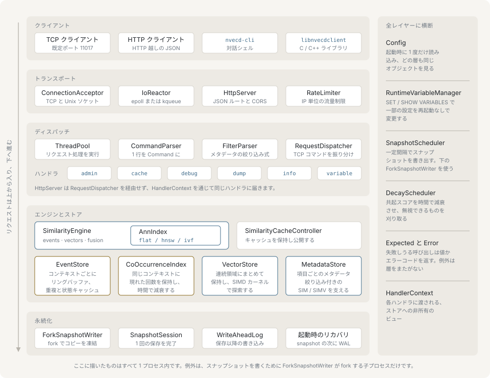
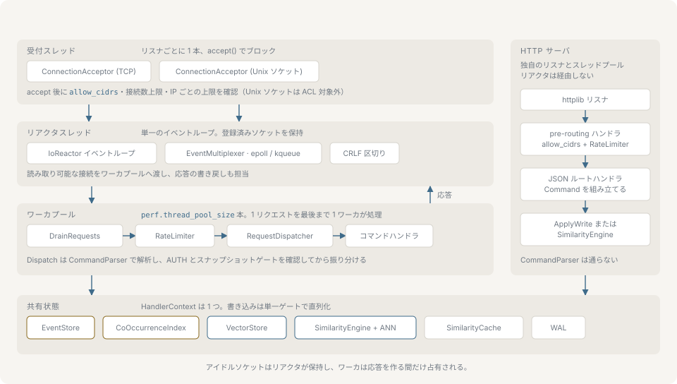
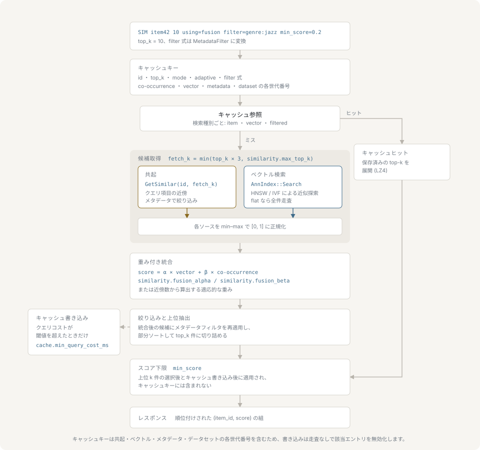
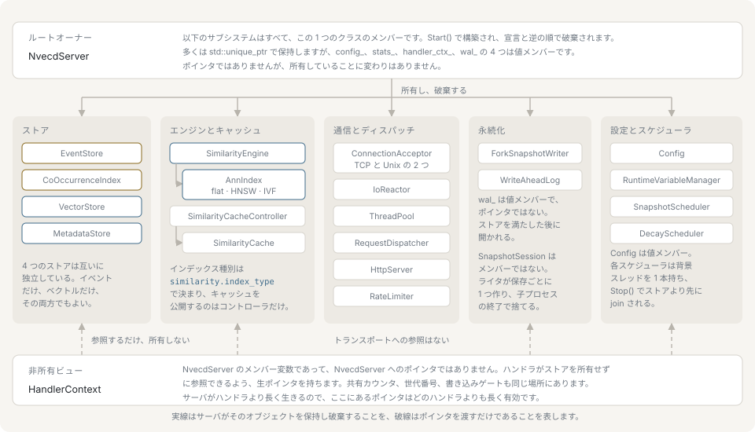

# アーキテクチャ

nvecd は単一のプロセスで、すべてのデータをメモリに保持し、1 組のストアの上に 2 つのプロトコルサーフェスを提供します。このページでは、その層構成、リクエストが層を通る経路、全体を成り立たせているロック、そして何を誰が所有するかを説明します。

## 層の構成

**ネットワーク**。`ConnectionAcceptor` はリスナーごとに accept ループを走らせます。TCP に 1 つ、必要なら Unix ドメインソケットに 1 つです。`IoReactor` は受理したディスクリプタすべてを所有する単一のレベルトリガのイベントループで、その背後にある可搬な readiness バックエンドが `reactor/event_multiplexer`、クライアントごとのバッファと書き込みキューを持つのが `ReactorConnection` です。フレーミングは `ConnectionIOHandler` が行います。`ThreadPool` はコマンドの実行をイベントループから切り離して走らせます。`HttpServer` は独自のワーカースレッドを持つ別のリスナーで、同じコマンドを JSON のルートとして公開します。`RateLimiter` は両者の手前に置く任意のクライアント単位のトークンバケットです。

**ディスパッチ**。`command_parser` がリクエスト行を `Command` に変換します。`RequestDispatcher` が認証し、ライフサイクルのゲートを確認し、振り分けます。クエリ以外のコマンドは `src/server/handlers/` の下のハンドラが担当します（`info_handler`、`admin_handler`、`debug_handler`、`dump_handler`、`cache_handler`、`variable_handler`）。`filter_parser` は `filter=` の式を `MetadataFilter` に変換します。

**ドメイン**。`EventStore` はコンテキストごとに直近のイベントを有界のリングで保持します。`CoOccurrenceIndex` はそこから導かれた項目間の関連を保持します。`VectorStore` はベクトルを、`MetadataStore` はフィルタが照合する項目ごとの属性を保持します。`SimilarityEngine` は 4 つすべてを読み、共起検索・ベクトル検索・統合検索に応答します。ANN 索引を所有するのもこのクラスです。

**ANN 索引**。インタフェースが `AnnIndex` で、その背後に `HnswIndex` と `IvfIndex` があり、`similarity.index_type`（`flat`、`hnsw`、`ivf`）に従って `ann_index_factory` が選びます。索引を所有するのは **`VectorStore` ではなく `SimilarityEngine`** です。ストアはベクトルを持ち、エンジンはそれを検索する構造を持ちます。

**キャッシュ**。`SimilarityCacheController` がプロセスの生存期間を通じてキャッシュの実体を所有し、有効化・無効化・公開・調整を一手に引き受けます。LRU 本体が `SimilarityCache` で、キーを導出するのが `cache_key_generator`、格納するエントリを圧縮するのが `result_compressor`、そして項目 ID からそれを含むキャッシュキーへの逆引き索引を持ちます。

**ストレージ**。`WriteAheadLog` が各変更を記録します。スナップショットの書き方は `snapshot_fork` と `snapshot_lock` の 2 つで、両者が共有する耐久性ハンドシェイクを `snapshot_session` が所有し、ディスク上の形式が `snapshot_format_v1` です。`wal_codec` は `Command` を WAL のペイロードへ、またその逆へ変換します。スナップショットの読み取りは自由関数（`ReadSnapshotV1`、`VerifySnapshotIntegrity`、`GetSnapshotInfo`）が行い、読み取り用のクラスはありません。

**スケジューラ**。`SnapshotScheduler` は周期的な fork スナップショットを取り、保持数を守らせます。`DecayScheduler` は共起索引に指数減衰をかけ、無視できるエントリを刈り込みます。

ストレージ層は[永続化](./persistence.md)が詳しく扱います。

## リクエストの経路

リアクタとスレッドプールはどちらも常に経路上にあります。どちらか一方を選ぶという構成ではありません。

1. **accept**。acceptor 自身のスレッドがソケットを受理し、接続数の上限と許可 CIDR を確認して、ディスクリプタをリアクタに渡します。ディスクリプタの所有権を移すのは登録の成否です。失敗すれば acceptor が唯一の閉じ手のままで、成功すればリアクタが唯一の閉じ手になります。
2. **待機**。ソケットはスレッドではなくイベントループの中に置かれます。アイドルな接続のコストはマップの 1 エントリで、ループはアイドルタイムアウトを超えた接続を回収します。
3. **読み取り**。ループが読み取り可能なディスクリプタを見つけると、その接続は接続単位のフレーミング上限とプロセス全体の未処理バイトの予算に照らしてバイト列を読み溜めます。
4. **実行**。完全なリクエストが組み立てられた時点で、接続はそれを `ThreadPool` に投入します。**ここがスレッドの境界です**。ここまではイベントループのスレッドで動き、ここから先はプールのワーカーで動きます。
5. **ディスパッチ**。ワーカー上でリクエストはレートリミッタを通り、解析され、認証要件とライフサイクルのゲートに照らされ、ハンドラに届きます。
6. **応答**。応答は接続のキューに戻されます。ソケットが全量を受け取れない場合、リアクタは書き込み可能性を監視し、残りをループのスレッドで送り切ります。

HTTP サーフェスは独自のリスナーと独自のワーカースレッドを持ち、リアクタを通りません。合流するのはその先です。同じ `Command` を組み立てて同じ書き込み経路と同じエンジンを呼び、ストア、キャッシュ、世代カウンタを TCP サーフェスと共有します。

## 読み取りの経路

統合検索の `SIM` は次の経路を通ります。

1. **フィルタの解析**。`filter=` 引数は `MetadataFilter` になります。フィルタの有無はキャッシュの検索種別の分類を変えます。フィルタ付きの結果とフィルタなしの結果は互換ではないからです。
2. **キャッシュの確認**。キーはクエリ ID、`top_k`、モード、適応フラグ、フィルタ式、そして 4 つの世代カウンタ（共起、ベクトル、メタデータ、データセット）から導かれます。世代がキーの一部なので、どれかを進める変更は影響を受けるキーを到達不能にします。古いエントリを探し出して削除する必要はありません。ヒットした場合はその結果をそのまま返し、返す途中で `min_score` を適用します。
3. **両方の信号の実行**。エンジンは要求された `top_k` の 3 倍（`similarity.max_top_k` で頭打ち）まで多めに取り、共起検索とベクトル検索をストア全体に対して独立に走らせます。両者は積集合ではなく加算的です。内容が似ているだけで一度も共起していない項目も浮かび上がります。
4. **重み付け**。適応的な統合では、配分はクエリ項目の共起索引における実際の近傍数から決まります。切り詰められた結果リストからではないので、`top_k` が小さいという理由で成熟した項目が新規に見えることはありません。適応的でない場合は設定された `fusion_alpha` と `fusion_beta` が使われます。
5. **正規化と配分**。加重和の前に各信号のスコアを正規化するので、2 つの尺度が比較可能である必要はありません。片方に候補が無い場合、その重みがもう片方の寄与を縮めることはありません。片方が失敗した場合でも、残った信号でクエリは応答し、失敗はログに残ります。
6. **フィルタと格納**。メタデータフィルタを適用し、所要時間を計測して、結果をキャッシュに挿入します。ただし挿入するのは、キャッシュが依然として公開中の実体であり、4 つの世代カウンタがすべて手順 2 で捕捉した値のままである場合だけです。すでに変化した状態に対して計算された結果は、キャッシュせずに捨てます。

スコアリング自体は[統合検索](./fusion.md)が扱います。

## 並行性のモデル

**存在するロック**。

| ロック | 保護する対象 |
|---|---|
| ストアごとの `shared_mutex` 各 1 つ | `EventStore`、`CoOccurrenceIndex`、`VectorStore`、`MetadataStore` の中身 |
| `snapshot_write_gate`（`shared_mutex`） | スナップショットの時点の境界 |
| `write_serialization_gate`（`mutex`） | 変更と WAL 追記の組、および世代カウンタ |
| `SimilarityCache::mutex_`（`shared_mutex`） | LRU リスト、エントリのマップ、逆引き索引 |
| `SimilarityEngine::ann_publication_mutex_`（`shared_mutex`） | ベクトルストアの世代と対で公開される ANN のラベル対応 |
| `IoReactor::connections_mutex_` | リアクタのディスクリプタ表 |

**ロックの順序**。状態を変更するリクエストは `snapshot_write_gate` を共有で取り、次に `write_serialization_gate`、最後にストア自身のロックを取ります。スナップショットと `DUMP LOAD` は `snapshot_write_gate` を排他で取り、次に `write_serialization_gate` を取ります。両者の順序が同じであることが、互いに対する安全性を成り立たせています。ストア群の中での順序はイベントストア、共起索引、ベクトルストア、メタデータストアで固定されており、どちらのスナップショットモードもこの順で 4 つを同時に取得します。

**`shared_mutex` が可能にしていること**。ストア自身のロックが同時読み取りを可能にしています。任意の数の `SIM` クエリがベクトルストアを同時に読み、`VECSET` は挿入のあいだそれらを締め出します。サーバー全体の 2 つのゲートはストア内部の整合のためのものではありません。スナップショットの時点の境界を実在させること、そして WAL の順序を両プロトコルサーフェスにまたがって依存関係の順序に一致させることのために存在します。

**ロックの代わりにアトミックを使う箇所**。単調であればよいだけのカウンタは relaxed のアトミックです。コマンド種別ごとの統計、接続数、キャッシュのヒット数とミス数がこれにあたります。4 つの世代カウンタとライフサイクルのフラグ（`loading`、`read_only`）は acquire/release のアトミックです。読み手はカウンタを進める前に書き手が公開した状態を見なければならないからです。公開されているキャッシュのポインタがアトミックなのは、キャッシュの有効化・無効化がクエリ経路のロックを一切必要としないようにするためです。キャッシュエントリの無効化フラグがアトミックなのは、キャッシュの書き込みロックを取らずに立てられるようにするためです。

**同時書き込みのもとで読み手に保証されるもの**。各ストアは読み手に**そのストアの**一貫した像を与えます。共起索引とベクトルストアの両方に触れるクエリはそれぞれのロックを別々に取るので、片方には反映され他方にはまだ反映されていない書き込みを観測することがあります。統合検索はこれが無害になるように定義されています。2 つの信号は独立で、別々に正規化され、候補の無い信号は誤った値ではなく何も寄与しません。

4 つのストアすべてにまたがる一貫性が成立するのはスナップショットゲートの下だけです。それはスナップショットに必要なものであって、クエリには必要のないものです。

## 所有と生存期間

唯一の根の所有者は `NvecdServer` です。各コンポーネントはそのメンバの `unique_ptr` で、WAL だけは直接のメンバです。それ以外は何も所有しません。`SimilarityEngine` はストアへの生ポインタを持ち、`SnapshotScheduler` と `DecayScheduler` は操作対象への生ポインタを持ち、`HandlerContext` は非所有ポインタと、サーバーの統計およびライフサイクルフラグへの参照からなる構造体です。ハンドラはこのコンテキストを受け取ることで、何も所有せずにすべてへ到達できます。

例外は ANN 索引ひとつで、これは `SimilarityEngine` が完全に所有します。

**構築の順序**はこれらのポインタによって決まります。最初にストアです。エンジンがそのアドレスを取るからです。次にエンジン、次にキャッシュコントローラ（自身のキャッシュポインタをハンドラコンテキストへ公開します）、次に実行時変数マネージャ（コントローラを必要とします）と続きます。ハンドラコンテキストが埋まり、その上にディスパッチャが作られるのはそのあとです。復旧（スナップショットの読み込みと WAL の再生）はストアが存在してからスケジューラが始まる前に走り、WAL のポインタがハンドラコンテキストへ公開されるのは再生が終わってからです。ネットワークスタックは最後で、スレッドプール、リアクタ、acceptor、そして HTTP サーバーの順です。

**停止の順序**はその逆で、各段はポインタを最後の利用者が消えるまで有効に保つために存在します。

1. スケジューラを止め、新しいスナップショットや減衰の処理が始まらないようにします。
2. 実行中の fork の子プロセスを、設定された停止予算の範囲で待ちます。
3. HTTP サーバー、続いて acceptor を止め、新しい接続を受け入れないようにします。
4. リアクタを止め、close コールバックが触れるサーバー状態がまだ有効なうちに全クライアントを登録解除します。
5. 稼働中の接続に停止タイムアウトぶんの猶予を与えます。
6. スレッドプールを停止します。この待ちは意図的に無制限です。キューに残るタスクはストアへの生ポインタを持っており、ワーカーが動いているうちに戻れば解放済みメモリを読ませることになります。acceptor もリアクタもすでに止まっているので新しいタスクは来ず、キューは有限です。
7. WAL を最後に閉じます。保留中の書き込みをフラッシュし、背景の fsync スレッドを join します。この時点で追記しうるサーフェスはすべて停止しています。

WAL がメンバの最後に宣言されているのは、破棄がまずそこへ届くようにするためで、それを参照するスケジューラが止まった後になります。

## エラーモデル

失敗しうる操作はすべて `Expected<T, Error>` を返します。リクエスト経路に例外はありません。失敗は値として、応答に変換できる層まで伝播します。`Error` はコード、メッセージ、そして任意のコンテキスト文字列を持ちます。ストレージの失敗ならファイルパスが入ります。

`ErrorCode` はモジュールごとに区分されており、コードの数値域がその出どころを示します。

| 範囲 | モジュール |
|---|---|
| 0–999 | 一般 |
| 1000–1999 | 設定 |
| 2000–2999 | イベント処理 |
| 3000–3999 | コマンド解析 |
| 4000–4999 | ベクトルと類似度 |
| 5000–5999 | ストレージとスナップショット |
| 6000–6999 | ネットワークとサーバー |
| 7000–7999 | クライアント |
| 8000–8999 | キャッシュ |

TCP サーフェスではエラーは `ERROR <メッセージ>` になります。HTTP サーフェスではコードから導かれた HTTP ステータスと JSON のボディになります。ハンドラに届く前に応答される条件もあり、それらは固有の接頭辞を持ちます。認証されていない特権コマンドには `NOAUTH`、`DUMP LOAD` の公開中は `LOADING`、lock モードのスナップショットが書き込みゲートを保持しているあいだは `READONLY` です。
