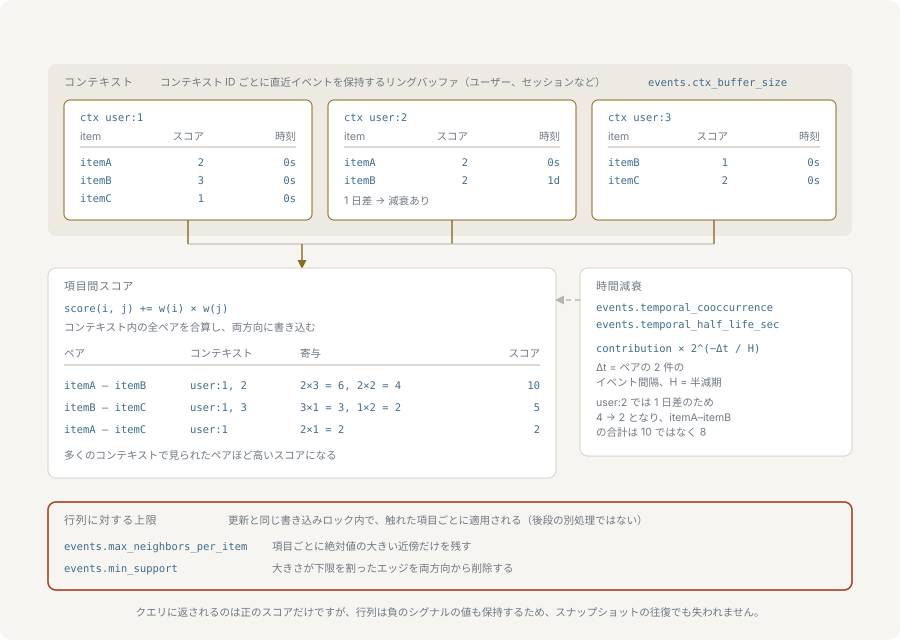
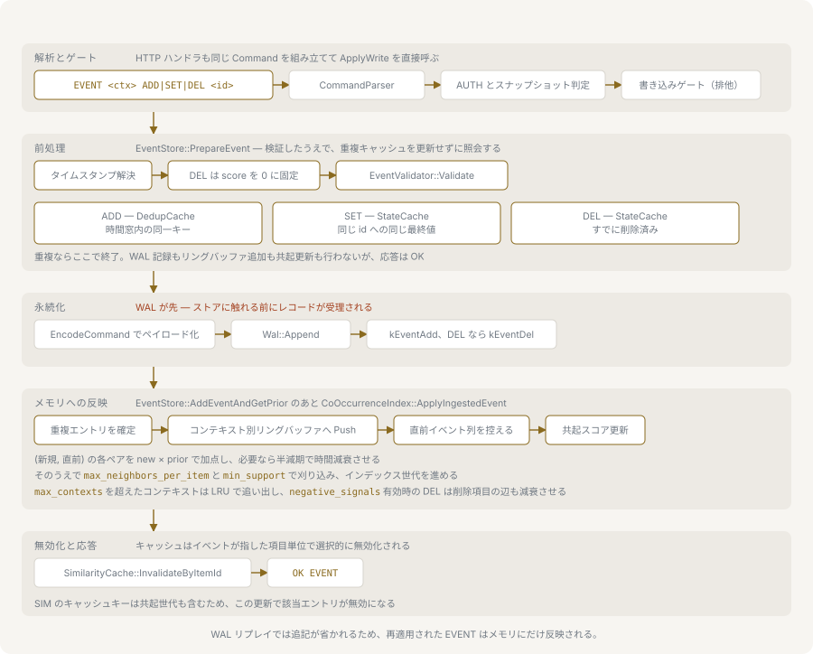

# イベントと共起

nvecd は行動からアイテム同士の関連を導きます。同じコンテキストに現れたアイテムを関連するものとして扱い、その強さを時間とともに積み上がるスコアで表します。このページでは、コンテキストとは何か、3 つのイベント動詞がそれぞれ何を意味するか、ペアのスコアがどう計算されるか、そして保持上限が何を捨てるかを扱います。



コマンドの構文は [protocol.md](./protocol.md) に網羅されています。ここで挙げる設定キーは、値の範囲とあわせて [configuration.md](./configuration.md) に記載されています。

## コンテキスト

コンテキストとは `EVENT` コマンドのまとめ方を決めるキー、つまり第 1 引数です。すべてのイベントが 1 つ持ちます。2 つのイベントが共起と数えられるのは、同じコンテキストに属し、かつ後から届いた側が到着した時点で両方がそのコンテキストのバッファに入っている場合だけです。

コンテキストは不透明な識別子です。何を選ぶべきかは、そのワークロードにとって「関連」が何を意味するかで決まります。ユーザー ID なら 1 人が触れたアイテムを、セッション ID なら 1 回の訪問で見たアイテムを、注文 ID なら一緒に購入されたアイテムをまとめます。狭いコンテキストは少ないイベントから鋭い関連を作り、広いコンテキストは速く積み上がる代わりに無関係な興味を混ぜ込みます。コンテキストは入れ子にならず、検索時に列挙されることもありません。コンテキストが育てる共起索引はグローバルなので、`SIM` はコンテキスト引数を取りません。

識別子は空にできず、空白・制御文字・`0x7F` を含められません。`0x80` 以上のバイトは通るので、UTF-8 の識別子はそのまま使えます。アイテム ID にも同じ規則が適用されます。

## 3 つの動詞

```bash
EVENT user1 ADD item42 80
EVENT user1 SET item42 100
EVENT user1 DEL item42
```

いずれも `OK EVENT` を返します。3 つとも末尾に `timestamp=<unix_seconds>` を取れます。省略した場合はサーバー自身の時計で打刻します。

`ADD` はストリームの動詞です。クリック、閲覧、再生などがこれにあたります。重複判定は時間窓で行われ、同じ `(コンテキスト, アイテム, スコア)` の組が `dedup_window_sec` 以内に再送されると、カウントだけされて捨てられます。窓の外なら同じ組でも新しいイベントとして再び寄与するので、`ADD` が冪等なのは窓の中だけです。

`SET` は状態の動詞です。評価、いいね、ブックマークなどがこれにあたります。重複判定は最終値で行われ、そのコンテキストがそのアイテムに対してすでに保持しているスコアと同じなら、経過時間にかかわらず捨てられます。したがって同じ `SET` の再送は常に何もせず、スコアを変える `SET` は常に新しいイベントになります。

`DEL` は削除の動詞です。いいねの取り消し、ブックマークの解除、レコメンドの非表示などがこれにあたります。スコアを持たず、サーバーはスコアちょうど 0 で保存します。プロトコル上もスコアの位置がありません。重複判定は削除フラグで行われ、そのコンテキストですでに削除済みのアイテムへの 2 回目の `DEL` は捨てられます。保存スコアが 0 なので、`DEL` が正のペア寄与を足すことはありません。`negative_signals` を有効にすると逆に働きます。[負のシグナル](#負のシグナル)を参照してください。

`ADD` と `SET` のスコアは 0 以上 100 以下の整数で、パース時とイベントストアの両方で検査されます。0 も受け付けますが、ペア寄与が 0 になるためペアは作られません。

## イベントがたどる経路



受理されたイベントはコンテキストのリングバッファに追加され、そのあとでスコアリングされます。新しいイベントはバッファにすでに入っている各イベントとペアごとに 1 回ずつ組まれ、得られた寄与が対称行列の両方向に書き込まれます。バッファ内容の取得は追加と同じロックの中で行われるので、1 つのコンテキストに同時に届いた 2 つのイベントはそれぞれ別々の一貫した過去像を見ることになり、ペアが失われることも二重に数えられることもありません。

ペアリングは常に増分で、再スキャンはしません。すでにバッファにあるイベントが、次のイベントの到着時に隣接イベントと組み直されることはありません。

### リングバッファ

各コンテキストは `ctx_buffer_size` 件（既定 50）を保持する固定長のリングバッファを持ちます。満杯になると最も古いイベントが上書きされます。

上書きされたイベントはそこで参加をやめます。それ以降に届くものと組まれることはありません。すでに与えた寄与は行列に残ります。つまりバッファサイズが共起の窓です。既定の 50 なら、あるアイテムは同じコンテキストの直近 50 件としか組まれません。大きくすれば関連は広がりますが、新しいイベントはバッファ全体に対してスコアリングされるので、1 件あたりのコストも上がります。

### 重複判定

`ADD` は `(コンテキスト, アイテム, スコア)` をキーとする `dedup_cache_size` 件（既定 10000）の LRU キャッシュを使い、その組を最後に見たタイムスタンプを保持します。`SET` と `DEL` は同じサイズの別のキャッシュを使い、`(コンテキスト, アイテム)` をキーに最終スコアまたは削除フラグを保持します。

`dedup_cache_size` を 0 にすると両方のキャッシュが無効になります。これは `ADD` の時間窓を外すだけでなく、`SET` と `DEL` の冪等性も外すので、同じ `SET` の再送が 2 回目の寄与を始めます。`dedup_window_sec` を 0 にした場合に無効になるのは `ADD` の窓だけで、状態キャッシュは残ります。

重複として捨てられたイベントも受理されたコマンドではあります。`INFO` が報告する `event_count` には数えられ、先行書き込みログには記録されません。バッファに入ることとスコアを動かすことだけをしません。

## ペアのスコアの計算

新しく保存されたイベント `e` と、同じコンテキストバッファ内の `p.item != e.item` を満たす各先行イベント `p` について、

```text
寄与 = e.score * p.score
```

この値が `score[e.item][p.item]` と `score[p.item][e.item]` の両方に加算されます。行列は対称で、両方向は常に同じ値を持ちます。スコアの上限が 100 なので、1 つのペアの寄与は最大 10000 です。ちょうど 0 の寄与は保存せずに読み飛ばすため、スコア 0 のイベントがエントリを作ることはありません。

`temporal_cooccurrence` を有効にすると、寄与はさらに、2 つのうち新しい方から見た各イベントの古さで重み付けされます。

```text
t_max = max(e.timestamp, p.timestamp)
decay(t) = max(2^(-(t_max - t) / temporal_half_life_sec), 1e-6)
寄与 = e.score * p.score * decay(e.timestamp) * decay(p.timestamp)
```

新しい方の係数は 1 になるので、積は `2^(-|e.timestamp - p.timestamp| / temporal_half_life_sec)` に帰着します。

ここで減衰させているのはペアの中の間隔であって、どちらかのイベントがどれだけ古いかではありません。半減期ぶん離れた 2 つのイベントは同時刻の 2 つのイベントの半分だけ寄与しますが、両方とも 1 年前で、しかも数秒差で記録された 2 つのイベントはまったく減衰しません。したがって `temporal_half_life_sec` が答えているのは「2 つの行動がどれだけ離れていても 1 つの振る舞いと見なすか」であって、「関連をどれだけの期間もたせるか」ではありません。後者は次に述べる減衰スケジューラの担当です。

重み付けは 2 つのタイムスタンプだけからペア単位で計算されるので、イベントが互いにどの順で届いたかには依存しません。また下限の `1e-6` があるため、大きく離れたペアもちょうど 0 には落ちません。半減期の既定値は 86400 秒です。

`SIM ... using=events` は、この積み上がったスコアの降順で問い合わせたアイテムの隣接を返します。正でないスコアは除外されます。

## 減衰

古い関連を弱める仕組みが 2 つあります。互いに独立していて、測っているものが違います。ここを混同するのがありがちな誤りです。

`temporal_cooccurrence` は前述のとおり、書き込み時に 2 つのイベントの間隔でペアを重み付けします。すでに行列にあるスコアには触れませんし、そのペアが絶対的にどれだけ古いかは関知しません。絶対的な経年はもう一方の仕組みの担当です。

減衰スケジューラは行列そのものに働き、関連を実際に古びさせるのはこちらです。`decay_interval_sec` 秒（既定 3600）ごとに全スコアを `decay_alpha`（既定 0.99）倍し、絶対値が `min_support` を下回ったエントリを消します。`min_support` が 0 の場合の閾値は `1e-6` です。隣接がなくなったアイテムは索引から外れます。10 回に 1 回は全体プルーニングも走り、書き込みで触れたアイテムだけでなく索引全体に `max_neighbors_per_item` を適用します。

`decay_interval_sec` を 0 にするとスケジューラが止まります。スコアは際限なく積み上がり、何も古びず、`min_support` は書き込みで触れたアイテムにしか適用されなくなります。

`decay_alpha` がちょうど 0 なら、次のサイクルで索引全体が消えます。0 から 1 の外の値は無視され、そのサイクルは何もしません。

## 負のシグナル

`negative_signals` を有効にすると、`DEL` は寄与をやめるだけでは済みません。コンテキストバッファに残っている各イベント `p` について、削除されたアイテムと `p` のペアの両方向から `p.score * negative_weight`（既定 0.5）が引かれます。

0 以下まで押し下げられたスコアも行列には残りますが、検索結果からは除外されます。結果に載るのは正のスコアだけだからです。引き算の対象としては生きているので、削除が繰り返されればさらに下がります。またスナップショットの往復でも保存されるので、負のシグナルが作ったベースラインが再起動で黙って戻ることはありません。減衰は負のスコアも他と同様に 0 の側へ動かし、絶対値が閾値を下回った時点で刈り取ります。

## 保持上限

索引とイベントストアが保持する量には 3 つの上限があります。3 つとも既定は無制限で、3 つとも効いたときにはデータを恒久的に捨てます。

`max_neighbors_per_item` と `min_support` はどちらも辺をスコアの絶対値で判定するので、削除によって負に押し下げられた辺も符号ではなく大きさで刈られます。どちらも、きっかけとなった更新と同じ書き込みロックの中で、その更新が触れた ID ごとに 1 回ずつ走ります。刈り取りはあとからの一掃ではなく書き込みの一部です。減衰スケジューラに委ねられるのは、どの書き込みも触れていないアイテムへの上限の適用だけです。

`max_neighbors_per_item` は 1 アイテムの隣接リストを制限します。上限を超えたアイテムは隣接をスコアの絶対値で並べ替え、上限より後ろをすべて消します。そのアイテムからも、落とされた各隣接の逆方向からも消えます。落ちたペアは失われ、あとから検索で返ることはなく、その 2 つのアイテムが再び共起したときにだけ復活します。書き込みは新しい辺の両端を成長させるので両端が検査され、いま届いたアイテムが小さいままでも人気のハブは削られます。共起のメモリはイベント数ではなく相異なるペア数に比例して増えるため、これが主たる調整点になります。

`min_support` は絶対値が閾値未満の辺を両方向から消します。1 回だけ、低いスコアで観測されたペアのような弱い関連を取り除くので、メモリ上限というよりノイズフィルタとして働きます。高くしすぎると、減衰サイクルのたびに閾値が再適用されるため、正当なロングテールの関連が生き残るところまで積み上がらなくなります。

`max_contexts` はリングバッファを保持するコンテキスト数を制限します。上限に達した状態で新しいコンテキストが現れると、最も長く書き込まれていないコンテキストのバッファが捨てられます。失われるのはバッファだけで、そのコンテキストがすでに与えた共起スコアは索引に残ります。代償は、追い出されたコンテキストが空のバッファから再開することです。次のイベントは何とも組まれず、そのコンテキストの古いアイテムと新しいアイテムの間の関連は作られません。

`INFO` は、隣接を 1 つ以上持つアイテム数を `id_count` として、バッファを持つコンテキスト数を `ctx_count` として報告します。設定した上限とこの 2 つを突き合わせるのが、上限が効いていることを確かめる方法です。`INFO` が報告する `used_memory_bytes` はベクトル行列だけを対象としているので、共起行列は含まれません。
