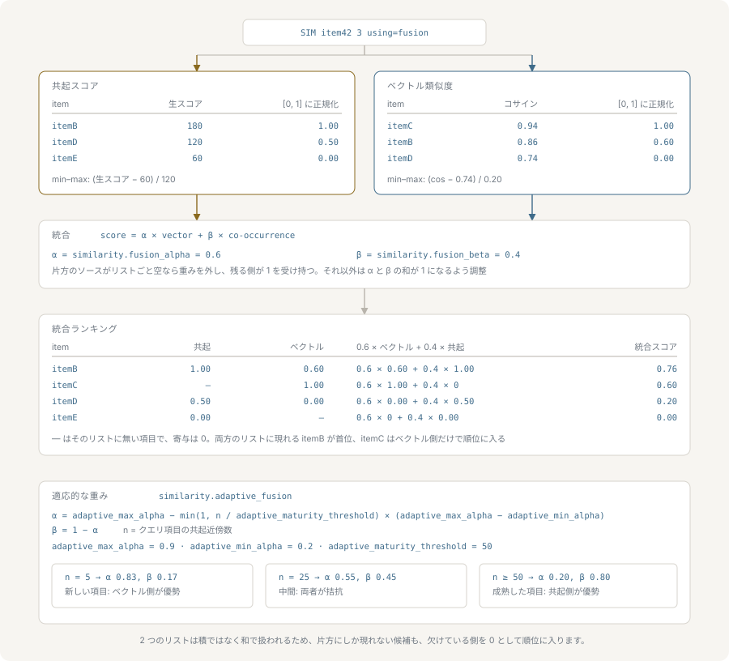

# 統合検索

統合検索は、nvecd が保持する 2 つの信号、すなわちイベント由来の共起と埋め込み由来の類似度を、1 つの順位付きリストにまとめます。このページでは、3 つのクエリモード、2 つのスコアリストを比較可能にする手順、配分の計算式と重み、データ密度に追随する適応的な統合、そして片側に返すものがないときに何が返るかを扱います。



## 3 つのモード

`SIM` は `using=` でモードを選びます。

```bash
SIM item42 10 using=events
SIM item42 10 using=vectors
SIM item42 10 using=fusion
```

`using=events` は積み上がった共起スコアだけで順位付けします。ベクトルの有無にかかわらず、イベントに現れたことのあるアイテムなら使えます。[events-and-co-occurrence.md](./events-and-co-occurrence.md) を参照してください。

`using=vectors` は設定された距離尺度だけで順位付けします。問い合わせたアイテムにベクトルが必要で、なければ not-found エラーになります。[vector-search.md](./vector-search.md) を参照してください。

`using=fusion` は両方を走らせて統合します。これが既定であり、`using=` を付けない `SIM` は統合検索です。

統合が使えるのは `SIM` だけです。`SIMV` に `using=` オプションはなく、パーサーが拒否します。`SIMV` は生のクエリベクトルに対して順位付けするため、共起の隣接を引くためのアイテム ID が存在しないからです。

## 統合前の正規化

2 つの信号は同じ尺度に乗っていません。共起スコアはイベントスコアの積の総和で、1 ペアあたり最大 10000 を寄与し、イベントが積み上がるにつれて際限なく伸びます。コサイン類似度は −1 から 1 の間に収まります。これをそのまま足すと共起の項が数桁の差で支配し、ベクトル側の重みは観測できるほどの効果を持ちません。

そこで各リストは統合の前に、リスト内で 0 から 1 へ min-max 正規化されます。

```text
正規化後 = (スコア - 最小) / (最大 - 最小)
```

この正規化は相対的です。各リストで最も弱い候補はちょうど 0 に正規化されてその側から何も寄与せず、最も強い候補は実際にどれだけ強かったかにかかわらず 1 になります。統合が消費しているのは、各候補が自分の側のリストの中で占める位置を 0 から 1 に引き伸ばしたものです。

この引き伸ばしを行わず、生のスコアを 0 から 1 に丸め込むだけの場合が 2 つあります。候補が 1 件以下のリストと、スコアが全て `1e-4` 以内に収まっているリストです。ここで丸め込むことで絶対的な確信度が保たれます。0.99 の単独候補は固定の中間値に潰されずに 0.99 のままになり、弱い一致ばかりの集まりは弱いままになります。

## 配分

統合は加算であり、積集合ではありません。両方の検索がそれぞれの全域に対して走り、候補は和集合になります。だから内容は似ているが一度も共起していないアイテムも浮上できますし、その逆も成り立ちます。順序を組み替えるだけの材料が揃うよう、両側とも `top_k` の 3 倍の候補を `similarity.max_top_k` を上限として取得します。

いずれかのリストに現れた各候補 ID について、

```text
統合スコア = ベクトルの重み * 正規化後のベクトルスコア
           + イベントの重み * 正規化後のイベントスコア
```

各候補は両側から与えられたものを足し合わせ、その候補を返さなかった側の寄与は 0 になります。

この最後の点が取り違えやすいところです。重みはアイテム単位ではなくリスト単位で決まります。ある側が寄与するかどうかは、そのリストが空で返ったかどうかから 1 度だけ計算される、ソースごとに 1 つの真偽値です。空でない 2 つのリストのうち片方にしか現れないアイテムは、片側だけのクエリとは違います。両方の重みは効いたままで、そのアイテムが返されなかった側から 0 点を取るだけです。後述の例の `itemE` がまさにこの場合で、ベクトルスコアの 0.6 倍を取るのであって、重み 1 のベクトルスコアを取るわけではありません。

重みは `similarity.fusion_alpha`（ベクトル側、既定 0.6）と `similarity.fusion_beta`（共起側、既定 0.4）から、合計が 1 になるよう再スケールして得られます。

```text
ベクトルの重み = fusion_alpha / (fusion_alpha + fusion_beta)
イベントの重み = fusion_beta  / (fusion_alpha + fusion_beta)
```

既定値ではすでに合計が 1 なので、再スケールは何も変えません。効いてくるのは別の値を設定したときです。`0.8` と `0.4` は `0.67` と `0.33` とまったく同じに振る舞います。意味を持つのは 2 つの比だけだからです。

統合されたリストは降順に並べ替えられ、`top_k` に切り詰められます。

### 計算例

既定の重みで `SIM item42 3 using=fusion` を実行します。共起が返したのは次の 3 件です。

| アイテム | 生スコア | 正規化後 |
|---|---|---|
| itemB | 120 | 1.00 |
| itemC | 80 | 0.50 |
| itemD | 40 | 0.00 |

ベクトル検索が返したのは次の 3 件です。

| アイテム | 生スコア | 正規化後 |
|---|---|---|
| itemC | 0.92 | 1.00 |
| itemE | 0.80 | 0.25 |
| itemB | 0.76 | 0.00 |

ベクトルの重み 0.6、イベントの重み 0.4 で統合すると、

| アイテム | ベクトル項 | イベント項 | 統合スコア |
|---|---|---|---|
| itemC | 0.6 × 1.00 = 0.60 | 0.4 × 0.50 = 0.20 | 0.80 |
| itemB | 0.6 × 0.00 = 0.00 | 0.4 × 1.00 = 0.40 | 0.40 |
| itemE | 0.6 × 0.25 = 0.15 | なし | 0.15 |
| itemD | なし | 0.4 × 0.00 = 0.00 | 0.00 |

応答は `itemC`、`itemB`、`itemE` です。`itemC` が勝つのは、両側で強い唯一の候補だからです。生の共起では 3 位、ベクトル類似度では 1 位であり、どちらのリスト単独でも 1 位にはなりませんでした。共起が一度も見ていない `itemE` も、ベクトル類似度だけで 3 位に入ります。`itemD` が落ちるのは、共起の候補として最も弱く 0 に正規化されたためです。

## 適応的な統合

固定の配分は、成熟度が揃ったコーパスには合います。埋め込みはあるがイベント履歴がほとんどない新しいアイテムが混じるコーパスには合いません。そこでは共起側は弱いというよりノイズに近く、固定で 0.4 を与えることが結果をむしろ悪くします。

適応的な統合は、問い合わせたアイテムが実際にどれだけ共起データを持っているかに合わせて重みを動かします。成熟度は共起索引におけるそのアイテムの隣接数です。クエリが取得した候補数ではなく真の隣接数なので、`top_k` が小さくても成熟したアイテムが新しく見えることはありません。

```text
比率           = min(1, 隣接数 / adaptive_maturity_threshold)
ベクトルの重み = adaptive_max_alpha - 比率 * (adaptive_max_alpha - adaptive_min_alpha)
イベントの重み = 1 - ベクトルの重み
```

既定値は `adaptive_min_alpha` が 0.2、`adaptive_max_alpha` が 0.9、`adaptive_maturity_threshold` が 50 です。隣接を持たないアイテムのベクトル重みは 0.9 になり、ほぼ埋め込みだけで判断されます。隣接が 50 以上のアイテムは 0.2 になり、確立された行動の信号が順位を担います。隣接が 10 のアイテムは `0.9 − 0.2 × 0.7 = 0.76` です。

重みは比率に対して線形に動き、境界で止まります。つまり `adaptive_min_alpha` と `adaptive_max_alpha` は重みが動ける範囲であり、`adaptive_maturity_threshold` はどれだけ速く動くかを決めます。閾値を下げれば早く成熟に達します。

適応的な統合が適用されるクエリでは `fusion_alpha` と `fusion_beta` は使われません。両者が組み合わされることはありません。

全体で有効にするのは `similarity.adaptive_fusion`、クエリ単位で切り替えるのは `adaptive=` です。

```bash
SIM item42 10 using=fusion adaptive=on
SIM item42 10 using=fusion adaptive=off
```

クエリ単位の値は双方向に優先します。有効な設定のもとでも `adaptive=off` で無効になり、無効な設定のもとでも `adaptive=on` で有効になります。オプションを省けば設定値がそのまま効きます。`adaptive=` はモードにかかわらず `SIM` で受け付けますが、効果があるのは統合検索だけです。

## 片側に返すものがないとき

ベクトルはあるがイベントがないコールドスタートのアイテムも、イベント履歴は長いが埋め込みがないアイテムも、どちらもありふれた事例です。ここで空になるのはリスト全体であって、片方のリストからアイテムが 1 つ欠けている状況ではありません。統合検索はこれを、空だった側を配分から完全に外し、生き残った側に重み 1 を与えることで扱います。設定された比率のぶんだけ寄与させる、という扱いはしません。

これによりスコアの尺度が対応する単一の信号のクエリと同じに保たれるので、片側にフォールバックしたクエリでも両側を使ったクエリでも `min_score` の下限が同じ意味を持ちます。この扱いがなければ、ベクトル側だけで成立した統合結果は既定の重みで 0.6 が上限になり、`using=vectors` に合わせて調整した下限がすべてを黙って弾いてしまいます。

失敗と空は区別されます。両側が失敗した場合、クエリはエラーを返します。問い合わせた ID が共起索引にもベクトルストアにも存在しない場合は、ID の打ち間違いを隠してしまう空の結果ではなく、ベクトルストアの not-found エラーを返します。ちょうど片側だけが失敗した場合、クエリはもう一方で続行し、失敗はログに残ります。ただしベクトルが存在しない場合だけは例外で、これは想定されたコールドスタートであり、記録すればそうしたクエリのたびに警告が出てしまうためです。

どちらの側にも本当に候補がないアイテムは、空の結果を返します。

```text
OK RESULTS 0
```
