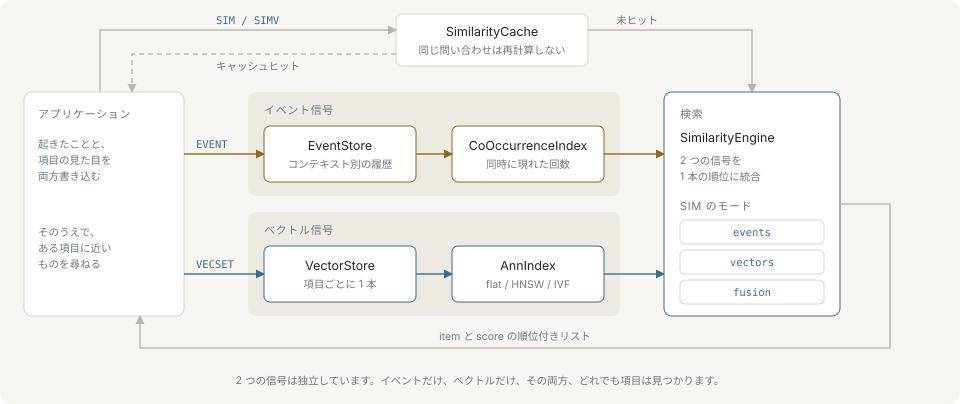

# はじめに

nvecd は、同じアイテムについて 2 つの独立した信号を保持し、そのどちらか一方、あるいは両方を混ぜた 1 つの順位でクエリに答えるインメモリ検索エンジンです。このページでは、エンジンが土台にしているモデルと、どういう問題に向くのかを説明します。

## 2 つの信号

1 つ目は行動の信号です。クライアントは `EVENT <context> ADD <item> <score>` で操作を報告します。コンテキストはまとめ方を決めるキーで、セッション・ユーザー・カート・ページ閲覧など何でも構いません。スコアは 0 から 100 の整数の重みです。同じコンテキストに現れたアイテム同士は関連があるとみなされ、その強さは関連を作ったイベントの重みに従って大きくなります。ここにエンジンの外から与えるものはありません。共起索引はイベントが届くたびにイベント列から導かれるもので、学習の工程もモデルも介在しません。

2 つ目はベクトルで、こちらは外から与えます。`VECSET <item> <f1> <f2> …` は、クライアントが既に生成した埋め込みを保存します。nvecd は埋め込みを作りません。ベクトルを保存し、索引を作り、設定した距離尺度で距離を測るだけです。次元は最初に保存されたベクトルで決まり、以降のベクトルはすべてそれに一致する必要があります。

2 つの信号は同じアイテム ID を指しますが、別々に保持されます。イベントだけを持つアイテム、ベクトルだけを持つアイテム、両方を持つアイテムのいずれもあり得ます。

## 1 つのプロセスに両方を持つ意味

「一緒に操作されたアイテム」と「埋め込みが近いアイテム」は別の問いです。両方に答えようとすると、ふつうはベクトルデータベースとアプリケーション側で組んだ関連ストアを並べて動かし、リクエストのたびに 2 つの順位を突き合わせることになります。nvecd は両方の索引を 1 つのプロセスに持つので、2 つのスコア列が既に揃っている場所で統合できます。`SIM <item> <k> using=fusion` は、1 回のクエリで、1 つのデータセットから、1 つの順位を返します。

永続化の口も、復元の口も、書き込み経路も 1 つで済みます。イベント・ベクトル・メタデータは同じスナップショットと同じ先行書き込みログに入るため、再起動すると両方の信号が同じ時点に戻ります。[永続化](./persistence.md) を参照してください。

## それぞれの信号が単独で答えられること

共起は行動についての問いに答えます。実際にトラフィックで起きたことを反映し、アイテムの内容を表現する必要がないので、使えるテキストも画像も持たないアイテムでも機能します。同じカートに入った無関係な 2 商品のように、内容の類似では見えない関連も拾えます。スコアは上限のない累積和で、[0, 1] に収まる類似度ではありません。[イベントと共起](./events-and-co-occurrence.md) を参照してください。

ベクトル検索は内容についての問いに答えます。埋め込みさえあれば使え、誰も操作していないアイテムにも効き、どのアイテムにも属さない生のベクトルで検索することもできます（`SIMV`）。アイテムがどう一緒に使われるかについては何も知りません。[ベクトル検索](./vector-search.md) を参照してください。

## コールドスタートの非対称性

2 つの信号は同時に使えるようになるわけではありません。誰も触っていないアイテムの共起は空です。そのアイテムは共起索引に項目自体が存在しないので、`using=events` の `SIM` は結果 0 件を返します。同じアイテムのベクトル類似は、埋め込みを保存した時点でそのまま使えます。

統合検索は、この移行をアプリケーション側で切り替えるスイッチではなく連続したものにします。片方のソースが候補を出さないときは、その配分を外して残った側を 1 に再正規化するので、まったく新しいアイテムはベクトルだけで順位付けされ、欠けた信号のぶんスコアが目減りすることもありません。`adaptive=on`（または設定の `similarity.adaptive_fusion`）を使うと、配分はアイテムごとのデータ密度に従います。共起の隣接が少ないアイテムではベクトル側の重みが `adaptive_max_alpha` 付近から始まり、隣接数が `adaptive_maturity_threshold` に近づくにつれて `adaptive_min_alpha` へ下がります。証拠が溜まるにつれて、切り替えなしに内容による順位から行動による順位へ移っていきます。[統合検索](./fusion.md) を参照してください。

## 他の選択肢との違い

汎用のベクトルデータベース、および組み込みの ANN ライブラリと比べると次のようになります。

| | nvecd | 汎用のベクトルデータベース | 組み込みの ANN ライブラリ |
|---|---|---|---|
| ベクトル検索 | flat・HNSW・IVF、cosine / dot / L2 | あり | あり |
| イベント列からの共起 | エンジンに内蔵 | アプリケーション側の仕事 | 対象外 |
| 1 クエリでの両信号の統合 | `using=fusion`、適応的な統合も可 | アプリケーションが 2 つの結果を統合 | 対象外 |
| 関連の経年減衰 | 定期的な減衰とペア単位の半減期 | 該当なし | 該当なし |
| 削除による重みの引き下げ | `EVENT … DEL` と負の信号 | 該当なし | 該当なし |
| メタデータによる絞り込み | 保存したメタデータへの比較・集合演算 | あり | 実装による |
| 配置 | 1 プロセスと 1 つの設定ファイル | サービスまたはクラスタ | アプリケーションにリンク |
| スケールアウト | なし | シャーディングとレプリケーション | 該当なし |
| データの置き場所 | メモリ常駐 | 多くはディスク上 | プロセス内 |

nvecd が違うのは表の中ほどの左側です。共起はキーバリューストアで組み上げるものではなく、エンジンの機能です。ベクトル類似との配分はクエリごとに計算します。関連は減衰するので、古い行動が支配し続けることもありません。

劣るのは表の下側です。nvecd は単一ノードで、分散クエリもレプリケーションもマネージドサービスもありません。データセットを別のマシンへ移すのは運用側のスクリプトの仕事で、`DUMP SAVE` してファイルをコピーし、移送先で `DUMP LOAD` します。nvecd が代わりにやってくれることはありません。

## nvecd がやらないこと

- **埋め込みの生成。** アイテムの符号化は外部で行い、結果を `VECSET` で送ります。
- **メモリより大きいデータセットの提供。** スナップショットと先行書き込みログで再起動から復旧できますが、クエリに答えるためにディスクを読むことはありません。
- **モデルによる順位付け。** 統合検索は正規化した 2 つのスコア列の重み付き和で、推論ではありません。
- **クラスタとしての動作。** 1 つのプロセスがデータセット全体を持ち、ノードをまたぐクエリはありません。

[はじめての操作](./getting-started.md) では、イベント・ベクトル・3 つの検索モード・スナップショットまでを 1 つのセッションで通します。
