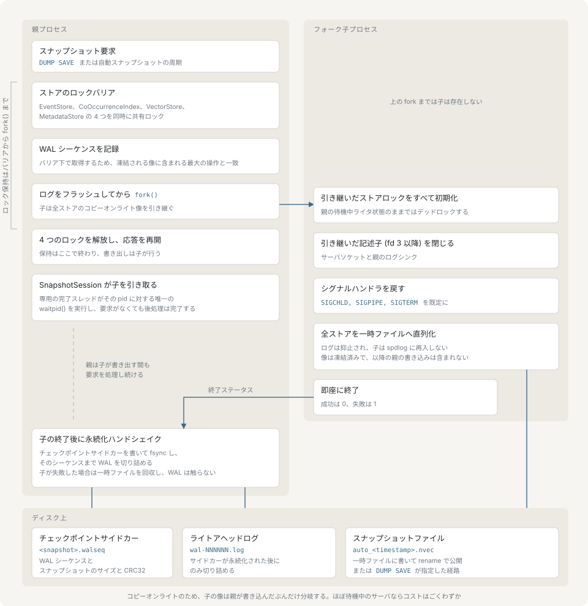
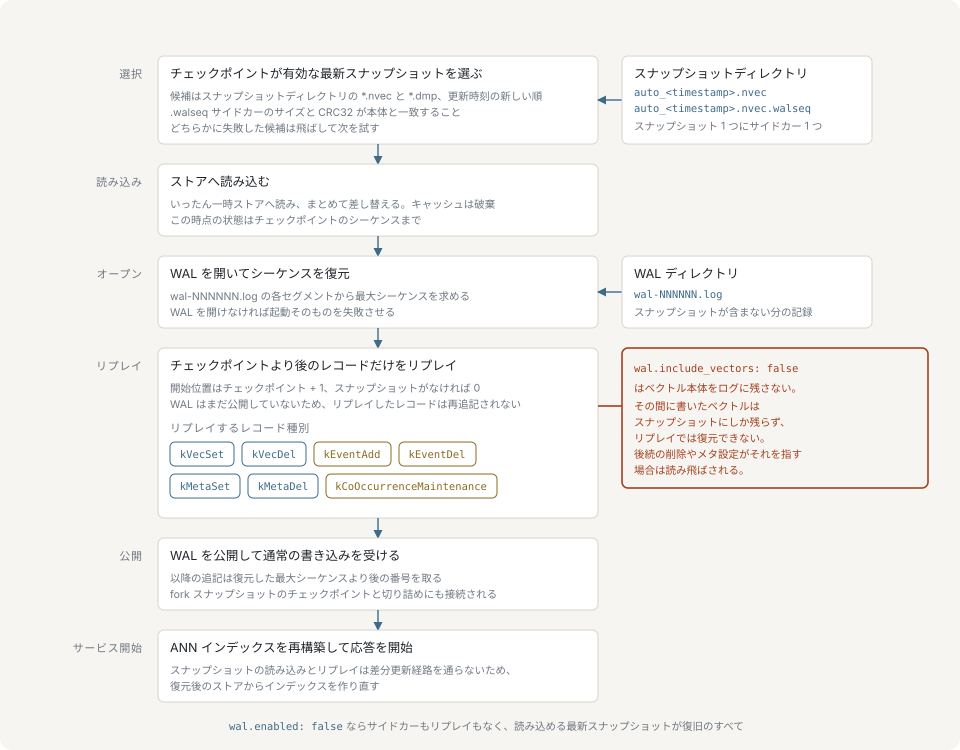

# 永続化

nvecd はデータをメモリ上に保持します。それをディスクに落とす仕組みは 2 つあり、ある時点のストア全体の像であるスナップショットと、スナップショット間のすべての変更を記録する先行書き込みログ（WAL）です。このページでは、それぞれの書き込み方、起動時の復旧がそれらをどう使うか、運用者がどう操作するかを扱います。

## スナップショットのモード

スナップショットの取り方は `snapshot.mode` で選びます。

| モード | 動作 | コスト |
|---|---|---|
| `fork`（既定） | プロセスを fork し、子プロセスがコピーオンライトの像を直列化する。親はそのまま応答を続ける | 子プロセスの実行中の書き込みがページを汚し、汚れたページが複製される |
| `lock` | 読み取り専用フラグを公開し、進行中の書き込みを排出してから、呼び出し元スレッドで直列化する | 直列化のあいだ、すべての書き込みが拒否される |

fork が既定なのは、親が書き込みを締め出すのがシーケンスの捕捉と `fork()` の呼び出しのあいだだけで、直列化のあいだではないからです。lock モードにはコピーオンライトによるメモリ増加がありませんが、lock モードの保存中に `EVENT`、`VECSET`、`VECDEL`、`METASET` を送ったクライアントは `ERROR READONLY Snapshot in progress` を受け取ります。

`snapshot.mode` が支配するのは `DUMP SAVE` です。自動スナップショットはこの設定にかかわらず常に fork 書き込みを使います。

## fork の手順



fork モードの保存は次の順に進みます。

1. ロックに触れる前に `in_progress` を公開します。2 つ目の保存は競合するのではなく拒否されます。
2. 4 つのストア（イベントストア、共起索引、ベクトルストア、メタデータストア）すべてに共有読み取りロックを同時にかけます。書き込みはこれらのロックの背後で直列化されるため、4 つすべてを保持すれば進行中の書き込みが排出され、新しい書き込みも締め出されます。
3. **この障壁を保持したまま WAL シーケンスを読み取ります**。進行中の書き込みが存在しえないので、捕捉した値は凍結直前の像が含む最大の操作そのものです。以降のすべてがこれに依存します。サイドカーがこの値を記録し、切り詰めがこの値を使うため、スナップショットが持たないレコードをログが落とすことはありえません。
4. ロガーを**親側で**静止させ、プロセスを fork します。静止は `pthread_atfork` の prepare ハンドラと、呼び出し直前のフラッシュで行います。子プロセスはロガーに一切触れません。fork 時点で別スレッドがロガーのレジストリのミューテックスを保持していた可能性があり、そのミューテックスは子プロセスでは永久にロックされたままになるからです。
5. 子プロセスは継承した 4 つのロックを再初期化し、標準エラー出力より上のディスクリプタをすべて閉じ、`SIGCHLD`、`SIGPIPE`、`SIGTERM` を既定に戻し、ログ出力を抑止したままストアを直列化します。完全に書き終えれば `0`、それ以外は `1` で終了します。失敗の報告は非同期シグナルセーフな `write(2)` で行い、これが唯一の診断手段です。
6. 親は 4 つのロックを解放して処理を再開します。子プロセスをセッションオブジェクトに引き渡して戻ります。

以降、子プロセスを所有するのはセッションです。親のリクエスト処理スレッドがこれを回収することはありません。セッション内の完了スレッドがその pid に対する唯一の `waitpid()` を行い、続けて耐久性ハンドシェイク（サイドカーの書き込みと WAL の切り詰め）を同じスレッドで実行します。クライアントの要求もスケジューラの周期も終了処理も待ちません。

## 耐久性ハンドシェイク

ファイルを書くのはスナップショットの半分にすぎません。残りの半分は両モードで同一で、同じセッションオブジェクトを通ります。

書き込みが失敗した場合、セッションは書き込み側が残した一時ファイルを回収し、WAL には手を触れません。復旧の基点は試行前とまったく同じままです。失敗したスナップショットは耐久性の面では何のコストも生みません。

書き込みが成功し WAL が設定されている場合、セッションは決まった順序で 2 つのことを行います。

1. **チェックポイントのサイドカーを書きます**。`<スナップショットのパス>.walseq` という 32 バイトのファイルに、マジック `NWCP`、フォーマットバージョン、捕捉した WAL シーケンス、束ねられたスナップショットのサイズとファイル全体の CRC32、そして先行する 28 バイトに対する CRC32 が入ります。一時ファイルに書いて fsync し、rename で所定の位置に置き、親ディレクトリを fsync します。
2. 捕捉したシーケンスまで **WAL を切り詰めます**。そのシーケンス以下のレコードしか含まないセグメントが unlink されます。

サイドカーが先なのは、2 つの手順の間でクラッシュしたときに、必要以上に長い WAL が残るほうが、どの読み手も復旧の基点として受け付けないスナップショットに合わせて切り詰められた WAL が残るよりましだからです。サイドカーを読むときにはスナップショットのサイズと CRC32 を読み直し、どちらかが食い違えばそのサイドカーを拒否します。差し替えられたり切り詰められたりしたスナップショットの隣に残ったサイドカーは使われません。

どちらかの手順が失敗すれば、それは成功に付随する警告ではなく、失敗したスナップショットとして報告されます。

## スナップショットのファイル形式

スナップショットはリトルエンディアンのバイナリファイルです。多バイト整数はリトルエンディアン、文字列は `uint32` のバイト数を前置し、CRC32 は zlib の多項式を使います。

```text
固定ヘッダ        マジック "NVEC" (4 バイト) + フォーマットバージョン uint32
V1 ヘッダ         header_size uint32
                  flags uint32
                  snapshot_timestamp uint64
                  total_file_size uint64
                  file_crc32 uint32
                  reserved_length uint32 + 予約バイト列
設定セクション    長さ uint32 + crc32 uint32 + 直列化された設定
統計セクション    長さ uint32 + crc32 uint32 + スナップショット統計
                  (kWithStatistics フラグが立っているときのみ存在)
ストアデータ      store_count uint32
                  ストアごとに:
                    ストア名 (長さ前置文字列)
                    ストア統計 (長さ uint32 + crc32 uint32 + データ、
                                無い場合は長さ 0)
                    ストアデータ (長さ uint32 + crc32 uint32 + データ)
```

ファイル全体の CRC32 はファイル末尾ではなくヘッダに置かれます。書き込み側はこのフィールドを 0 にしたヘッダを出力し、全セクションを書き、シークして戻り実際の総サイズを記録し、そのフィールドを 0 にしたまま完成したファイル全体に対して CRC32 を計算し直して、固定オフセットに埋め込みます。

ストアセクションは **4 つ**あり、`events`、`co_occurrence`、`vectors`、`metadata` の順に書かれます。読み取り側は 3 つ（メタデータストアなしで書かれたスナップショット）または 4 つを受け付け、それ以外の名前と重複した名前を拒否します。

フラグ語には常に立っている `kWithCRC`（`0x10`）と、呼び出し側が統計を渡したときだけ立つ `kWithStatistics`（`0x08`）が入ります。サーバーの保存経路も fork の子プロセスも統計を渡さないため、稼働中のサーバーが書いたスナップショットは `flags: 16`、`has_statistics: false` になります。

形式は 3 GiB を超えるファイルを拒否します。

### 整合性

`DUMP VERIFY` は高速な検査を行います。確認するのは、ファイルが存在して読めること、マジックとバージョンが正しいこと、ディスク上の長さが `total_file_size` と一致すること、そしてファイル全体の CRC32 が合うことです。個々のセクションのチェックサムは検証せず、逆直列化も行いません。定期的なヘルスチェックに使える程度に軽い検査です。

読み込みは完全な検査です。上記をすべて繰り返したうえで、設定セクション、統計セクション、各ストアの統計、各ストアのデータそれぞれの CRC32 を検証し、どのセクションにも余剰バイトがないことを確認します。失敗したときはどのセクションかが報告され、設定・統計・イベントストア・共起・ベクトルストア・メタデータストアのどのチェックサムかがエラーに現れます。

サイズ検証と CRC32 検証はどちらも切り詰められたファイルを検出します。書き込み中にディスクが埋まったスナップショットはこの形になります。rename が原子的なので、途中まで書かれたスナップショットが最終的な名前で現れること自体がありません。

## 先行書き込みログ

WAL は最後のスナップショット以降に起きた変更を復旧するためにあります。既定では無効（`wal.enabled: false`）で、無効な場合は再起動によって最後のスナップショットがそのまま復元され、それ以降はすべて失われます。

セグメントは `wal.dir` に置かれる `wal-NNNNNN.log` という名前のファイルです。先頭に 8 バイトのヘッダ（マジック `NWAL` とバージョン）があり、続いて次の形のレコードが並びます。

```text
[body_length uint32] [crc32 uint32] [sequence uint64] [timestamp_us uint64] [op uint8] [ペイロード]
```

シーケンス番号はセグメントをまたいで連続し、復旧は欠落を破損として扱います。書き込まれるレコードの種類は、イベントの追加、イベントの削除、ベクトルの設定、ベクトルの削除、メタデータの設定、そして減衰係数と刈り込みの有無を記録する共起メンテナンスのエポックです。

### 順序

**レコードはメモリ上の変更の後ではなく、前に追記されます**。書き込みハンドラはコマンドを検証し、レコードを追記し、そのあとで初めてストアに適用します。追記が拒否されればエラーとして伝播するので、ログが受け付けなかった書き込みに対してクライアントが `OK` を受け取ることはありません。同時にサーバーは自身を読み取り専用に固定します。レコードを受け付けられない WAL は、サーバーが何をしたかをもはや記述できないからです。

重複排除の窓に弾かれたイベントは何もしない操作として適用され、レコードは書かれません。

変更とその追記は、TCP と HTTP の両サーフェスが共有する直列化ミューテックスの下で一体として動きます。そのため WAL の順序は両サーフェスにまたがって依存関係の順序と一致します。あるベクトルを見た `METASET` が、そのベクトルを作った `VECSET` より先に再生されることはありません。

### fsync の方針

`wal.sync_on_write: true` では、ハンドラが戻る前に毎回の追記が fsync されるので、応答が返った書き込みはディスク上にあります。それ以外の場合は背景スレッドが最大 `wal.sync_interval_ms` ミリ秒ごとに fsync します。こちらは安価ですが、電源断では応答済みの書き込みが最大 1 区間ぶん失われます。`sync_on_write: false` のまま `sync_interval_ms: 0` にすると fsync を行う者が誰もいなくなるため、サーバーはログを開くときにこの組み合わせを追記ごとの fsync に格上げします。

短い書き込みや失敗した書き込みは、そのセグメントを閉じて以降の追記を拒否させます。復旧は壊れた末尾で停止するので、そこを越えて追記を続けると同じファイル内の以降のレコードがすべて黙って失われます。

### ローテーションと切り詰め

現在のセグメントが `wal.max_file_size`（既定 64 MiB）を超えることになる時点で、新しいセグメントが始まります。セグメント番号は 6 桁固定で、読み取り側もその固定幅しか照合しません。

WAL の容量を回収するのは切り詰めだけであり、切り詰めはスナップショットの耐久性ハンドシェイクの一部としてのみ動きます。WAL を有効にしてスナップショットを一度も取らない構成では、セグメントが際限なく積み上がります。

### ベクトル本体の省略

`wal.include_vectors: false` は `VECSET` に対してレコードをまったく書きません。ベクトルデータの耐久性の境界をスナップショットに置くつもりで、ログにはイベントとメタデータだけを載せたい運用者がこれを選びます。

結果は率直です。**この設定が無効なあいだに書かれたベクトルは、WAL からは復旧できません**。それを保持するのは、その書き込みより後に取られたスナップショットだけです。復旧はこの欠落を狭く許容します。対象のベクトルが存在しない `VECDEL` と `METASET` は破損ではなく意図された不在なので、読み飛ばして数えます。累計は `INFO` が `wal_replay_records_skipped` として報告するので、欠落の大きさはログのローテーションを越えて残ります。それ以外の操作、およびそれ以外の失敗（CRC の不一致、切り詰め、デコードの失敗）はすべて復旧を停止させます。

## 再起動時の復旧



WAL が有効なとき、起動は次の順序で進み、この順序には意味があります。

1. **スナップショットを選びます**。サーバーは `snapshot.dir` の中から、拡張子が `.nvec` または `.dmp` で、隣に `.walseq` サイドカーがある通常ファイルを、更新時刻の新しい順に並べます。候補ごとにサイドカーを検証し、スナップショットを別に用意したストア群へ逆直列化して、成功した場合にのみ公開します。両方を通った最初の候補が採用されます。
2. **WAL を開きます**。開く処理はセグメントディレクトリを走査し、前回の実行が何も追記せずに残したヘッダのみのセグメントを破棄し、現在のシーケンスを復元して、新しいセグメントを始めます。
3. **再生します**。チェックポイントのシーケンスより後のレコードだけが再適用されます。下限はサイドカーのシーケンス + 1 で、スナップショットを読み込まなかった場合は 0 です。各レコードは通常のトラフィックと同じ書き込み経路を通るので、復旧は元のコマンドが生んだ状態をそのまま再構成します。
4. **WAL を公開します**。書き込みハンドラと fork 書き込みが WAL のポインタを受け取るのはこの時点です。それまでは null であり、これが再生されたレコードの二重追記を防いでいます。

そのあと ANN 索引が復元済みのベクトルストアから再構築されます。スナップショットの読み込みも再生も、増分追加の経路ではなくストアを直接埋めるため、そうしなければ索引は空か、再生された末尾のベクトルしか持たない状態になります。

WAL が有効なあいだ、サイドカーの**ない**スナップショットはそもそも候補になりません。再生をどこから始めればよいかを示すものが無いからです。記録されたサイズや CRC32 が隣のスナップショットと一致しない**古い**サイドカーは、警告とともに拒否され、サーバーは次に新しい候補へ移ります。候補が存在してそのすべてが失敗した場合は、空のストアで黙って起動するのではなく起動自体が失敗します。候補が 1 つも無いディレクトリの場合は空の状態で起動します。

WAL が無効なときは、サイドカーの要求なしで同じ候補走査が動き、有効な最新のスナップショットが読み込まれ、再生は行われません。

耐久性の窓について読み手が結論すべきことは次のとおりです。WAL が有効で `sync_on_write` を設定していれば、クラッシュ前に応答を返したものはすべて残ります。バッチ fsync なら、最後の `sync_interval_ms` を除いてすべて残ります。WAL が無効なら、境界は最後に完了したスナップショットです。

## DUMP コマンド

引数の網羅的な構文は[プロトコル](./protocol.md)が扱います。ここでは各サブコマンドが何のためのものかを示します。

**`DUMP SAVE [パス]`** はスナップショットを書きます。引数を省くと `snapshot.default_filename` を使い、その値もクライアントが指定した名前と同じパス検証を通ります。fork モードでは子プロセスが存在した時点で応答が返ります。

```bash
nvecd-cli DUMP SAVE backup.nvec
```

```text
OK DUMP_SAVE_STARTED /var/lib/nvecd/snapshots/backup.nvec
```

lock モードではハンドシェイク全体が完了してから `OK DUMP_SAVED /var/lib/nvecd/snapshots/backup.nvec` が返ります。

**`DUMP LOAD <パス>`** は稼働中の状態をスナップショットで置き換えます。ファイルはまず別に用意したストア群へ逆直列化されるので、破損したスナップショットや意味的に不正なスナップショットが壊せるのはそちらだけです。稼働中のストアは排他ゲートの下で差し替えられ、ANN 索引が再構築され、クエリキャッシュが消去されます。WAL が設定されている場合、読み込みは意図的な巻き戻しとして扱われます。読み込んだスナップショットが最新の復旧基点になり、読み込み前の WAL の末尾は破棄されるので、後の再起動が運用者の巻き戻したはずの変更を再生することはありません。公開後の耐久性の手順が失敗した場合、サーバーは自身を読み取り専用に固定し、再起動が必要になります。復旧の基点が不確かな状態のまま応答を再開することはありません。

**`DUMP VERIFY <パス>`** は何も読み込まずに、上で述べた整合性検査を実行します。

**`DUMP INFO <パス>`** はストアデータを読まずにヘッダを報告します。

```bash
nvecd-cli DUMP INFO backup.nvec
```

```text
OK DUMP_INFO /var/lib/nvecd/snapshots/backup.nvec
version: 1
stores: 4
flags: 16
file_size: 20481
timestamp: 1767225600
has_statistics: false
END
```

**`DUMP STATUS`** は fork 書き込みの状態を報告します。状態は 4 つあり、`idle` 以外はすべて追加のフィールドを伴います。

| 状態 | フィールド |
|---|---|
| `idle` | なし |
| `in_progress` | `filepath`、`pid`、`start_time` |
| `completed` | `filepath`、`start_time`、`end_time` |
| `failed` | `filepath`、`start_time`、`end_time`、`error` |

```text
OK DUMP_STATUS
status: completed
filepath: /var/lib/nvecd/snapshots/backup.nvec
start_time: 1767225600
end_time: 1767225601
END
```

`completed` と `failed` が表すのは進行中のスナップショットではなく直前のスナップショットで、次の保存が始まるまで残ります。`DUMP STATUS` の発行は完了した背景スナップショットの結果を公開もするので、スナップショットスケジューラが動いていないサーバーはこれによって `in_progress` を抜けます。

## 自動スナップショット

```yaml
snapshot:
  dir: "/var/lib/nvecd/snapshots"
  default_filename: "nvecd.snapshot"
  interval_sec: 3600
  retain: 3
  mode: "fork"
```

`interval_sec` は既定で `0` で、この場合スケジューラは動きません。正の値にすると背景スレッドが間隔ごとに fork スナップショットを開始し、`auto_YYYYMMDD_HHMMSS.nvec` という名前を付けます。

`retain` は保持する自動スナップショットの本数を制限します。保持処理は `auto_*.nvec` だけを対象に更新時刻で並べるので、`DUMP SAVE` が別の名前で書いたスナップショットが削除されることはありません。掃除が動くのは fork の子プロセスを回収した後であって進行中ではないため、ファイル数を数えた後に新しいスナップショットが現れて `retain + 1` 本が残ることはありません。

スケジューラの各周期は完了した背景スナップショットの結果も公開します。これが書き込みを `in_progress` から抜けさせ、次のスナップショットを開始可能にします。耐久性ハンドシェイク自体はこの周期を待ちません。セッション自身のスレッドがすでに実行しています。スケジューラを無効にしたサーバーでは、次の `DUMP SAVE` か `DUMP STATUS` が代わりに結果を公開します。

書き込み側のプロセスがすでに存在しない一時ファイルは、起動時と保持処理のたびに回収されます。一時ファイルの名前は `.<スナップショット名>.tmp.<pid>.<n>` で、作成したプロセスにしか公開できないため、所有者が消えたものは二度と完成しません。

## ファイル権限とパスの制約

スナップショットの一時ファイル、WAL のセグメント、チェックポイントのサイドカーはモード `0600` で作られます。WAL ディレクトリはモード `0700` で作られます。

書き込みの前に、親ディレクトリはサーバーの実効ユーザーの所有であり、グループや他者から書き込み可能であってはなりません。祖先のディレクトリも、スティッキービットなしにグループや全体から書き込み可能であってはなりません。検証を通ったディレクトリはディスクリプタとして開いたまま保持され、以降の操作（一時ファイルの作成、所定の位置への rename、fsync）はすべてそのディスクリプタからの相対で行われるので、検証後に経路上のディレクトリを差し替えても書き込み先を逸らすことはできません。

`DUMP` のサブコマンドに渡されたパスは、`..` をどこかに含んでいれば即座に拒否され、正規化した後は `snapshot.dir` の内側に解決される必要があります。同じ検証が `snapshot.default_filename` にも適用されます。この値はコードではなく設定ファイル由来なので、スナップショットディレクトリから外へ出る名前は、そこを基準に解決されるのではなく拒否されます。

## バックアップと機器間の状態のコピー

nvecd にはレプリケーションも、ノード間のスナップショット同期も、クラスタリングもありません。機器間で状態を移すのは、運用者が外側でスクリプトを書いて行う作業です。

```bash
nvecd-cli -h source-host DUMP SAVE transfer.nvec
scp source-host:/var/lib/nvecd/snapshots/transfer.nvec \
    target-host:/var/lib/nvecd/snapshots/
nvecd-cli -h target-host DUMP VERIFY transfer.nvec
nvecd-cli -h target-host DUMP LOAD transfer.nvec
```

コピーするのはスナップショットファイルだけです。`.walseq` サイドカーはそれを書いた機器の WAL に束ねられており、別の機器では意味を持ちません。移送先のサイドカーは `DUMP LOAD` がハンドシェイクの一部として書きます。

fork モードの `DUMP SAVE` はファイルが完成する前に応答を返すので、すぐにコピーするスクリプトは途中のファイルをコピーします。そのパスについて `DUMP STATUS` が `completed` を報告するまで待つか、読み込みの前に移送先で `DUMP VERIFY` を実行してください。いずれにせよ後者は行う価値があります。移送そのものが無事だったかを確かめる手段はこれだけだからです。

バックアップとしては、完成したスナップショットファイルをコピーすれば十分です。それ自体で完結した像であり、整合性はオフラインで検証できます。WAL はバックアップの成果物ではありません。スナップショットのたびに切り詰められ、最後のスナップショット以降の区間しか記述しないからです。
