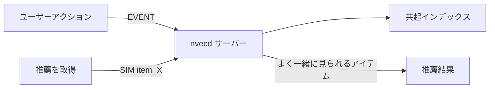
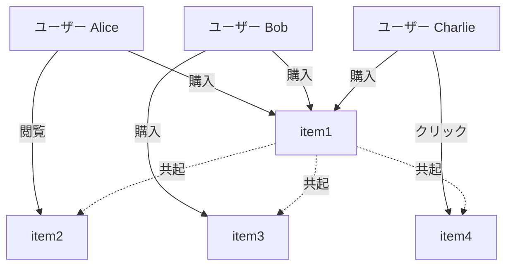
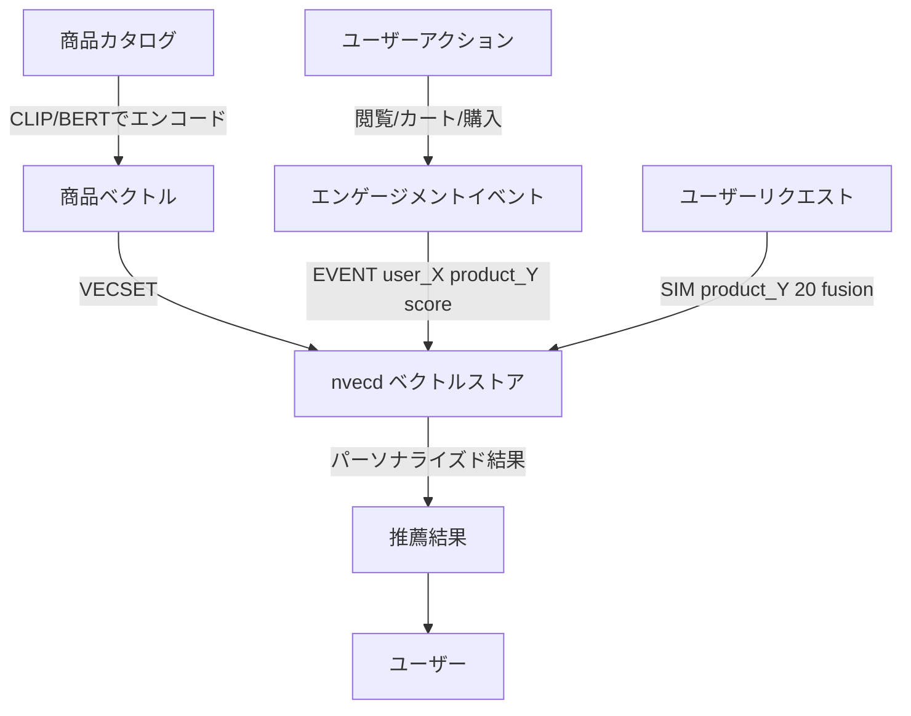
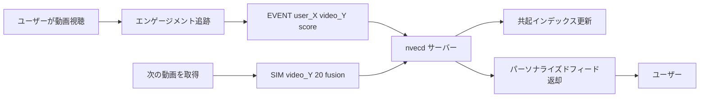
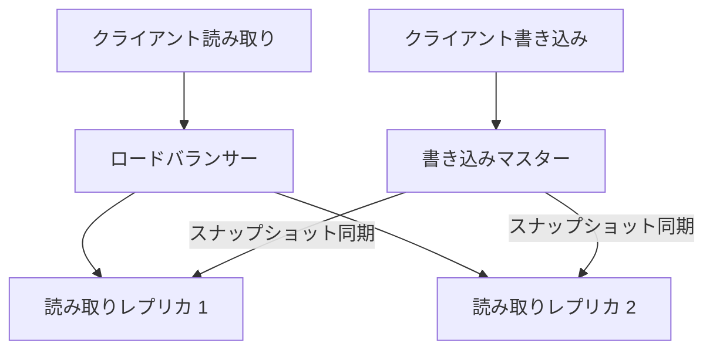

# ユースケースと実装例

このガイドでは、Nvecd の実世界での利用例を詳細な実装例とともに紹介します。

---

## ユースケース 0: はじめに - シンプルな推薦エンジン

ユーザー行動パターンに基づいた推薦エンジンを構築します。

### 概要

これは Nvecd を使う**最もシンプルな**方法です：
- ユーザーとアイテムのインタラクションを追跡（閲覧、クリック、購入）
- ユーザーが一緒に行う行動に基づいて推薦を取得
- 数行のコードで始められる
- すぐに始めるのに最適

### 仕組み

ユーザーが類似したアイテムとインタラクションすると、Nvecd は自動的に共起インデックスを構築します。頻繁に一緒に閲覧/購入されるアイテムは一緒に推薦されます。



### データモデル

**イベント**: ユーザーインタラクション（閲覧、クリック、購入）
**コンテキスト**: `user_{user_id}`（ユーザーごとのインタラクション履歴）

### Node.js 実装例

```javascript
const net = require('net');

class SimpleRecommender {
  constructor(host = 'localhost', port = 11017) {
    this.host = host;
    this.port = port;
  }

  // nvecd にコマンドを送信するヘルパー
  async sendCommand(command) {
    return new Promise((resolve, reject) => {
      const client = net.createConnection({ host: this.host, port: this.port }, () => {
        client.write(command + '\n');
      });

      let data = '';
      client.on('data', (chunk) => {
        data += chunk.toString();
      });

      client.on('end', () => {
        resolve(data.trim());
      });

      client.on('error', (err) => {
        reject(err);
      });
    });
  }

  // ユーザーとアイテムのインタラクションを追跡
  async trackInteraction(userId, itemId, interactionType) {
    // インタラクションタイプに基づくスコア
    const scores = {
      'view': 60,
      'click': 70,
      'add_to_cart': 85,
      'purchase': 100,
      'like': 90
    };

    const score = scores[interactionType] || 50;
    const command = `EVENT user_${userId} ${itemId} ${score}`;

    const response = await this.sendCommand(command);
    return response === 'OK';
  }

  // アイテムの推薦を取得
  async getRecommendations(itemId, limit = 10) {
    const command = `SIM ${itemId} ${limit} fusion`;
    const response = await this.sendCommand(command);

    // レスポンスをパース
    // OK RESULTS 5
    // item2 0.85
    // item3 0.72
    // ...

    const lines = response.split('\n');
    if (!lines[0].startsWith('OK RESULTS')) {
      throw new Error('Unexpected response: ' + response);
    }

    const recommendations = [];
    for (let i = 1; i < lines.length; i++) {
      const line = lines[i].trim();
      if (!line) continue;

      const [itemId, score] = line.split(/\s+/);
      recommendations.push({
        itemId: itemId,
        score: parseFloat(score)
      });
    }

    return recommendations;
  }
}

// 使用例
async function main() {
  const recommender = new SimpleRecommender();

  // ユーザーインタラクションを追跡
  console.log('ユーザーインタラクションを追跡中...');

  // ユーザー alice が item1 を閲覧して購入
  await recommender.trackInteraction('alice', 'item1', 'view');
  await recommender.trackInteraction('alice', 'item1', 'purchase');

  // ユーザー alice は item2 も閲覧
  await recommender.trackInteraction('alice', 'item2', 'view');

  // ユーザー bob が item1 を購入（alice と似ている）
  await recommender.trackInteraction('bob', 'item1', 'purchase');
  await recommender.trackInteraction('bob', 'item3', 'purchase');

  // ユーザー charlie が item1 と item4 を購入
  await recommender.trackInteraction('charlie', 'item1', 'purchase');
  await recommender.trackInteraction('charlie', 'item4', 'click');

  console.log('\nitem1 の推薦を取得中...');

  // item1 の推薦を取得
  // item1 とインタラクションしたユーザーが好んだアイテムを返すべき
  const recommendations = await recommender.getRecommendations('item1', 5);

  console.log('\nitem1 を好んだユーザーへの推薦アイテム:');
  recommendations.forEach((rec, index) => {
    console.log(`${index + 1}. ${rec.itemId} (スコア: ${rec.score.toFixed(3)})`);
  });
}

main().catch(console.error);
```

### 実行例

```bash
$ node simple-recommender.js

ユーザーインタラクションを追跡中...

item1 の推薦を取得中...

item1 を好んだユーザーへの推薦アイテム:
1. item3 (スコア: 0.850)
2. item2 (スコア: 0.720)
3. item4 (スコア: 0.650)
```

### 共起の仕組み

複数のユーザーが同じアイテムとインタラクションすると、nvecd は共起グラフを構築します：



**結果**: `SIM item1` をクエリすると、Nvecd はユーザーコンテキストで item1 と共起するアイテムを返します。

### 設定

```yaml
events:
  ctx_buffer_size: 50         # ユーザーごとに最新50インタラクションを追跡
  decay_interval_sec: 86400   # 毎日減衰
  decay_alpha: 0.98           # 緩やかな減衰（安定した好み）
```

### このアプローチを使うべき場合

✅ **適している:**
- クイックプロトタイプと MVP
- 小〜中規模のカタログ（<10万アイテム）
- ユーザー行動に基づく協調フィルタリング
- 「この商品を買った人はこんな商品も買っています」
- 複雑なセットアップなしですぐに始めたい場合

❌ **適していない:**
- まだユーザーインタラクションがない新しいアイテム（コールドスタート問題）
- アイテムの特性・コンテンツに基づいて類似アイテムを見つける場合

### 発展: コンテンツベース類似度の追加

後で、アイテムの特徴を追加して推薦を強化できます（詳細はユースケース1を参照）。

### 本番環境のヒント

- ユーザーインタラクションの追跡のみから始める
- 共起インデックスの成長を監視
- 適切なイベントスコアを使用（購入=100、閲覧=60）
- ユーザーの好みの変化速度に基づいて減衰を設定
- 後でハイブリッド推薦へのアップグレードを検討（ユースケース1参照）

---

## ユースケース 1: E コマース商品推薦

コンテンツ類似度とユーザー行動を組み合わせた商品推薦システムを構築します。

### 概要

以下に基づいて商品を推薦：
- 商品類似度（ビジュアル特徴、説明文）
- ユーザーの購入/閲覧履歴
- 協調フィルタリング（似た嗜好のユーザー）

### データフロー



### データモデル

**ベクトル**: 商品埋め込み（画像 + テキスト特徴、768次元）
**イベント**: ユーザーインタラクション（閲覧、カート追加、購入）
**コンテキスト**: `user_{user_id}`（ユーザーごとの履歴）

### 実装例

```bash
# 1. 商品ベクトルを登録（埋め込みから）
# 例: CLIP/BERT でエンコードされた商品画像 + 説明文
VECSET product_12345 768 0.123 0.456 0.789 ... (768次元)
VECSET product_67890 768 0.234 0.567 0.891 ...
VECSET product_11111 768 0.345 0.678 0.912 ...

# 2. ユーザーインタラクションを追跡
# ユーザー alice が商品を閲覧
EVENT user_alice product_12345 60

# ユーザー alice がカートに追加（高いエンゲージメント）
EVENT user_alice product_12345 85

# ユーザー alice が購入（最高のエンゲージメント）
EVENT user_alice product_12345 100

# ユーザー bob も同じ商品を購入
EVENT user_bob product_12345 100
EVENT user_bob product_67890 95

# 3. ユーザー alice への推薦を取得
# 購入した商品に基づいて
SIM product_12345 20 fusion
# 返却: 特徴が類似し、かつ似たユーザーが購入した商品
```

### 設定

```yaml
events:
  ctx_buffer_size: 100        # ユーザーごとに最新100インタラクションを追跡
  decay_interval_sec: 86400   # 毎日減衰
  decay_alpha: 0.98           # 緩やかな減衰（1日あたり2%）

similarity:
  fusion_alpha: 0.7           # 70% コンテンツ類似度
  fusion_beta: 0.3            # 30% 協調フィルタリングシグナル

vectors:
  default_dimension: 768
```

### イベントスコアリング戦略

- **100**: 購入
- **85**: カートに追加
- **70**: ウィッシュリストに追加
- **60**: 商品ページ閲覧
- **40**: インプレッションのみ

### 本番環境のヒント

- カタログ変更時に商品ベクトルを更新
- ユーザー履歴を保存するために定期的なスナップショット
- 共起インデックスの成長を監視（バッファ制限を設定）

---

## ユースケース 2: TikTok 風リアルタイム動画フィード

リアルタイムエンゲージメント追跡を備えたパーソナライズドショート動画フィードを構築します。

### 概要

以下に基づいてリアルタイムで適応するパーソナライズド動画フィードを生成：
- 動画コンテンツ類似度（視覚/音声特徴）
- ユーザーエンゲージメントシグナル（視聴時間、いいね、シェア）
- トレンド動画（最近の高エンゲージメント）

### システムアーキテクチャ



### データモデル

**ベクトル**: 動画埋め込み（視覚 + 音声特徴、512次元）
**イベント**: ユーザーエンゲージメント（視聴、視聴時間、インタラクション）
**コンテキスト**:
- `user_{user_id}` - ユーザーごとの好み
- `trending_{hour}` - 時間ごとのトレンドパターン

### 実装例

```bash
# 1. 動画ベクトルを登録
# 例: VideoMAE/CLAP でエンコードされた動画フレーム + 音声
VECSET video_abc123 512 0.11 0.22 0.33 ... (512次元)
VECSET video_def456 512 0.44 0.55 0.66 ...
VECSET video_ghi789 512 0.77 0.88 0.99 ...

# 2. リアルタイムユーザーエンゲージメントを追跡
# ユーザーが動画の10%を視聴（低エンゲージメント）
EVENT user_alice video_abc123 10

# ユーザーが動画の50%を視聴（中エンゲージメント）
EVENT user_alice video_abc123 50

# ユーザーが100%視聴 + いいね（高エンゲージメント）
EVENT user_alice video_abc123 100

# ユーザーが動画をシェア（非常に高いエンゲージメント）
EVENT user_alice video_abc123 100
EVENT user_alice video_abc123 95  # 2回目のイベントで強化

# 3. トレンドパターンを追跡（時間ごとのコンテキスト）
EVENT trending_2025011812 video_abc123 100
EVENT trending_2025011812 video_def456 95
EVENT trending_2025011812 video_ghi789 90

# 4. ユーザー向けのパーソナライズドフィードを生成
# ユーザーが最後に視聴した動画に基づいて次の動画を取得
SIM video_abc123 20 fusion

# 5. トレンド動画でブースト
# 時間ごとのコンテキストからトレンド動画を取得
# （実装ノート: 最近のトレンド動画で SIM を使用）
```

### リアルタイムフィード生成アルゴリズム

```python
import socket

def generate_feed(user_id, last_video_id, feed_size=20):
    sock = socket.socket(socket.AF_INET, socket.SOCK_STREAM)
    sock.connect(('localhost', 11017))

    # パーソナライズド推薦を取得
    sock.sendall(f'SIM {last_video_id} {feed_size} fusion\n'.encode())
    response = sock.recv(4096).decode()

    # 結果をパース
    # OK RESULTS 20
    # video_def456 0.92
    # video_ghi789 0.88
    # ...

    feed = []
    for line in response.split('\n')[1:]:  # "OK RESULTS" 行をスキップ
        if line.strip():
            video_id, score = line.split()
            feed.append({'video_id': video_id, 'score': float(score)})

    sock.close()
    return feed

# リアルタイムでエンゲージメントを追跡
def track_engagement(user_id, video_id, watch_percentage, liked=False, shared=False):
    sock = socket.socket(socket.AF_INET, socket.SOCK_STREAM)
    sock.connect(('localhost', 11017))

    # 視聴率からベースエンゲージメントスコアを計算
    score = watch_percentage

    # インタラクションによるブースト
    if liked:
        score = 100
        sock.sendall(f'EVENT user_{user_id} {video_id} {score}\n'.encode())
        sock.recv(1024)

    if shared:
        score = 100
        # シェアは2回イベント（非常に高いシグナル）
        sock.sendall(f'EVENT user_{user_id} {video_id} {score}\n'.encode())
        sock.recv(1024)
        sock.sendall(f'EVENT user_{user_id} {video_id} 95\n'.encode())
        sock.recv(1024)

    # 視聴率を追跡
    sock.sendall(f'EVENT user_{user_id} {video_id} {watch_percentage}\n'.encode())
    sock.recv(1024)

    sock.close()
```

### 設定

```yaml
events:
  ctx_buffer_size: 50         # ユーザーごとに最近50動画
  decay_interval_sec: 3600    # 1時間ごとに減衰（トレンド対応の高速減衰）
  decay_alpha: 0.90           # 1時間あたり10%減衰（トレンドをキャプチャ）

similarity:
  fusion_alpha: 0.5           # 50% コンテンツ類似度
  fusion_beta: 0.5            # 50% エンゲージメントパターン

vectors:
  default_dimension: 512      # 動画埋め込み

performance:
  thread_pool_size: 16        # リアルタイム処理のための高並行性
  max_connections: 10000      # 多数の同時ユーザー
```

### イベントスコアリング戦略

- **100**: 完全視聴 + いいね/シェア
- **80-99**: インタラクションなしの完全視聴
- **50-79**: 50-99% 視聴時間
- **20-49**: 20-49% 視聴時間
- **1-19**: <20% 視聴時間（即スキップ）

### 本番環境のヒント

- **高速減衰**: トレンドコンテンツをキャプチャするために時間ごとの減衰を使用
- **短いバッファ**: 最近の好みのためにバッファを小さく（50）保つ
- **リアルタイム更新**: ユーザーアクション時にエンゲージメントを即座に更新
- **トレンドコンテキスト**: 時間窓ごとに別々のトレンドコンテキストを維持
- **プリフェッチ**: ユーザーが視聴中に次のバッチの推薦をプリフェッチ

---

## ユースケース 3: ニュース記事推薦

トピック類似度と読書行動を組み合わせたパーソナライズドニュースフィードです。

### 概要

以下に基づいて記事を推薦：
- コンテンツ類似度（トピック、エンティティ、感情）
- 読書履歴
- トレンドトピック

### データモデル

**ベクトル**: 記事埋め込み（タイトル + コンテンツ、384次元）
**イベント**: 読書行動（クリック、読書時間）
**コンテキスト**:
- `user_{user_id}` - ユーザーごとの読書履歴
- `category_{category}` - カテゴリごとのトレンド

### 実装例

```bash
# 1. 記事ベクトルを登録
VECSET article_tech_001 384 0.1 0.2 0.3 ... (384次元)
VECSET article_sports_002 384 0.4 0.5 0.6 ...

# 2. 読書行動を追跡
# ユーザーが記事をクリック（低シグナル）
EVENT user_bob article_tech_001 40

# ユーザーが記事の50%を読む
EVENT user_bob article_tech_001 70

# ユーザーが記事の100%を読む
EVENT user_bob article_tech_001 100

# ユーザーが記事をシェア（非常に高いシグナル）
EVENT user_bob article_tech_001 100

# 3. カテゴリトレンドを追跡
EVENT category_tech article_tech_001 95
EVENT category_sports article_sports_002 88

# 4. 推薦を取得
SIM article_tech_001 10 fusion
```

### 設定

```yaml
events:
  ctx_buffer_size: 30         # ユーザーごとに最新30記事
  decay_interval_sec: 7200    # 2時間ごとに減衰
  decay_alpha: 0.95           # 5%減衰（ニュースは短命）

similarity:
  fusion_alpha: 0.6           # 60% コンテンツ類似度
  fusion_beta: 0.4            # 40% 読書パターン

vectors:
  default_dimension: 384      # 軽量埋め込み（MiniLM）
```

### イベントスコアリング戦略

- **100**: 完全読了 + シェア
- **90**: 完全読了 + コメント
- **80**: 完全読了（100% スクロール）
- **70**: 部分読了（50-99%）
- **40**: クリックのみ（<50% 読了）

---

## ユースケース 4: 音楽ストリーミング推薦

リスニング履歴と楽曲特徴に基づく Spotify スタイルの音楽推薦です。

### 概要

以下に基づいて楽曲を推薦：
- 音声特徴（テンポ、ムード、ジャンル）
- リスニング履歴
- スキップ/リピート行動

### データモデル

**ベクトル**: 楽曲埋め込み（音声特徴、128次元）
**イベント**: リスニング行動（再生、スキップ、リピート）
**コンテキスト**: `user_{user_id}`

### 実装例

```bash
# 1. 楽曲ベクトルを登録
VECSET song_pop_001 128 0.5 0.3 0.8 ... (128次元)
VECSET song_rock_002 128 0.6 0.4 0.2 ...

# 2. リスニング行動を追跡
# ユーザーが完全に再生
EVENT user_charlie song_pop_001 100

# ユーザーがすぐにスキップ（<30秒）
EVENT user_charlie song_rock_002 10

# ユーザーがリピート（非常に高いシグナル）
EVENT user_charlie song_pop_001 100
EVENT user_charlie song_pop_001 100

# ユーザーがプレイリストに追加
EVENT user_charlie song_pop_001 95

# 3. 次の楽曲推薦を取得
SIM song_pop_001 20 fusion
```

### 設定

```yaml
events:
  ctx_buffer_size: 100        # 最新100曲
  decay_interval_sec: 604800  # 週次減衰（7日）
  decay_alpha: 0.99           # 非常に緩やかな減衰（安定した嗜好）

similarity:
  fusion_alpha: 0.4           # 40% 音声類似度
  fusion_beta: 0.6            # 60% リスニングパターン（強いシグナル）

vectors:
  default_dimension: 128
```

### イベントスコアリング戦略

- **100**: 完全再生 / リピート / プレイリスト追加
- **80**: 完全再生（スキップなし）
- **50**: 部分再生（>50%）
- **10**: スキップ（<30秒）

---

## ユースケース 5: セマンティック検索エンジン

ドキュメント、画像、コードの純粋なコンテンツベース類似検索です。

### 概要

キーワードではなく意味で検索。意味的に類似したコンテンツを見つけます。

### データモデル

**ベクトル**: コンテンツ埋め込み（テキスト/画像/コード）
**イベント**: 使用しない（純粋なベクトル検索）

### 実装例

```bash
# 1. ドキュメントベクトルを登録
VECSET doc_python_tutorial 768 0.1 0.2 ... (768次元)
VECSET doc_javascript_guide 768 0.3 0.4 ...

# 2. クエリベクトルで検索
# ユーザー検索: "how to sort arrays in python"
# クエリをベクトルにエンコード: [0.15, 0.25, ...]
SIMV 768 0.15 0.25 0.35 ... 10 cosine

# 意味的に類似したドキュメントを返す
```

### 設定

```yaml
vectors:
  default_dimension: 768
  distance_metric: "cosine"   # 正規化された類似度

similarity:
  default_top_k: 100          # 上位100件の結果を返す
```

---

## スケーリング戦略

### 水平スケーリングパターン

高トラフィックアプリケーション向け：

1. **読み取りレプリカ**: 定期的なスナップショット同期で複数の nvecd インスタンスを実行
2. **ロードバランサー**: レプリカ間で読み取りをルーティング
3. **書き込みマスター**: EVENT/VECSET 書き込み用の単一マスター
4. **スナップショット同期**: マスターがスナップショットを保存、レプリカが定期的に読み込み



### 垂直スケーリング

単一インスタンス最適化向け：

```yaml
performance:
  thread_pool_size: 32       # CPU コア数に合わせる
  max_connections: 20000     # 接続制限を増やす

events:
  ctx_buffer_size: 200       # より多くの履歴のために大きなバッファ

snapshot:
  interval_sec: 3600         # 安全のための頻繁なスナップショット
  retain: 10                 # より多くのスナップショットを保持
```

---

## パフォーマンスベンチマーク

### 期待されるスループット

| 操作 | スループット | レイテンシ (p50) | レイテンシ (p99) |
|-----------|-----------|---------------|---------------|
| EVENT     | ~50K/s    | <0.1ms        | <0.5ms        |
| VECSET    | ~20K/s    | <0.2ms        | <1ms          |
| SIM       | ~10K/s    | <1ms          | <5ms          |
| SIMV      | ~8K/s     | <1.5ms        | <7ms          |

*16コアサーバー、768次元ベクトル、100万ベクトル、10万コンテキストでのベンチマーク*

### 最適化のヒント

1. **フュージョンモードを使用** - ハイブリッド推薦に最適（最高品質）
2. **コサインモードを使用** - 純粋なセマンティック検索用
3. **VECSET をバッチ処理** - 一括ロード時
4. **減衰を設定** - コンテンツの寿命に基づいて
5. **メモリを監視** - バッファサイズを調整
6. **定期的なスナップショット** - データ損失を防ぐ

---

## 次のステップ

- チューニングパラメータについては [設定ガイド](configuration.md) を参照
- コマンド詳細については [プロトコルリファレンス](protocol.md) を参照
- 最適化のヒントについては [パフォーマンスガイド](performance.md) を参照
