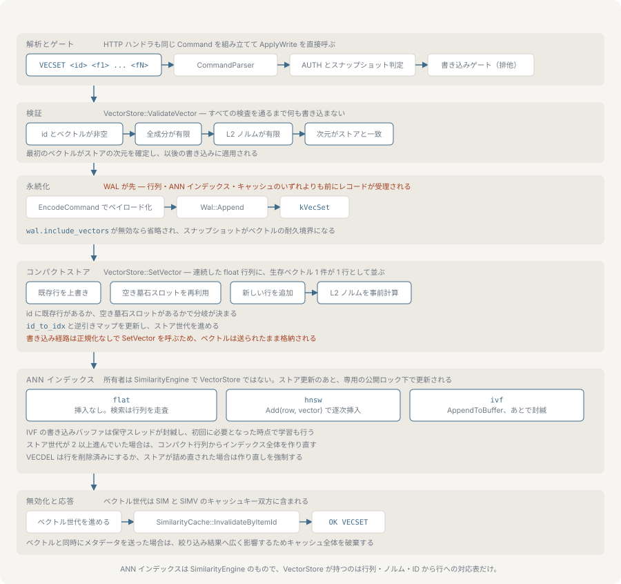

# ベクトル検索

nvecd はアイテム ID ごとに 1 本の埋め込みを連続したメモリ上の行列に保持し、類似度の尺度でクエリに対する候補を順位付けします。このページでは、ベクトルの登録、距離尺度、3 種類の索引、削除と断片化、メタデータによる絞り込み、そしてフィルタとスコア下限がパイプラインのどこで適用されるかを扱います。



コマンドの構文は [protocol.md](./protocol.md) に網羅されています。ここで挙げる設定キーは、値の範囲とあわせて [configuration.md](./configuration.md) に記載されています。

## ベクトルの登録と削除

```bash
VECSET item42 0.12 -0.44 0.98
VECDEL item42
```

`VECSET` は `OK VECSET` を、`VECDEL` は `OK VECDEL` を返します。既存 ID への `VECSET` は行をその場で上書きします。未知の ID への `VECDEL` はエラーです。

成分は有限でなければならず、成分と算出される L2 ノルムの両方が保存前に検査されます。1 本のベクトルが持てる成分は最大 4096 です。

### 次元が確定するタイミング

ストアは最初に書き込まれたベクトルから次元を学習し、それ以降は長さの異なる `VECSET` を拒否します。`vectors.default_dimension` は書き込みを制約しません。起動時に ANN 索引をあらかじめ確保するための値であり、ベクトルが 1 本でも入った時点で索引はストアの実際の次元に再束縛されます。ベクトルを一度も保持していないストアは、最初の書き込みとしてどんな長さでも受け付けます。

復旧は、永続化されたコーパスが空の場合でも次元を復元します。再起動でこの窓が開き直すことはありません。ストアをクリアすると次元は未設定に戻ります。

### 正規化

ベクトルは送られたとおりに保存されます。nvecd は書き込み時に正規化しません。行ごとに計算して保持するのは L2 ノルムで、コサインのカーネルがこれを使うため、クエリが候補側の大きさを計算し直さずに済みます。

これは尺度の選択に効いてきます。`dot` ではスコアに大きさが含まれるので、同じ向きなら長いベクトルが短いベクトルより上位に来ます。それが望ましくなければ、送る前にクライアント側で正規化してください。`cosine` ではノルムが約分されるので違いは出ません。

## 距離尺度

尺度は `vectors.distance_metric` で選びます。受け付ける値は `cosine`（既定）、`dot`、`l2` で、認識できない値はコサインにフォールバックします。`similarity.metric` というキーは存在しません。尺度は `vectors` の下にあり、`similarity.index_type` はそれを適用する索引を選ぶキーです。

| 値 | スコア | 範囲 |
|---|---|---|
| `cosine` | `dot(a,b) / (‖a‖·‖b‖)` | −1 〜 1 |
| `dot` | `dot(a,b)` | 無制限 |
| `l2` | `1 / (1 + ‖a−b‖)` | 0 〜 1 |

3 つとも類似度の形をしています。値が大きいほど似ており、結果は常に降順で並びます。`l2` はユークリッド距離を `1/(1+d)` に通してこの約束に合わせたものです。ノルムが `1e-7` を下回るベクトルは、コサインではゼロ除算ではなくスコア 0 になります。

尺度はグローバルです。起動時に決まり、`SIM` と `SIMV` に、そして ANN 索引にも適用されます。索引にも同じ尺度を渡しているので、その順位付けが総当たりのカーネルからずれることはありません。

## 格納レイアウト

ベクトルは `[n × 次元]` の連続した float 行列 1 つに置かれ、あらかじめ計算したノルムの配列、ID から行への写像、行から ID への配列が並走します。スキャンは 4 行先をプリフェッチしながら行列を順に走り、上位 `top_k` を有界の最小ヒープで保持するので、文字列として実体化されるのは生き残った ID だけです。

読み取りは、生存期間のあいだ読み取りロックを保持するスナップショットを取ります。クエリの足元で行列が再確保されることがないのはこのためです。

## SIMD のディスパッチ

内積、L2 ノルム、L2 距離の各カーネルには AVX2 実装、NEON 実装、スカラー実装があります。どれを使うかは初回利用時に実行時の CPU 検出で決まりますが、対象はバイナリにコンパイルされているものに限られます。AVX2 が候補になるのはビルドが `__AVX2__` を定義した場合、NEON は `__ARM_NEON` を定義した場合だけで、スカラーは常に存在するフォールバックです。

有効な実装は起動時にログへ書き出されます。

```text
Vector SIMD: NEON
```

これを報告するコマンドはありません。`NVECD_PORTABLE_BUILD` を付けたビルドはアーキテクチャの基本命令セットを対象とするため、x86-64 ではコンパイルされるカーネルから AVX2 が外れます。そうしたバイナリは、AVX2 に対応した CPU 上でも `Scalar` と報告します。NEON は AArch64 の基本命令セットに含まれるので、ポータブルビルドでも使われます。ビルドオプションは [installation.md](./installation.md) を参照してください。

## 索引の種類

`similarity.index_type` で `flat`、`hnsw`、`ivf` のいずれかを選びます。認識できない名前は `flat` として扱われます。`similarity.ivf_enabled` を true にすると、`flat` の設定が `ivf` に格上げされます。

### flat

既定です。索引オブジェクトは作られず、すべてのクエリが行列全体をスキャンします。構築コストはゼロ、クエリコストはコーパスに比例し、結果は厳密です。ただし例外が 1 つあります。`similarity.sample_size`（既定 10000）は、コーパスがその 2 倍を超えた時点でリザーバサンプリングを開始します。以降スキャンは全行ではなくその件数のランダムサンプルだけを見るので、大きなコーパスでは `flat` も近似になり、しかもクエリごとにサンプルが変わります。`sample_size` を 0 にするとサンプリングは無効になり、規模によらずスキャンは厳密なままです。

### hnsw

多層の近傍グラフです。`VECSET` のたびにグラフへ増分挿入するので、構築コストはバッチではなく書き込みごとに支払われ、索引は 1 本でも入った時点で問い合わせ可能になります。クエリコストはコーパスに比例せず、その対数で伸びます。

`hnsw_m`（既定 16）はノードあたりの接続数を、`hnsw_ef_construction`（既定 200）は挿入時の探索幅を決めます。どちらも再現率を上げ、どちらもメモリと構築時間を消費します。`hnsw_ef_search`（既定 50）はクエリ時の探索幅で、再構築なしにクエリ遅延と再現率を交換できるため最初に触るべきつまみです。`hnsw_max_elements` は容量を事前確保します。0 なら動的に伸びます。

`VECDEL` はグラフのノードを切り離すのではなく退役として印を付けます。グラフはノードが 64 個以上ある前提で、退役ノードが全体の 4 分の 1 に達した時点で自らを詰め直します。

### ivf

k-means でボロノイセルに分割し、セルごとに転置リストを持ちます。クエリはコーパス全体ではなくクエリに近い `ivf_nprobe` 個（既定 8）のセルだけをスコアリングするので、クエリコストはおおよそ `nprobe / nlist` の比で下がります。

IVF は分割の前に学習が必要です。学習はストアが `ivf_train_threshold` 本（既定 10000）を保持した時点で始まり、最大 50000 本のサンプルに対してバックグラウンドスレッドで走るので、取り込みを止めません。`ivf_nlist`（既定 256）はセル数です。0 なら `sqrt(n)` から導出し、上限は 1024 です。

学習が終わるまで、そして学習後に書き込まれたベクトルも、いったんフラットな書き込みバッファに入り、セルと並んで総当たりで検索されます。書いたばかりのベクトルがすぐ見つかるのはこのためで、代償はバッファに対する線形スキャンです。バッファは `ivf_seal_threshold`（既定 100000）に達したときにセルへ封入されます。加えて、前回以降に書き込みがなかったことをメンテナンスパスが検出したときにも封入され、静かになったストリームの末尾を吐き出します。

`ivf_nprobe` を上げると再現率とクエリコストが上がります。`ivf_nlist` を上げるとセルが小さくなるのでセルあたりのコストは下がりますが、同じ再現率を保つには `nprobe` を比例して上げる必要があります。

### 索引が再構築されるとき

索引が増分更新ではなくストア全体から再構築されるのは、ストアのコンパクトなレイアウトが足元で変わったときです。デフラグを引き起こした `VECDEL` はすべての行を振り直すので、対応関係を保つには索引を作り直すしかありません。直前に自分が行った 1 回を超えてストアの世代が進んでいることを書き込みが検出した場合も、再構築が走ります。

再構築や IVF の学習によって索引がストアと不整合な間、クエリは古い行を返すのではなく、新しく取ったスナップショットに対する総当たりの経路へ落ちます。結果の正しさが索引の最新性に依存することはありません。依存するのはコストだけです。

厳密な総当たりに対する再現率は `tests/benchmark/ann_recall_benchmark.cpp` が測定しており、各索引の top-k を同じコーパスの全走査と突き合わせます。実行方法と報告内容は [benchmarks.md](./benchmarks.md) を参照してください。

## 削除と断片化

`VECDEL` は他の行を動かしません。その行を墓標として印を付け、参照表から ID を外し、そのスロットを再利用可能として記録します。新しい ID への次の `VECSET` は追記より先に再利用可能なスロットを取るので、削除と挿入を繰り返すワークロードで行列が伸び続けることはありません。

墓標が確保済みスロットの 4 分の 1 を超えると、ストアは自らデフラグします。生きている行だけから行列を作り直すので、メモリが回収され、すべての行が振り直されます。デフラグを強制するコマンドはありません。閾値をまたいだ削除の結果として起きるものです。

そこに至るまで、墓標の行はメモリを占め続け、`flat` のスキャンからも走査されます（読み飛ばされます）。したがって、挿入せずに削除ばかりするワークロードは、比率が閾値をまたぐまで削除済みの行の分を払い続けます。

## メタデータと絞り込み

メタデータはアイテムごとに登録し、対象のベクトルが存在している必要があります。

```bash
METASET item42 category:shoes,price:8900,in_stock:true
```

値の型はパーサーが決めます。`true` と `false` は真偽値に、裸の整数は整数に、小数は浮動小数点数になり、それ以外は文字列のままです。型が合わない比較は一致しません。整数と浮動小数点数だけは、両者をまたいで数値として比較されます。

`filter=` はカンマ区切りの条件を AND で結合します。OR もグルーピングもありません。

| 演算子 | 例 | 一致する条件 |
|---|---|---|
| `=` | `filter=category=shoes` | 値と等しい |
| `:` | `filter=category:shoes` | `=` の別名 |
| `!=` | `filter=category!=shoes` | 値と異なる、または欠けている |
| `>` | `filter=price>5000` | 値より大きい |
| `<` | `filter=price<5000` | 値より小さい |
| `>=` | `filter=rating>=4` | 値以上 |
| `<=` | `filter=rating<=4` | 値以下 |
| `in(…)` | `filter=category=in(shoes\|boots\|sandals)` | 列挙のいずれかと等しい |

`in(…)` は `=` または `:` の後ろに書き、値を `|` で区切ります。複数の条件はカンマでつなぎます。

```bash
SIM item42 10 using=vectors filter=category=shoes,price<10000,rating>=4
```

そのフィールドをメタデータに持たないアイテムは、`!=` を除くすべての演算子で不一致になります。`!=` だけは、欠けているフィールドを値と異なるものとして扱います。したがってメタデータをまったく持たないアイテムが生き残れるのは、すべて `!=` で構成されたフィルタだけです。

`METASET` はクエリキャッシュ全体を無効化します。メタデータの変更は、絞り込みを伴う任意のクエリが返すアイテムを変えうるからです。[caching.md](./caching.md) を参照してください。

## 絞り込み、top-k、min_score

呼び出し側に何件返るかは、これらが適用される順序で決まります。

メタデータのフィルタは後処理の工程ではありません。候補を集めながら、各取得経路の内部で適用されます。フィルタに落ちた候補は、そもそも top-k のヒープに入りません。統合検索では統合後の候補集合に対して 2 度目が適用され、さらにディスパッチャが `events` 以外のすべてのモードで最後の一巡を行うので、別の経路で応答に届いた結果も同じフィルタに従います。

収集の途中で絞り込むからこそ、絞り込んだクエリが単に少ない件数を返すことにはなりません。エンジンは多めに取得し、ベクトル検索なら `top_k` の 3 倍を `similarity.max_top_k` を上限として取ったうえで、足りなければ補充します。ANN の経路では `top_k` 件の生存者が集まるか索引を汲み尽くすまで取得数を倍にして検索し直し、共起検索も隣接リストに対して同じように倍にしていきます。したがって、一致するアイテムがコーパスのどこかに十分あれば、絞り込んだクエリでも `top_k` は埋まります。絞り込む前の上位 `top_k` 件の中にあるかどうかは関係ありません。

`min_score` は top-k の選択より後に走ります。検索パラメータではなく返却行に対する下限なので、応答を縮めることしかできません。

```bash
SIM item42 10 using=vectors min_score=0.8
```

これは上位 10 件を求めたうえで、スコアが 0.8 未満のものを落とします。下限を超えたものが 3 件しかなければ 3 件が返り、エンジンが残り 7 件を探しに行くことはありません。下限を超えた結果を 10 件ほしい呼び出し側は、`top_k` を大きめに要求して自分で切る必要があります。

`min_score` は top-k の後であると同時にクエリキャッシュより後にも適用されます。キャッシュキーに含まれていないのはこのためです。保存されるのは下限を適用する前の top-k なので、`min_score` だけが違う 2 つのクエリは 1 つのキャッシュエントリを共有し、それぞれが同じ保存済みリストを切ります。`min_score` を変えてもミスにはなりません。[caching.md](./caching.md) を参照してください。

## 生のベクトルによる問い合わせ

`SIMV` は ID の参照を省き、その場で渡されたベクトルに対して順位付けします。

```bash
SIMV 10 filter=category=shoes 0.12 -0.44 0.98
```

オプションは成分より前に置きます。`=` を含まない最初のトークンからベクトルが始まります。クエリはストアと同じ次元でなければならず、成分とノルムが有限である必要があります。コサインではノルムが 0 のクエリは拒否されます。

`SIMV` に `using=` オプションはありません。モードを取らず、統合検索も使えません。共起の隣接を引くためのアイテム ID が存在しないからです。[fusion.md](./fusion.md) を参照してください。

どちらのコマンドも、件数行に続けて結果 1 件ごとに 1 行を返します。スコアは小数点以下 4 桁で描画されます。

```text
OK RESULTS 3
item17 0.9312
item88 0.9044
item03 0.8771
```
